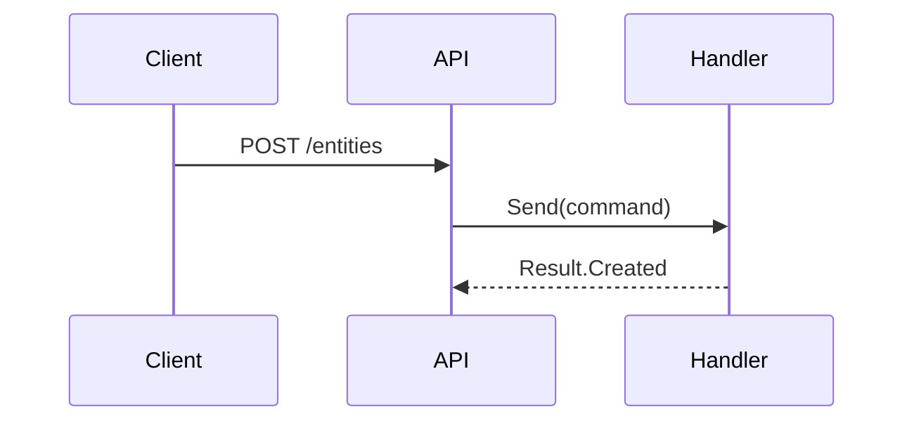

# Goal
Define the formatting rules every skill in this solution must follow.
Without this skill, code identifiers appear as plain text, cross-references break,
sequence diagrams are unreadable, and skill files are placed inconsistently.
This skill is the single source of truth for skill authoring conventions.

# Core Principles
- Code identifiers and filenames are always in `code format` — never plain text
- Cross-references always use [[Link|Human readable format]] — never bare URLs or plain names
- Sequences with more than 3 flows are extracted to a `.mmd` file — keeping the skill readable
- Variable name parts are written as `{Placeholder}` — distinguishing templates from constants
- Skills exist in exactly two physical forms: flat file or directory
- A skill must follow the same conventions it enforces — it is its own first test case

# Structure / Contracts
## Flat skill — single file
Use when the skill has no extracted diagrams or supplementary files.
```
{skill-name}.skill.md
```
## Directory skill — multi-file
Use when the skill contains one or more extracted `.mmd` diagram files or other related files
```
/{skill-name}
  {skill-name}.skill.md    ← main skill file
  {diagram-name}.mmd       ← extracted Mermaid diagram
```
## Frontmatter fields
```yaml
---
status:       # todo | draft | implemented | canceled
name:         # kebab-case skill name
description:  # one sentence — what the skill defines
domain:       skill
type:         # pattern | architecture | declarative
tags:
  - tag
triggers:
  - phrase that should activate this skill
whenToUse: One sentence trigger
---
```

## Code format

All of the following must be wrapped in backticks:

- Class, interface, and record names: `IHasGuid`, `TodoTask`, `CreateTaskCommand`
- Method and property names: `SaveChangesAsync`, `DomainEvents`
- File and directory names: `CreateTask.Handler.cs`, `/Domain/Specifications/`
- Project names: `Task.Application`, `BuildingBlocks`
- Variable name templates: `{ModuleName}.Domain`, `{FeatureName}Handler`

## Cross-reference links

All references to other skills, files, or documents use wiki-link format:

```
[[target-file|Human readable label]]
```

Examples:
- `[[domain-event-pattern.skill|Domain Event pattern]]`
- `[[backend-project-structure.skill|Backend project structure]]`

## Sequence diagrams

Sequences with 3 or fewer flows — inline Mermaid in the skill file:

````

````

Sequences with more than 3 flows — extract to a `.mmd` file and convert the skill to directory format:

```
{skill-name}/
  {skill-name}.skill.md
  {diagram-name}.mmd
```

Reference from the skill file:

```
See [[{diagram-name}.mmd|Full flow diagram]]
```

# Rules

MUST:
- All code identifiers, filenames, and project names written in `code format`
- All cross-references written as `[[target|Human readable label]]`
- Variable parts of names written as `{Placeholder}` in `code format`: `{ModuleName}Handler`
- Skill file named `{skill-name}.skill.md` in kebab-case
- Frontmatter uses `triggers` — not `whenToUse` or any other field name
- Sequences with more than 3 flows extracted to `.mmd` and skill converted to directory format
- Extracted `.mmd` files linked from the skill using `[[...]]` format

SHOULD:
- Skill sections follow the order: Goal → Core Principles → Structure/Contracts → Rules → Anti-patterns → Check list → Unittest TestCases → Relations
- Inline Mermaid diagrams used for sequences with 3 or fewer flows

MUST NOT:
- Use plain text for code identifiers or filenames
- Use bare URLs or plain text for cross-references
- Embed large sequences (more than 3 flows) inline — extract to `.mmd`
- Use `whenToUse` as a frontmatter field — use `triggers`
- Use `Principals` — correct spelling is `Principles`
- Leave incomplete sentences in MUST/SHOULD/MUST NOT lists

# Anti-patterns

- `IHasGuid` written as plain text instead of `` `IHasGuid` `` — breaks scannability and search
- Link written as `domain-event-pattern.skill` instead of `[[domain-event-pattern.skill|Domain Event pattern]]` — breaks navigation
- `{ModuleName}` written as `ModuleName` without braces — indistinguishable from a real identifier
- 20-step sequence embedded inline — use `.mmd` extraction
- Frontmatter field `whenToUse` instead of `triggers` — inconsistent with all other skills
- Incomplete rule sentence: *"All Non constant names"* with no predicate — rule cannot be applied

# Check list

- [ ] All code identifiers and filenames wrapped in backticks
- [ ] All cross-references use `[[target|Human readable label]]` format
- [ ] Template placeholders written as `{Placeholder}` inside backticks
- [ ] Frontmatter contains `triggers`, not `whenToUse`
- [ ] Sequences with more than 3 flows extracted to `.mmd` and linked
- [ ] Skill is flat file if no `.mmd` files exist, directory if `.mmd` files are present
- [ ] No incomplete sentences in Rules section
- [ ] Spelling: `Principles` not `Principals`
