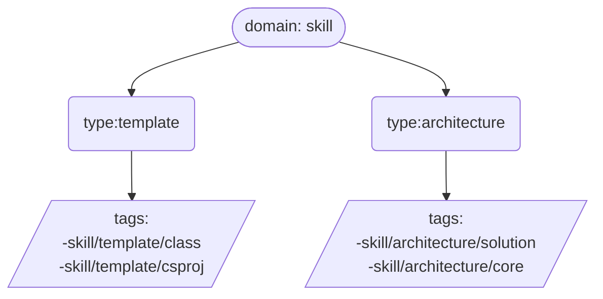

# Skill types

- `domain:skill`
	- `type: template` - define how write code
		- `tag: skill/template/csproj` - define how write csproj
		- `tag: skill/template/class` - define how write classes
	- `type: architecture` - define architecture pattern
		- `tag: skill/architecture/core` - core architecture principles
		- `tag: skill/architecture/solution` - architecture solution how organize workflow

