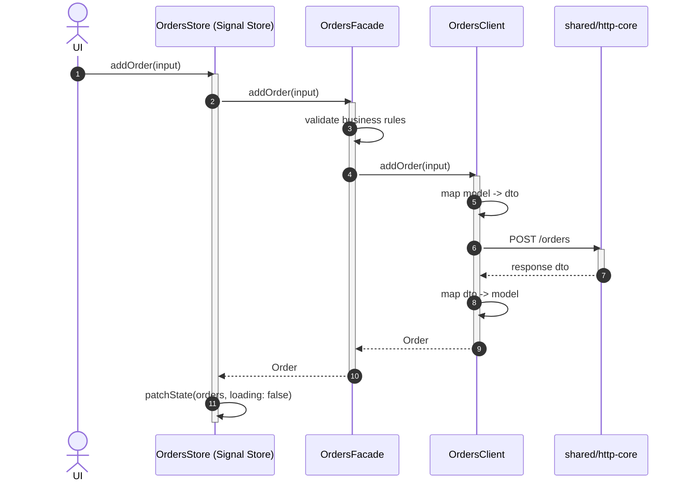

# Goal

- Give every feature a consistent internal structure for data operations: Facade (business logic, public API) → Client (transport/DTO mapping, internal) → shared base HTTP service
- Remove the redundant classical-NgRx orchestration (Action/Reducer/Effect) for feature-level operations, now that Signal Store already owns that role
- Give callers (Signal Store methods, NgRx effects for global state) a single, typed, predictable error shape instead of raw HTTP errors

# Capabilities

- Business validation (Facade) stays testable in isolation from transport/DTO concerns (Client)
- A raw `HttpErrorResponse` never reaches feature or business code — every caller works with typed domain errors
- Common HTTP concerns (base URL, timeout, retry) are defined once in `libs/shared/http-core`, not reimplemented per feature
- No duplicated orchestration mechanism for feature-level state — Signal Store is the only place that manages it

# Core Principles

- **Facade** is a feature's `data-access` public API: business validation and orchestration, calling the Client. It is the only thing a feature's Signal Store method (or, for global state, an NgRx effect) is allowed to call.
- **Client** is internal to a feature's `data-access` lib, never exported: DTO mapping (via that feature's `{feature}.mapper.ts`) plus the actual HTTP call through `libs/shared/http-core`. It is the single point where a raw `HttpErrorResponse` is caught and converted into a typed domain error.
- For feature-level operations, no Action/Reducer/Effect is introduced — the Signal Store method calls the Facade directly and updates its own state from the result. Global/cross-cutting state (auth, notifications, offline-sync) keeps its existing classical NgRx chain (Effect → Facade → Client), unchanged by this solution.
- DTO ↔ domain model mapping is always a hand-written function in `{feature}.mapper.ts`, including any enrichment from data not present in the DTO itself.

# Adr

- [[adr/facade-client-layering.md|Signal Store calls Facade directly; Client is an internal transport detail — Action/Reducer/Effect collapsed for feature-level operations]]
  - Selected variant: this layering — chosen because it removes duplicated orchestration once Signal Store already owns feature-level state, while preserving the global-state NgRx chain unchanged
- [[adr/error-handling-strategy.md|Client throws typed domain errors; Facade preserves the throw/reject channel]]
  - Selected variant: typed domain errors via throw/reject — chosen for compatibility with both existing call-site styles (`try/catch` in Signal Store, `catchError` in NgRx effects) without requiring a `Result<T,E>` rewrite
- [[adr/dto-mapping-strategy.md|Manual mapper functions instead of an automatic mapping library]]
  - Selected variant: manual mappers — chosen because some fields require enrichment from external context that an automatic mapper would not handle cleanly anyway

# Requirements

SOLUTION:
- [[../solution-repository-structure.skill/solution-repository-structure.skill.md|Структура репозитория (база)]]
  - [[../solution-repository-structure.skill/Implementation/Repository.create.md|libs/{feature}/data-access]] - internal structure formalized by this solution
- [[../solution-state-management.skill/solution-state-management.skill.md|State management]]
  - Feature Signal Store methods (e.g. `OrdersStore.load()`/`addOrder()`) call this solution's Facade directly, per that solution's own examples
  - Global auth/notifications/offline-sync NgRx effects continue calling Facade → Client exactly as already established there and in the "Аутентификация" solution

NPM:
- No new npm dependency beyond `@angular/common`'s `HttpClient`, already a base Angular dependency

# Template Skill Mutations

REPOSITORY:
- [[./Implementation/Repository.extend.md|Repository]] - extend - add `libs/shared/http-core`, formalize the Facade/Client/Mapper/Errors structure inside every `data-access` project
PROJECT:
- [[./Implementation/HttpCore/shared-http-core.project.create.md|libs/shared/http-core]] - create - base HTTP service (base URL, timeout, retry) shared by every feature's Client

Artifact-level (generic patterns, applied by any solution that creates a `libs/{feature}/data-access` project):
- [[./Implementation/DataAccess/{Feature}.project.create/{feature}.facade.ts.create.md|{feature}.facade.ts]] - create - public API, business validation/orchestration
- [[./Implementation/DataAccess/{Feature}.project.create/{feature}.client.ts.create.md|{feature}.client.ts]] - create - internal transport/DTO layer
- [[./Implementation/DataAccess/{Feature}.project.create/{feature}.mapper-and-errors.ts.create.md|{feature}.mapper.ts / {feature}.errors.ts]] - create - hand-written DTO mapping and typed domain errors

# Workflow

## Feature-level data operation (happy path)

1. UI calls a Signal Store method (e.g. `ordersStore.addOrder(input)`), per the "State management" solution.
2. The store method calls `OrdersFacade.addOrder(input)` directly — no Action is dispatched.
3. The Facade validates business rules; if they fail, it throws immediately without calling the Client.
4. Otherwise, the Facade calls `OrdersClient.addOrder(input)`, which maps the domain model to a DTO (enriching fields as needed via `{feature}.mapper.ts`), calls `libs/shared/http-core`, and maps the response back to a domain model.
5. The store method receives the result and calls `patchState` to update its own signals — no Reducer involved.

## Transport failure mapped to a domain error (failure path)

1. The backend responds with a 409 conflict.
2. `OrdersClient` catches the `HttpErrorResponse` and throws `OrdersConflictError`, never letting the raw error escape.
3. `OrdersFacade` catches `OrdersConflictError` and re-wraps it into a more specific business error (`OrdersAlreadySubmittedError`) if that adds clarity, or lets it propagate as-is.
4. `OrdersStore`'s `try/catch` catches the typed error and sets its `error` signal — the UI never sees an HTTP status code directly.

## Global/cross-cutting operation — unchanged (steady state)

1. An auth operation (e.g. login) still goes through the classical NgRx chain established in "State management" and "Аутентификация": an Effect calls `AuthFacade.login()`, which calls `AuthClient.login()` internally.
2. This solution does not change that chain — it only formalizes the Facade/Client split inside it and applies the same error-handling and mapping conventions.

# Rules

## MUST
- [[./Implementation/Repository.extend.md#MUST|Repository.extend]]
- [[./Implementation/HttpCore/shared-http-core.project.create.md#MUST|HttpCore/shared-http-core.project.create]]
- [[./Implementation/DataAccess/{Feature}.project.create/{feature}.facade.ts.create.md#MUST|{feature}.facade.ts.create]]
- [[./Implementation/DataAccess/{Feature}.project.create/{feature}.client.ts.create.md#MUST|{feature}.client.ts.create]]
- [[./Implementation/DataAccess/{Feature}.project.create/{feature}.mapper-and-errors.ts.create.md#MUST|{feature}.mapper-and-errors.ts.create]]

## MUST NOT
- [[./Implementation/Repository.extend.md#MUST NOT|Repository.extend]]

# Anti-patterns

- [[./Implementation/Repository.extend.md|See Repository.extend.md]] — a Signal Store method calling a feature's Client directly, skipping the Facade; a Client letting a raw `HttpErrorResponse` escape.
- [[./Implementation/HttpCore/shared-http-core.project.create.md|See shared-http-core.project.create.md]] — adding feature-specific special cases into the shared base HTTP service.
- [[./Implementation/DataAccess/{Feature}.project.create/{feature}.facade.ts.create.md|See {feature}.facade.ts.create.md]] — putting DTO mapping or direct HTTP calls inside the Facade.
- [[./Implementation/DataAccess/{Feature}.project.create/{feature}.client.ts.create.md|See {feature}.client.ts.create.md]] — inlining ad hoc field mapping instead of using the feature's mapper functions.

# Check list

- [ ] No feature-level operation uses an Action/Reducer/Effect — only a Signal Store method calling its Facade
- [ ] Every feature's Client is internal (not exported from `index.ts`) and calls `libs/shared/http-core`, never `HttpClient` directly
- [ ] No raw `HttpErrorResponse` is ever visible outside a feature's Client
- [ ] Every DTO ↔ model conversion goes through that feature's hand-written mapper functions
- [ ] Global/cross-cutting state (auth, notifications, offline-sync) still uses its existing classical NgRx chain, unchanged by this solution
