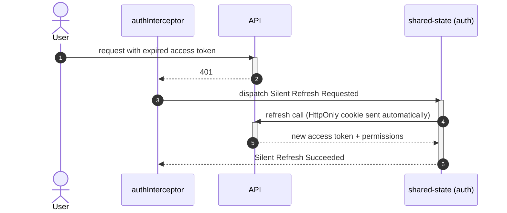

# Goal

- Store auth tokens in a way that minimizes XSS exposure, given that federated third-party code shares the same JS runtime (per the "Встраиваемость платформы" solution)
- Give the UI a single, granular permission model shared by route guards, UI visibility checks, and embeddable apps
- Formally define the auth guards that the "App routing (база)" solution deliberately deferred to this solution
- Let embeddable apps read the platform's session without implementing their own authentication

# Capabilities

- No token value ever persists in `localStorage`/`sessionStorage`, closing off the most common XSS-driven token theft vector
- A single permission model reused by route guards, a structural UI directive, and embeddable apps — no parallel authorization logic to keep in sync
- Silent, transparent session recovery after a page reload or a transient 401, without forcing the user to re-authenticate
- Embeddable apps built by separate teams get a working session for free, with no login screen of their own to build or maintain

# Core Principles

- The access token lives only in memory, inside `shared-state`'s auth slice; the refresh token lives only in an `HttpOnly`/`Secure`/`SameSite` cookie the client never reads
- Every authorization check — guards, directives, embeddable apps — is expressed as a permission string, never a role name
- Route guards live inside the feature whose route they protect, consistent with the hierarchical route ownership from "App routing (база)" — never centralized in the shell
- Hiding UI with a permission check is a convenience, not a security boundary; the backend remains the actual authorization boundary
- Embeddable apps are session consumers only — they read `SessionContract` from `@platform/contracts` and never implement their own login flow

# Adr

- [[adr/token-storage-strategy.md|In-memory access token + HttpOnly refresh cookie instead of localStorage or fully cookie-based auth]]
  - Selected variant: in-memory access + HttpOnly refresh cookie — chosen to minimize what an XSS payload (including from a misbehaving federated remote) can steal
- [[adr/authorization-model.md|Granular permissions instead of coarse roles]]
  - Selected variant: granular permissions — chosen for scalability and to decouple embeddable apps from the platform's internal role taxonomy

# Requirements

SOLUTION:
- [[../solution-state-management.skill/solution-state-management.skill.md|State management]]
  - [[../solution-state-management.skill/Implementation/GlobalStore/shared-state.project.create/auth.store.ts.create.md|libs/shared/state auth slice]] - extended by this solution with in-memory token, permissions, silent refresh
- [[../solution-app-routing.skill/solution-app-routing.skill.md|App routing (база)]]
  - Auth guards, deferred by that solution, are formally defined here (see [[./Implementation/Routing/{feature}.guard.ts.create.md]])
- [[../solution-platform-embeddability.skill/solution-platform-embeddability.skill.md|Встраиваемость платформы]]
  - [[../solution-platform-embeddability.skill/adr/embedding-mechanism.md|@platform/contracts]] - extended with `SessionContract` so embeddable apps can read session/permissions

NPM:
- @ngrx/store, @ngrx/effects
  - Already required by the State management solution; this solution adds actions/state to the existing auth slice, no new package

# Template Skill Mutations

REPOSITORY:
- [[./Implementation/Repository.extend.md|Repository]] - extend - add `libs/shared/auth-ui`, and the conventions for guard/interceptor/directive placement
PROJECT:
- No new Nx project beyond `libs/shared/auth-ui`; all other changes extend existing projects (`shared-state`, `apps/platform-shell`'s HTTP configuration, individual feature projects)

Artifact-level:
- [[./Implementation/GlobalStore/auth.store.ts.extend.md|auth.store.ts (extend)]] - extend - in-memory access token, permissions, silent-refresh handling
- [[./Implementation/HttpLayer/auth.interceptor.ts.create.md|auth.interceptor.ts]] - create - attaches access token, triggers silent refresh on 401
- [[./Implementation/Routing/{feature}.guard.ts.create.md|{feature}.guard.ts (generic pattern)]] - create - functional permission-based route guard, applied by any feature protecting one of its own routes
- [[./Implementation/UI/has-permission.directive.ts.create.md|has-permission.directive.ts]] - create - structural directive for permission-based UI visibility
- [[./Implementation/EmbeddableApp/platform-contracts.extend.md|@platform/contracts (extend)]] - extend - `SessionContract` for embeddable apps to read session/permissions

This solution's interceptor is a contract point the future "API/HTTP-слой" solution must integrate with — that solution will define the fuller request/facade pipeline, but the token-attaching and silent-refresh-triggering behavior defined here does not change.

# Workflow

## App bootstrap (happy path)

1. On application start, `Silent Refresh Requested` is dispatched before any authenticated request is made.
2. The browser sends the `HttpOnly` refresh cookie automatically to the refresh endpoint.
3. On success, `Silent Refresh Succeeded` populates the in-memory `accessToken` and `permissions`.
4. The app proceeds as an authenticated session, with `authInterceptor` attaching the access token to subsequent requests.

## Transparent recovery from an expired access token (happy path)

1. A request fails with a 401 (access token expired, but the refresh cookie is still valid).
2. `authInterceptor` dispatches `Silent Refresh Requested` instead of surfacing the error immediately.
3. On success, the app has a fresh `accessToken`; the originating request can be retried by the caller (full retry orchestration is finalized in the future "API/HTTP-слой" solution).
4. The user experiences no visible interruption.

## Guarding a feature's own route (happy path)

1. A feature attaches `requirePermission('orders.delete')` to one of its own routes, at the point that route is defined inside the feature — not in the shell.
2. A user without that permission is redirected to a forbidden route on navigation attempt; a user with it proceeds.

## Embeddable app reads the platform session (happy path)

1. An embeddable app (per the platform-embeddability solution) is loaded into the shell.
2. It reads `SessionContract.currentUser`/`permissions`/`isAuthenticated` from `@platform/contracts` — the same singleton instance the platform itself reads from.
3. It never presents its own login screen; if `isAuthenticated` is false, it renders a "not authenticated" state and defers to the platform.

## Session expiry (cross-cutting failure path)

1. The refresh cookie itself expires or is revoked; a silent refresh fails.
2. `Session Expired` (from the base auth slice) is dispatched; `accessToken` and `permissions` are cleared.
3. Every consumer — the platform's own UI and every embeddable app reading `SessionContract` — reflects the logged-out state simultaneously, without needing to poll or be told individually.

# Rules

## MUST
- [[./Implementation/Repository.extend.md#MUST|Repository.extend]]
- [[./Implementation/GlobalStore/auth.store.ts.extend.md#MUST|auth.store.ts.extend]]
- [[./Implementation/HttpLayer/auth.interceptor.ts.create.md#MUST|auth.interceptor.ts.create]]
- [[./Implementation/Routing/{feature}.guard.ts.create.md#MUST|{feature}.guard.ts.create]]
- [[./Implementation/UI/has-permission.directive.ts.create.md#MUST|has-permission.directive.ts.create]]
- [[./Implementation/EmbeddableApp/platform-contracts.extend.md#MUST|platform-contracts.extend]]

# Anti-patterns

- [[./Implementation/Repository.extend.md|See Repository.extend.md]] — checking a role name instead of a permission.
- [[./Implementation/GlobalStore/auth.store.ts.extend.md|See auth.store.ts.extend.md]] — persisting the access token to storage for reload convenience.
- [[./Implementation/HttpLayer/auth.interceptor.ts.create.md|See auth.interceptor.ts.create.md]] — retrying indefinitely on repeated 401s.
- [[./Implementation/Routing/{feature}.guard.ts.create.md|See {feature}.guard.ts.create.md]] — centralizing permission guards in the shell's root routes.
- [[./Implementation/UI/has-permission.directive.ts.create.md|See has-permission.directive.ts.create.md]] — relying on the directive alone with no server-side check.
- [[./Implementation/EmbeddableApp/platform-contracts.extend.md|See platform-contracts.extend.md]] — an embeddable app implementing its own login flow.

# Check list

- [ ] No token value is ever written to `localStorage`/`sessionStorage`
- [ ] Every authorization check (guard, directive, embeddable app) uses a permission string, never a role name
- [ ] Route guards are attached inside the feature they protect, not centralized in the shell
- [ ] `authInterceptor` is registered globally and excluded from the silent-refresh request itself
- [ ] Every embeddable app reads session state exclusively via `SessionContract`, with no login flow of its own
- [ ] Bootstrap always triggers exactly one silent-refresh attempt before treating the user as unauthenticated
