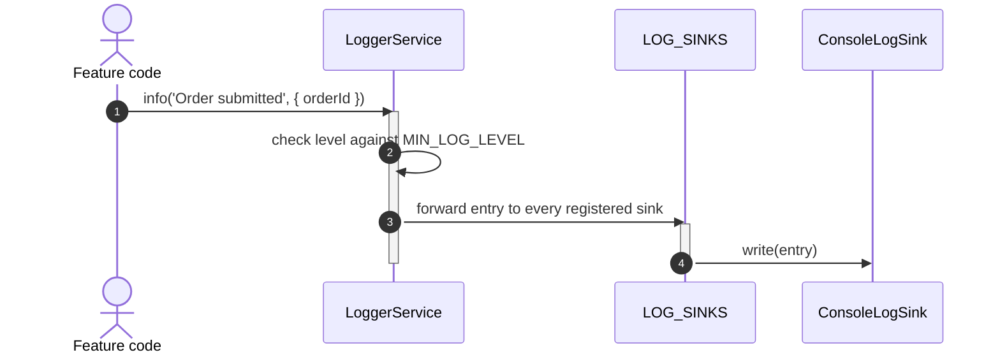

# Goal

- Give the application one consistent, structured way to log to the console
- Establish the `LogSink` extension point now, so the future "Логирование (глобальное)" solution can add backend-sending without touching call sites
- Prevent tokens, passwords, or PII from ever reaching a log entry, at every log level

# Capabilities

- Structured log context (feature name, relevant IDs) is filterable/queryable from day one, not retrofitted later
- Production builds automatically drop `debug`/`info` noise while keeping `warn`/`error`
- Adding a backend log sink later is a one-file addition (`BackendLogSink`, registered alongside `ConsoleLogSink`), not a rewrite

# Core Principles

- All logging goes through `LoggerService` — no direct `console.*` calls anywhere else in the application
- A log entry is always structured: a message plus a context object, never a single interpolated string
- `LoggerService` forwards every entry to a pluggable list of `LogSink`s; this solution registers only `ConsoleLogSink`
- Sensitive data (tokens, passwords, PII) is never logged, at any level — this is a hard rule, not a per-call-site judgment

# Adr

- [[adr/logging-architecture.md|Custom LoggerService over pluggable LogSinks, structured entries — instead of raw console calls or plain-string logging]]
  - Selected variant: `LoggerService` + `LOG_SINKS` + structured entries — chosen so the future backend-logging extension adds a sink without touching any existing call site, and so logs are filterable/queryable from the start

# Requirements

SOLUTION:
- [[../solution-repository-structure.skill/solution-repository-structure.skill.md|Структура репозитория (база)]]
  - `libs/shared/logging` follows the same `type:util`/`scope:shared` placement as other shared libs

NPM:
- None beyond Angular's own DI/core APIs

# Template Skill Mutations

REPOSITORY:
- [[./Implementation/Repository.extend.md|Repository]] - extend - add `libs/shared/logging`, enforce "log only through `LoggerService`" and the never-log-sensitive-data rule workspace-wide
PROJECT:
- [[./Implementation/Logging/shared-logging.project.create.md|libs/shared/logging]] - create - `LoggerService`, the `LogSink` extension point, `ConsoleLogSink`, environment-based level filtering

# Workflow

## Logging from a feature (happy path)

1. A feature injects `LoggerService` once (typically via `forFeature('orders')`, which auto-attaches `{ feature: 'orders' }` to every entry).
2. It calls `.info('Order submitted', { orderId })` or similar, passing structured context rather than an interpolated string.
3. `LoggerService` checks the entry's level against `MIN_LOG_LEVEL` (environment-specific); if it passes, the entry is forwarded to every registered sink — today, only `ConsoleLogSink`.

## Production build filtering (happy path)

1. The application is built for production; `MIN_LOG_LEVEL` resolves to `'warn'`.
2. `debug`/`info` calls throughout the codebase are silently filtered before reaching any sink — the console stays quiet for routine operation, while `warn`/`error` still surface.

## Future extension point in use (illustrative, not part of this solution)

1. The "Логирование (глобальное)" solution adds `BackendLogSink` and registers it alongside `ConsoleLogSink` via the same `LOG_SINKS` multi-provider token.
2. Every existing `LoggerService` call, across the entire codebase, now also reaches the backend — with zero call-site changes.

# Rules

## MUST
- [[./Implementation/Repository.extend.md#MUST|Repository.extend]]
- [[./Implementation/Logging/shared-logging.project.create.md#MUST|Logging/shared-logging.project.create]]

## MUST NOT
- [[./Implementation/Logging/shared-logging.project.create.md#MUST NOT|Logging/shared-logging.project.create]]

# Anti-patterns

- [[./Implementation/Repository.extend.md|See Repository.extend.md]] — calling `console.*` directly from feature code; logging a token/password/PII value for local debugging.
- [[./Implementation/Logging/shared-logging.project.create.md|See shared-logging.project.create.md]] — a feature building its own ad hoc console wrapper instead of using `LoggerService.forFeature(...)`.

# Check list

- [ ] No direct `console.*` call exists outside `libs/shared/logging`'s own `ConsoleLogSink`
- [ ] Every log entry passes structured context, not an interpolated string
- [ ] Production builds filter out `debug`/`info`, keeping `warn`/`error`
- [ ] No log entry anywhere contains a token, password, or PII value
