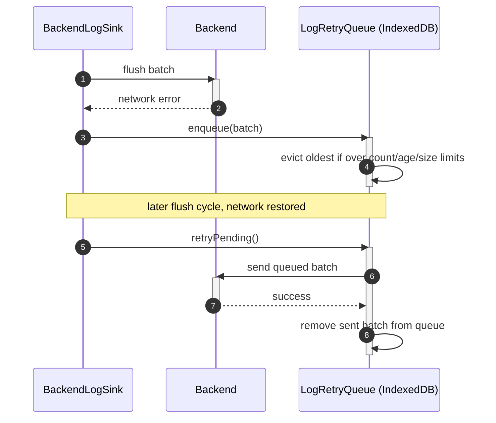

# Goal

- Send the logs that matter (`warn`/`error`, plus explicit `report()` events) to the backend, without the cost/noise of shipping every `debug`/`info` call
- Never silently lose an error report to a transient network outage, within a bounded storage budget
- Capture uncaught exceptions automatically, since they are often the most important signal that something has broken

# Capabilities

- Backend visibility into frontend failures, without needing every code path to explicitly opt into "please also send this to the backend"
- Resilience to brief network outages via a persisted, bounded retry queue — a failed batch is retried, not dropped
- No rework of the base logging solution or any existing `LoggerService` call site — this solution only adds a second sink

# Core Principles

- Only `warn`/`error`/`report()` entries reach `BackendLogSink`; `debug`/`info` stay local to `ConsoleLogSink`
- Entries are batched and flushed on a timer/size threshold, with a `sendBeacon`-based flush on page unload for reliability
- A failed batch send is never dropped outright — it is persisted to a bounded IndexedDB queue and retried, evicting the oldest entries first once any of three independent limits (count, age, size) is exceeded
- Every uncaught exception is captured by a global `ErrorHandler` and routed through `LoggerService.error`, reaching the backend the same way any other error log does
- The raw caught error object is never logged directly — only sanitized, structured fields are extracted, consistent with the base solution's never-log-sensitive-data rule

# Adr

- [[adr/backend-log-sink-strategy.md|Selective levels, batched sending, bounded IndexedDB-persisted retry queue, global ErrorHandler]]
  - Selected variant: this combination — chosen to balance backend visibility against network/storage cost, and to guarantee uncaught exceptions are captured without relying on explicit instrumentation everywhere

# Requirements

SOLUTION:
- [[../solution-logging-base.skill/solution-logging-base.skill.md|Логирование (база)]]
  - [[../solution-logging-base.skill/Implementation/Logging/shared-logging.project.create.md|libs/shared/logging]] - extended with `BackendLogSink`, `LogRetryQueue`, `LoggerService.report()`
- [[../solution-api-http-layer.skill/solution-api-http-layer.skill.md|API/HTTP-слой]]
  - `BackendLogSink` sends batches through `libs/shared/http-core`'s base HTTP service, consistent with that solution's conventions

NPM:
- None beyond the browser's native IndexedDB and `navigator.sendBeacon` APIs

# Template Skill Mutations

REPOSITORY:
- [[./Implementation/Repository.extend.md|Repository]] - extend - register `BackendLogSink` alongside `ConsoleLogSink`, register `GlobalErrorHandler` in `apps/platform-shell`

Artifact-level:
- [[./Implementation/Logging/backend-log-sink.ts.create.md|backend-log-sink.ts]] - create - batches and sends `warn`/`error`/`report` entries to the backend
- [[./Implementation/Logging/log-retry-queue.ts.create.md|log-retry-queue.ts]] - create - bounded, IndexedDB-persisted retry queue for failed batches
- [[./Implementation/Logging/logger.service.ts.extend.md|logger.service.ts (extend)]] - extend - add `report()`, always sent regardless of environment-based level filtering
- [[./Implementation/PlatformHost/global-error-handler.ts.create.md|global-error-handler.ts]] - create - captures uncaught exceptions, routes them through `LoggerService.error`

# Workflow

## Normal error logging (happy path)

1. Feature code calls `LoggerService.error('Failed to save order', { orderId })`.
2. `LoggerService` forwards the entry to every registered sink: `ConsoleLogSink` (always) and `BackendLogSink` (since it's `error` level).
3. `BackendLogSink` buffers the entry; on the next flush (timer or size threshold), it is sent to the backend in a batch.

## Uncaught exception (happy path)

1. An unhandled exception occurs anywhere in the running application.
2. `GlobalErrorHandler.handleError` catches it, extracts `message`/`stack`, and calls `LoggerService.error('Uncaught exception', { message, stack })`.
3. From here, it flows through the same pipeline as any other error log — console and, batched, to the backend.

## Network outage during flush (failure path)

1. `BackendLogSink` attempts to flush a batch; the HTTP call fails (network unavailable).
2. The batch is handed to `LogRetryQueue.enqueue(...)`, persisted to IndexedDB.
3. On a later flush cycle, once the network is back, `retryPending()` sends the queued batch and removes it from the queue.
4. If the outage persists long enough that the queue exceeds its count/age/size limits, the oldest queued entries are evicted — bounded data loss, not unbounded local storage growth.

## Page closed mid-flush (edge case)

1. The user closes the tab while entries are still buffered, not yet flushed.
2. The `pagehide` handler fires `navigator.sendBeacon`, delivering the remaining buffer reliably even as the page unloads, instead of losing it to a cancelled `fetch`/`HttpClient` request.

# Rules

## MUST
- [[./Implementation/Repository.extend.md#MUST|Repository.extend]]
- [[./Implementation/Logging/backend-log-sink.ts.create.md#MUST|backend-log-sink.ts.create]]
- [[./Implementation/Logging/log-retry-queue.ts.create.md#MUST|log-retry-queue.ts.create]]
- [[./Implementation/Logging/logger.service.ts.extend.md#MUST|logger.service.ts.extend]]
- [[./Implementation/PlatformHost/global-error-handler.ts.create.md#MUST|global-error-handler.ts.create]]

## SHOULD
- [[./Implementation/Logging/log-retry-queue.ts.create.md#SHOULD|log-retry-queue.ts.create]]

# Anti-patterns

- [[./Implementation/Repository.extend.md|See Repository.extend.md]] — forwarding `debug`/`info` entries to `BackendLogSink`.
- [[./Implementation/Logging/backend-log-sink.ts.create.md|See backend-log-sink.ts.create.md]] — sending each entry as its own request instead of batching.
- [[./Implementation/Logging/log-retry-queue.ts.create.md|See log-retry-queue.ts.create.md]] — an unbounded retry queue; retrying the whole queue in a tight loop after the first failure.
- [[./Implementation/Logging/logger.service.ts.extend.md|See logger.service.ts.extend.md]] — using `report()` as a workaround to bypass `error()` conventions.
- [[./Implementation/PlatformHost/global-error-handler.ts.create.md|See global-error-handler.ts.create.md]] — logging the raw caught error object instead of sanitized fields.

# Check list

- [ ] Only `warn`/`error`/`report()` entries ever reach `BackendLogSink`
- [ ] A failed batch send is always retried via `LogRetryQueue`, never dropped outright
- [ ] The retry queue is bounded by count, age, and size, with oldest-first eviction
- [ ] `GlobalErrorHandler` is registered once, in `apps/platform-shell`, and captures every uncaught exception
- [ ] No raw error object or sensitive data ever reaches a log entry sent to the backend
