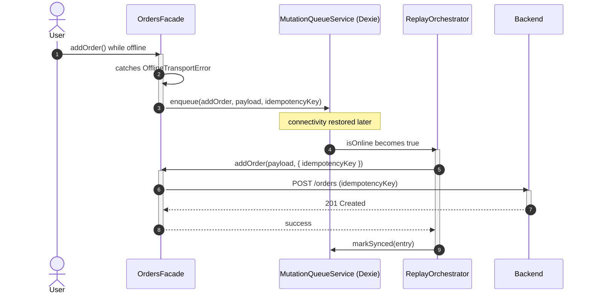

# Goal

- Let mutations attempted while offline (the scenario the "Offline-first" solution deliberately left as an immediate failure) be queued and automatically replayed once connectivity returns
- Give the user visibility into pending, unsynced actions, and clear information when a queued action conflicts with a server-side change
- Avoid one struggling feature's replay blocking every other feature's sync
- Keep the queue's replay logic aligned with this application's actual command-oriented backend, not a generic document-sync model

# Capabilities

- Mutations attempted offline are queued instead of lost or immediately failed, for operations a Facade explicitly opts in
- Reactive "pending sync" UI, updating automatically as the queue changes
- A struggling feature (e.g. one dependent on a flaky external service) only stalls its own queue partition, not the whole application's sync
- Idempotent replay — a retried command that actually succeeded server-side but lost its response is not double-applied
- Server-wins conflict resolution with field-scoped detail, telling the user specifically what didn't apply and why — without the cost of storing full entity snapshots client-side

# Core Principles

- Dexie.js is a storage/reactivity layer only — the queue's replay logic calls this application's own Facade/Client methods directly, never a generic document-replication protocol
- The queue is partitioned by feature; FIFO ordering is preserved within a partition, and partitions replay independently and in parallel
- Every queued mutation carries a stable idempotency key, generated once at enqueue time and reused across every replay attempt
- Only operations a Facade explicitly marks as queueable get enqueued on `OfflineTransportError` — queueing is never implicit
- Conflict resolution defaults to server-wins, compared only against the fields the queued command itself intended to change — no full entity snapshot is ever stored
- The conflict-handling step is a single, clearly separated seam in the replay orchestrator, reserved for a future solution to plug in smarter, per-operation resolution logic

# Adr

- [[skills/angular/architecture/artifacts/solution-offline-sync.skill/adr/queue-storage-mechanism|Dexie.js + custom orchestration instead of RxDB's document-replication engine or raw IndexedDB]]
  - Selected variant: Dexie.js — chosen because this application's backend exposes command-style operations, not a document store RxDB's replication protocol assumes, and Dexie's `liveQuery()` gives reactive UI without RxDB's unused replication weight
- [[skills/angular/architecture/artifacts/solution-offline-sync.skill/adr/queue-partitioning-and-ordering|Partition by feature instead of global FIFO or per-entity partitioning]]
  - Selected variant: per-feature partitioning — chosen to directly prevent one struggling feature from blocking others, while staying meaningfully simpler than per-entity dependency tracking
- [[skills/angular/architecture/artifacts/solution-offline-sync.skill/adr/conflict-resolution-strategy|Server wins with field-scoped diff, extension point deferred, instead of full-snapshot diffing, client-wins, or mandatory manual resolution]]
  - Selected variant: server-wins + field-scoped diff — chosen to give the user real information about what conflicted without requiring client-side entity snapshots, and to keep this solution's scope bounded while explicitly preparing a seam for smarter future resolution logic

# Requirements

SOLUTION:
- [[../solution-offline-first.skill/solution-offline-first.skill.md|Offline-first]]
  - `OfflineTransportError` (Client-level network-failure distinction) and the `connectivity` slice's `isOnline` signal are both consumed directly by this solution
- [[../solution-api-http-layer.skill/solution-api-http-layer.skill.md|API/HTTP-слой]]
  - The replay orchestrator calls existing Facade methods exactly as they are already defined — no parallel command-execution path is introduced
- [[../solution-state-management.skill/solution-state-management.skill.md|State management]]
  - Conflict notifications are surfaced via the `notifications` global slice, following the same classical-NgRx pattern as `auth`/`connectivity`

NPM:
- dexie
  - Typed, reactive IndexedDB storage for the mutation queue, per [[skills/angular/architecture/artifacts/solution-offline-sync.skill/adr/queue-storage-mechanism|Queue Storage Mechanism ADR]]

BACKEND CONTRACT:
- Every mutation endpoint MUST support idempotency keys (rejecting or deduplicating a retried request with the same key) and MUST return, on a 409-style conflict, the current values of only the fields the original request attempted to change — this is a required cross-team contract, not solely a frontend concern

# Template Skill Mutations

REPOSITORY:
- [[./Implementation/Repository.extend.md|Repository]] - extend - add `libs/shared/offline-sync`, idempotency-key requirement, Facade-queueing convention

PROJECT:
- [[./Implementation/OfflineSync/shared-offline-sync.project.create.md|libs/shared/offline-sync]] - create - Dexie schema, `MutationQueueService`, per-feature partitioning

Artifact-level:
- [[./Implementation/OfflineSync/replay-orchestrator.ts.create.md|replay-orchestrator.ts]] - create - per-feature FIFO replay, triggered by `connectivity`, server-wins conflict seam
- [[./Implementation/DataAccess/{feature}.facade.ts.extend.md|{feature}.facade.ts (extend)]] - extend - catches `OfflineTransportError`, enqueues queueable operations, generic pattern applied to any feature
- [[./Implementation/UI/pending-sync-indicator.component.ts.create.md|pending-sync-indicator.component.ts]] - create - reactive "N actions pending sync" indicator, mounted per feature

# Workflow

## Mutation attempted offline, later synced (happy path)

1. A user adds an order while offline; `OrdersClient` throws `OfflineTransportError` (per the "Offline-first" solution).
2. `OrdersFacade` catches it, confirms `addOrder` is a queueable operation, and calls `MutationQueueService.enqueue(...)` with the payload, touched fields, and a freshly generated idempotency key — returning `{ queued: true }` instead of throwing.
3. `PendingSyncIndicatorComponent`, reading `pendingForFeature$('orders')`, shows "1 action waiting to sync."
4. Connectivity is restored; the `connectivity` slice's `isOnline` becomes `true`.
5. `ReplayOrchestrator` replays the `orders` partition FIFO; `addOrder` succeeds; the entry is removed from the queue; the indicator updates to 0.

## Conflict during replay (failure path)

1. While the client was offline, another user changed the same order's `priority` on the server.
2. On replay, the backend returns a 409 with the current value of `priority` (the only field this queued mutation touched).
3. `ReplayOrchestrator.handleConflict` discards the local change (server wins), removes the entry from the queue, and dispatches a notification: "Your change to priority in orders wasn't applied — it was changed elsewhere," including the current server value.
4. The user sees this via the `notifications` slice's existing UI, without the application ever comparing full entity snapshots.

## One feature's queue is stuck, others proceed (isolation, per partitioning ADR)

1. A feature depending on a flaky geolocation service repeatedly fails to replay its queued mutation.
2. `replayPartition` for that feature stops on the first failure of that cycle; other features' partitions, running concurrently, are unaffected and complete their own replay normally.
3. The stuck feature's partition retries on the next connectivity-restoration event, exactly like the failed one, without blocking anything else in the meantime.

# Rules

## MUST
- [[./Implementation/Repository.extend.md#MUST|Repository.extend]]
- [[./Implementation/OfflineSync/shared-offline-sync.project.create.md#MUST|OfflineSync/shared-offline-sync.project.create]]
- [[./Implementation/OfflineSync/replay-orchestrator.ts.create.md#MUST|OfflineSync/replay-orchestrator.ts.create]]
- [[./Implementation/DataAccess/{feature}.facade.ts.extend.md#MUST|DataAccess/{feature}.facade.ts.extend]]
- [[./Implementation/UI/pending-sync-indicator.component.ts.create.md#MUST|UI/pending-sync-indicator.component.ts.create]]

## MUST NOT
- [[./Implementation/OfflineSync/replay-orchestrator.ts.create.md#MUST NOT|OfflineSync/replay-orchestrator.ts.create]]
- [[./Implementation/DataAccess/{feature}.facade.ts.extend.md#MUST NOT|DataAccess/{feature}.facade.ts.extend]]

# Anti-patterns

- [[./Implementation/Repository.extend.md|See Repository.extend.md]] — enqueueing every `OfflineTransportError` unconditionally; reusing idempotency keys incorrectly.
- [[./Implementation/OfflineSync/shared-offline-sync.project.create.md|See shared-offline-sync.project.create.md]] — querying the queue table without using the feature index.
- [[./Implementation/OfflineSync/replay-orchestrator.ts.create.md|See replay-orchestrator.ts.create.md]] — inlining conflict logic instead of using the `handleConflict` seam; retrying a failed entry in a tight loop within one cycle.
- [[./Implementation/DataAccess/{feature}.facade.ts.extend.md|See {feature}.facade.ts.extend.md]] — enqueueing an operation that already failed business validation.
- [[./Implementation/UI/pending-sync-indicator.component.ts.create.md|See pending-sync-indicator.component.ts.create.md]] — a feature queueing mutations with no visible pending indicator.

# Check list

- [ ] `libs/shared/offline-sync` is the only place mutation queueing/replay logic lives
- [ ] Every queued mutation has a stable idempotency key, generated once and reused across replay attempts
- [ ] Feature partitions replay independently in parallel; a stuck partition doesn't block others
- [ ] Only Facades that explicitly opt in enqueue on `OfflineTransportError`
- [ ] Conflict handling is server-wins by default, surfaced with field-scoped detail, via the single `handleConflict` seam
- [ ] Every feature that queues mutations shows a pending-sync indicator somewhere in its UI
- [ ] Backend mutation endpoints support idempotency keys and return touched-field current values on conflict
