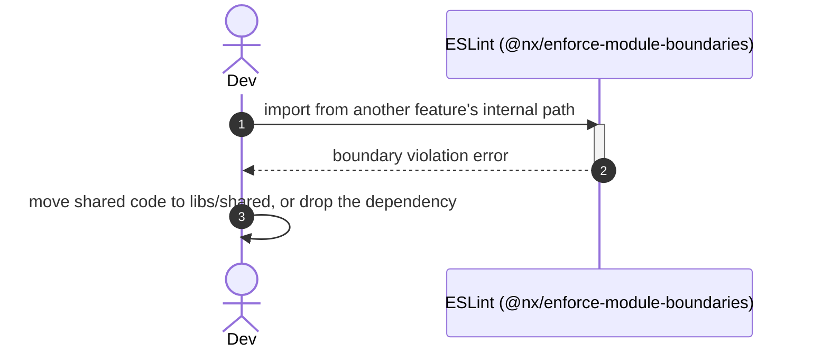

# Goal

- Define a single, predictable Angular workspace structure so any engineer or AI agent can locate and place code without guessing
- Provide the base that later solutions (embeddability, offline-first, lazy loading, logging) extend rather than redefine
- Make architectural boundaries between features enforceable by tooling, not only by code review

# Capabilities

- Low coupling between business features via enforced module boundaries
- `nx affected` runs CI tasks only for projects impacted by a change, instead of the whole workspace
- A single, greppable place to look for "where does X live" for both humans and AI agents
- A dependency graph (`nx graph`) that reflects the real architecture, not just folder conventions
- A structure that the "Встраиваемость платформы" and "Offline-first" solutions can extend without reshaping the base

# Core Principles

- Nx workspace is the single source of truth for dependencies between projects — no implicit coupling outside what Nx tags allow
- `apps/` are deployable units, `libs/` are reusable code — nothing else lives at the top level
- One Nx project = one responsibility (one feature's UI, one feature's data-access, or one shared concern)
- Every business feature is split into at least a `feature` lib and a `data-access` lib from the start
- Every lib exposes a narrow public API through a single `index.ts` barrel; internals are never imported directly
- Boundaries between features/layers are enforced by Nx tags (`type:*`, `scope:*`) checked via `@nx/enforce-module-boundaries`, not by convention alone

# Adr

- [[adr/nx-vs-angular-cli-workspace.md|Nx monorepo instead of plain Angular CLI workspace]]
  - Selected variant: Nx monorepo — chosen for affected-based builds, enforced module boundaries, and readiness for the planned embeddability (Module Federation) and offline-first extensions

# Requirements

SOLUTION:
- None — this is the base solution for the architecture graph

NPM:
- nx / @nx/angular
  - Workspace generators, `project.json` graph, `nx affected`/`nx run-many` task running
- @nx/eslint-plugin
  - `@nx/enforce-module-boundaries` rule — enforces the `type:*`/`scope:*` tag taxonomy defined in [[./Implementation/Repository.create.md]]

# Template Skill Mutations

REPOSITORY:
- [[./Implementation/Repository.create.md|Repository]] - create - define the `apps/libs` layout, the `type:*`/`scope:*` tag taxonomy, and the module-boundary allow-list

No project- or artifact-level (component/service/etc.) implementation files are introduced by this solution — it only establishes workspace-level structure. Individual features created later will follow the `{feature}/feature` + `{feature}/data-access` split defined in [[./Implementation/Repository.create.md]], with their own Project/Class-level implementation files written as part of the solutions that create them.

# Workflow

## Bootstrap the workspace (happy path)

1. Engineer creates an Nx workspace with the Angular preset.
2. `apps/platform-shell` is generated as the single deployable unit, tagged `type:app`, `scope:platform`.
3. `libs/shared/ui` and `libs/shared/util` are generated, tagged `type:ui`/`type:util` with `scope:shared`.
4. `@nx/enforce-module-boundaries` allow-list from [[./Implementation/Repository.create.md]] is configured in the root ESLint config.
5. CI is configured to run `nx affected -t lint,test,build` instead of `nx run-many` on the whole workspace.

## Add a new business feature (happy path)

1. Engineer scaffolds `libs/{feature}/feature` and `libs/{feature}/data-access`, tagged `type:feature`/`type:data-access` with `scope:{feature}`.
2. `feature` lib is wired into `apps/platform-shell` routing (lazy — see the future "Lazy loading routing" solution).
3. Public API of both libs is limited to their `index.ts`.
4. Lint passes with zero `enforce-module-boundaries` violations.

## Boundary violation (failure path)

1. Engineer imports a component from another feature's internal path (bypassing `index.ts`), or imports one `type:feature` project from another directly.
2. `@nx/enforce-module-boundaries` fails the lint step in CI.
3. Engineer either exposes the needed piece through `libs/shared/ui`/`libs/shared/util`, or reconsiders the design to avoid the direct feature-to-feature dependency.

## Cross-cutting: affected-based CI

1. A commit touches only `libs/orders/feature`.
2. `nx affected -t test` computes the dependency graph and runs tests only for `orders-feature` and any project that depends on it.
3. Unrelated features (e.g. `libs/billing/*`) are skipped, keeping CI fast regardless of workspace size.

# Rules

## MUST
- [[./Implementation/Repository.create.md#MUST|Repository.create]]

## SHOULD
- [[./Implementation/Repository.create.md#SHOULD|Repository.create]]

## MUST NOT
- [[./Implementation/Repository.create.md#MUST NOT|Repository.create]]

# Anti-patterns

- [[./Implementation/Repository.create.md|See Repository.create.md for the full list]] — two features importing each other directly, business logic creeping into `apps/platform-shell`, and single flat feature libs instead of the `feature`/`data-access` split.

# Check list

- [ ] `nx graph` shows only the dependencies allowed by the [[./Implementation/Repository.create.md|tag taxonomy]]
- [ ] Every project under `/apps` and `/libs` has both a `type:*` and a `scope:*` tag
- [ ] `nx run-many -t lint` passes with zero `@nx/enforce-module-boundaries` violations
- [ ] CI is configured to use `nx affected`, not a full `nx run-many` on every commit
- [ ] `apps/platform-shell` contains no HTTP calls, no business state, no feature-specific components
