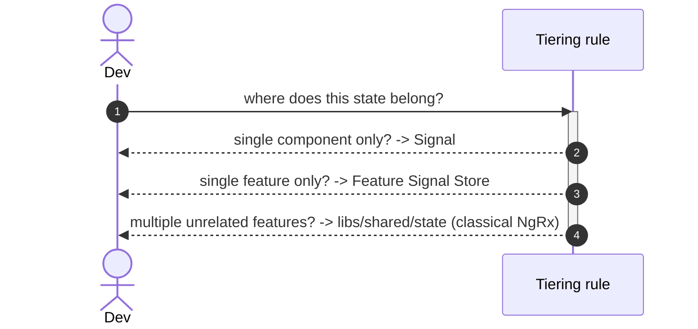

# Goal

- Give every piece of application state an unambiguous home based on its actual scope, instead of one tool stretched to fit every case
- Keep feature-level state colocated with its owning feature, consistent with the module boundaries from solution #1
- Give global/cross-cutting state (auth, notifications, offline-sync) the auditability and effect-based retry/conflict handling it needs, since the planned offline-sync solution builds directly on this

# Capabilities

- No NgRx boilerplate for purely local UI state
- Feature-level state stays encapsulated inside its owning feature's `feature` lib, with no cross-feature state leakage
- A single, auditable source of truth for auth/notifications/offline-sync, safe to build the future offline-sync solution on top of
- A clear, teachable rule for "which tier does this state belong to" instead of ad hoc decisions per feature

# Core Principles

- **Component-local state** (dialog visibility, selected tab, form draft, component-scoped loading flags) is a plain Angular Signal on the component — no store of any kind
- **Feature-level state** (data and UI state owned by one feature) is an NgRx Signal Store, colocated inside that feature's `libs/{feature}/feature` project
- **Global/cross-cutting state** (auth session, notifications, offline-sync queue — read or dispatched by more than one unrelated feature) is a classical NgRx Store slice inside `libs/shared/state`
- State is promoted from a lower tier to a higher one only when a second, unrelated consumer genuinely needs it — never preemptively
- A feature store or component never duplicates global state locally; it always reads global state through `libs/shared/state` selectors

# Adr

- [[adr/state-management-tiering.md|Three-tier state management: Signals / NgRx Signal Store / classical NgRx Store]]
  - Selected variant: three-tier — chosen to match each tier's tooling cost to its actual state complexity, and to preserve NgRx's auditability and effect-based retry/conflict handling specifically for auth and offline-sync

# Requirements

SOLUTION:
- [[../solution-repository-structure.skill/solution-repository-structure.skill.md|Структура репозитория (база)]]
  - [[../solution-repository-structure.skill/Implementation/Repository.create.md|libs/{feature}/feature]] - feature-level Signal Stores are colocated here

NPM:
- @ngrx/signals
  - Feature-level Signal Stores (`libs/{feature}/feature`)
- @ngrx/store, @ngrx/effects
  - Global/cross-cutting state slices (`libs/shared/state`)

# Template Skill Mutations

REPOSITORY:
- [[./Implementation/Repository.extend.md|Repository]] - extend - add `libs/shared/state`, the `type:store` tag, and the module-boundary rules for global state
PROJECT:
- [[./Implementation/GlobalStore/shared-state.project.create.md|libs/shared/state]] - create - host classical NgRx slices for auth, notifications, offline-sync
  - [[./Implementation/GlobalStore/shared-state.project.create/auth.store.ts.create.md|auth.store.ts]] - create - auth session slice (actions/reducer/effects/selectors)
- [[./Implementation/FeatureStore/{Feature}.project.extend.md|{Feature}/feature (generic pattern)]] - extend - add a feature-level Signal Store
  - [[./Implementation/FeatureStore/{Feature}.project.extend/{feature}.store.ts.create.md|{feature}.store.ts]] - create - feature-level Signal Store pattern, applied by any future feature-owning solution
- [[./Implementation/LocalState/{component-name}.component.ts.extend.md|{component-name} (generic pattern)]] - extend - component-local state via plain Signals, applied to any component

Only the `auth` slice inside `libs/shared/state` is fully specified by this solution, as a concrete worked example. The `notifications` and `offline-sync` slices follow the same structural pattern (see [[./Implementation/GlobalStore/shared-state.project.create.md]]) and will be filled in by the solutions that actually introduce them.

# Workflow

## Deciding where new state belongs (happy path)

1. Ask: is this state read/written by exactly one component (and optionally its direct children)? → plain Signal on the component.
2. Otherwise, ask: is this state owned by exactly one feature? → NgRx Signal Store inside that feature's `feature` lib.
3. Otherwise (more than one unrelated feature needs to read or dispatch it) → classical NgRx Store slice inside `libs/shared/state`.

## Feature needs a cross-cutting value (happy path)

1. A feature Signal Store needs the current user (auth) to decide what to render.
2. Instead of duplicating a "current user" field locally, the feature store injects and reads `selectCurrentUser` from `libs/shared/state`'s auth slice.
3. If the session expires, the auth slice's state changes once, and every feature reading the shared selector reflects it — no manual synchronization needed.

## State misplacement (failure path / anti-pattern)

1. A feature store starts caching a copy of the current user locally "for convenience."
2. On logout, the global auth slice clears its state, but the feature's local copy does not update automatically.
3. The feature renders as if the user is still logged in — a divergence bug caused by skipping the tiering rule.
4. Fix: remove the local copy, read `selectCurrentUser` from `libs/shared/state` directly wherever it's needed.

# Rules

## MUST
- [[./Implementation/Repository.extend.md#MUST|Repository.extend]]
- [[./Implementation/GlobalStore/shared-state.project.create.md#MUST|GlobalStore/shared-state.project.create]]
  - [[./Implementation/GlobalStore/shared-state.project.create/auth.store.ts.create.md#MUST|auth.store.ts.create]]
- [[./Implementation/FeatureStore/{Feature}.project.extend/{feature}.store.ts.create.md#MUST|{feature}.store.ts.create]]
- [[./Implementation/LocalState/{component-name}.component.ts.extend.md#MUST|{component-name}.component.ts.extend]]

## SHOULD
- [[./Implementation/FeatureStore/{Feature}.project.extend/{feature}.store.ts.create.md#SHOULD|{feature}.store.ts.create]]

## MUST NOT
- [[./Implementation/Repository.extend.md#MUST NOT|Repository.extend]]
- [[./Implementation/GlobalStore/shared-state.project.create.md#MUST NOT|GlobalStore/shared-state.project.create]]
  - [[./Implementation/GlobalStore/shared-state.project.create/auth.store.ts.create.md#MUST NOT|auth.store.ts.create]]
- [[./Implementation/LocalState/{component-name}.component.ts.extend.md#MUST NOT|{component-name}.component.ts.extend]]

# Anti-patterns

- [[./Implementation/Repository.extend.md|See Repository.extend.md]] — adding feature-specific slices to `libs/shared/state`.
- [[./Implementation/GlobalStore/shared-state.project.create/auth.store.ts.create.md|See auth.store.ts.create.md]] — a feature caching auth state locally instead of selecting from `shared-state`.
- [[./Implementation/FeatureStore/{Feature}.project.extend/{feature}.store.ts.create.md|See {feature}.store.ts.create.md]] — a feature store re-implementing cross-cutting state locally.
- [[./Implementation/LocalState/{component-name}.component.ts.extend.md|See {component-name}.component.ts.extend.md]] — creating a feature or global store for state only one component ever reads.

# Check list

- [ ] No feature Signal Store duplicates state already available from `libs/shared/state`
- [ ] No component-local Signal has been unnecessarily promoted to a feature or global store
- [ ] `libs/shared/state` contains only genuinely global/cross-cutting slices (auth, notifications, offline-sync, and similar)
- [ ] Every feature-level Signal Store lives inside that feature's own `libs/{feature}/feature` project, not in a shared location
- [ ] `@nx/enforce-module-boundaries` passes with the extended allow-list from [[./Implementation/Repository.extend.md]]
