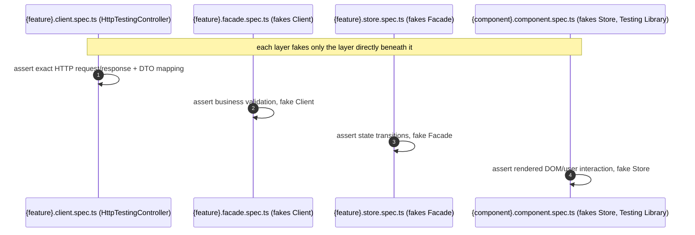

# Goal

- Standardize on Vitest and Playwright, matching Angular's own current tooling direction
- Give every architectural layer (Client, Facade, Signal Store, component) a matching, well-scoped test pattern
- Eliminate the risk of duplicated, inconsistent HTTP mocks by giving each mocking tool exactly one layer it belongs to

# Capabilities

- Fast, ESM-native unit/component test runs via Vitest
- Reliable, multi-browser e2e coverage via Playwright, with strong debugging tools (trace viewer, video capture) for CI failures
- A single source of truth for what a given HTTP request/response looks like (the Client's own `HttpTestingController` tests) — no other test layer re-asserts or re-mocks the same request differently
- Component tests that verify user-facing behavior (via Testing Library) rather than coupling to internal implementation details

# Core Principles

- Non-DOM units (Client, Facade, Signal Store, plain services) are tested via `TestBed`, faking the layer directly beneath the unit under test — never skipping a layer, never reaching further down than necessary
- Components are tested via Angular Testing Library, interacting through the rendered DOM (roles, labels) exactly as a user would, never through `fixture.componentInstance`/`debugElement` internals
- `HttpTestingController` is used only inside a feature's own `{feature}.client.ts` tests — nowhere else
- MSW is reserved for tests that deliberately span multiple layers (Signal Store → Facade → Client → network), and may double as shared mocks for Storybook/local dev tooling
- End-to-end tests (Playwright) are reserved for a small number of critical, cross-cutting user journeys — not a substitute for unit/component/integration coverage
- Coverage thresholds are enforced in CI as an error, following the same enforcement pattern already established for bundle budgets in the "Lazy loading routing" solution

# Adr

- [[skills/angular/architecture/artifacts/solution-testing.skill/adr/test-runner-choice|Vitest instead of Jest or Karma/Jasmine]]
  - Selected variant: Vitest — Angular's own current default, matching the esbuild-based build pipeline already in use
- [[skills/angular/architecture/artifacts/solution-testing.skill/adr/e2e-framework-choice|Playwright instead of Cypress]]
  - Selected variant: Playwright — true multi-browser coverage (including WebKit) and better fit for scenarios involving federated embeddable modules
- [[skills/angular/architecture/artifacts/solution-testing.skill/adr/testing-layers-and-mocking|TestBed for non-DOM units, Testing Library for components; HttpTestingController only at the Client, MSW only for cross-layer integration tests]]
  - Selected variant: this layered strategy — chosen to give each HTTP mock exactly one source of truth and to keep component tests decoupled from implementation details

# Requirements

SOLUTION:
- [[../solution-api-http-layer.skill/solution-api-http-layer.skill.md|API/HTTP-слой]]
  - Test patterns here directly test the Facade/Client structure that solution establishes
- [[../solution-state-management.skill/solution-state-management.skill.md|State management]]
  - Signal Store test pattern here directly tests the store methods that solution establishes

NPM:
- vitest, @testing-library/angular, @testing-library/user-event
  - Unit/component test runner and DOM-level testing utilities
- @playwright/test
  - End-to-end testing framework
- msw
  - Network-level mocking for genuine cross-layer integration tests only, per [[skills/angular/architecture/artifacts/solution-testing.skill/adr/testing-layers-and-mocking|Testing Layers And Mocking ADR]]

# Template Skill Mutations

REPOSITORY:
- [[./Implementation/Repository.extend.md|Repository]] - extend - add `apps/platform-shell-e2e`, enforce Vitest/Playwright workspace-wide, enforce coverage thresholds in CI, add the `type:e2e` tag

Artifact-level (generic patterns):
- [[./Implementation/Testing/{feature}.client.spec.ts.create.md|{feature}.client.spec.ts]] - create - Client unit test via `TestBed` + `HttpTestingController`
- [[./Implementation/Testing/{feature}.facade-and-store.spec.ts.create.md|{feature}.facade.spec.ts / {feature}.store.spec.ts]] - create - Facade/Signal Store unit tests, each faking the layer directly beneath it
- [[./Implementation/Testing/{component-name}.component.spec.ts.create.md|{component-name}.component.spec.ts]] - create - component test via Testing Library, faking the Signal Store
- [[./Implementation/Testing/{feature}.integration.spec.ts.create.md|{feature}.integration.spec.ts]] - create - cross-layer integration test via MSW, reserved for genuine multi-layer scenarios
- [[./Implementation/Testing/{scenario-name}.e2e.spec.ts.create.md|{scenario-name}.e2e.spec.ts]] - create - Playwright end-to-end scenario in `apps/platform-shell-e2e`

# Workflow

## Testing a new feature end-to-end (happy path)

1. `{feature}.client.ts` gets a `TestBed` + `HttpTestingController` spec asserting exact request/response shape and DTO mapping — the one and only place this endpoint's HTTP contract is verified in detail.
2. `{feature}.facade.ts` gets a `TestBed` spec faking the Client, verifying business validation and orchestration.
3. `{feature}.store.ts` (Signal Store) gets a `TestBed` spec faking the Facade, verifying state transitions (`loading`, data, `error`).
4. The feature's components get Testing Library specs faking the Signal Store, verifying rendered behavior from a user's point of view.
5. If a genuinely cross-layer scenario needs verifying as a whole, one MSW-based integration spec covers it — not a substitute for the layer-specific tests above.
6. A small number of critical user journeys involving this feature get Playwright e2e coverage in `apps/platform-shell-e2e`.

## Misusing a mocking tool at the wrong layer (anti-pattern, caught in review)

1. An engineer, under time pressure, uses `HttpTestingController` inside a Signal Store test instead of faking the Facade.
2. This is flagged in review against [[./Implementation/Repository.extend.md#MUST]] — the store test now knows about the Client's HTTP contract, a layer it shouldn't need to know about, and duplicates what the Client's own test already verifies.
3. Fix: replace the `HttpTestingController` usage with a faked Facade, per [[./Implementation/Testing/{feature}.facade-and-store.spec.ts.create.md]].

# Rules

## MUST
- [[./Implementation/Repository.extend.md#MUST|Repository.extend]]
- [[./Implementation/Testing/{feature}.client.spec.ts.create.md#MUST|{feature}.client.spec.ts.create]]
- [[./Implementation/Testing/{feature}.facade-and-store.spec.ts.create.md#MUST|{feature}.facade-and-store.spec.ts.create]]
- [[./Implementation/Testing/{component-name}.component.spec.ts.create.md#MUST|{component-name}.component.spec.ts.create]]
- [[./Implementation/Testing/{feature}.integration.spec.ts.create.md#MUST|{feature}.integration.spec.ts.create]]
- [[./Implementation/Testing/{scenario-name}.e2e.spec.ts.create.md#MUST|{scenario-name}.e2e.spec.ts.create]]

# Anti-patterns

- [[./Implementation/Repository.extend.md|See Repository.extend.md]] — using `HttpTestingController` outside a Client spec; lowering a coverage threshold to silence a CI failure.
- [[./Implementation/Testing/{component-name}.component.spec.ts.create.md|See {component-name}.component.spec.ts.create.md]] — asserting against `fixture.componentInstance` instead of the rendered DOM; defaulting to `getByTestId` over accessible queries.
- [[./Implementation/Testing/{feature}.facade-and-store.spec.ts.create.md|See {feature}.facade-and-store.spec.ts.create.md]] — a Signal Store test faking the Client instead of the Facade, skipping a layer.
- [[./Implementation/Testing/{feature}.integration.spec.ts.create.md|See {feature}.integration.spec.ts.create.md]] — reaching for the MSW integration pattern as the default way to test a Facade or Store.
- [[./Implementation/Testing/{scenario-name}.e2e.spec.ts.create.md|See {scenario-name}.e2e.spec.ts.create.md]] — writing a large number of fine-grained e2e tests instead of pushing detailed coverage down to cheaper layers.

# Check list

- [ ] Every project runs its tests via Vitest, none via Karma or Jest
- [ ] `apps/platform-shell-e2e` runs Playwright specs for a small set of critical user journeys
- [ ] `HttpTestingController` appears only in `{feature}.client.spec.ts` files
- [ ] Every Facade/Signal Store test fakes only the layer directly beneath it
- [ ] Every component test interacts through the rendered DOM via Testing Library, never `fixture.componentInstance`
- [ ] CI enforces a coverage threshold as an error, not a warning
