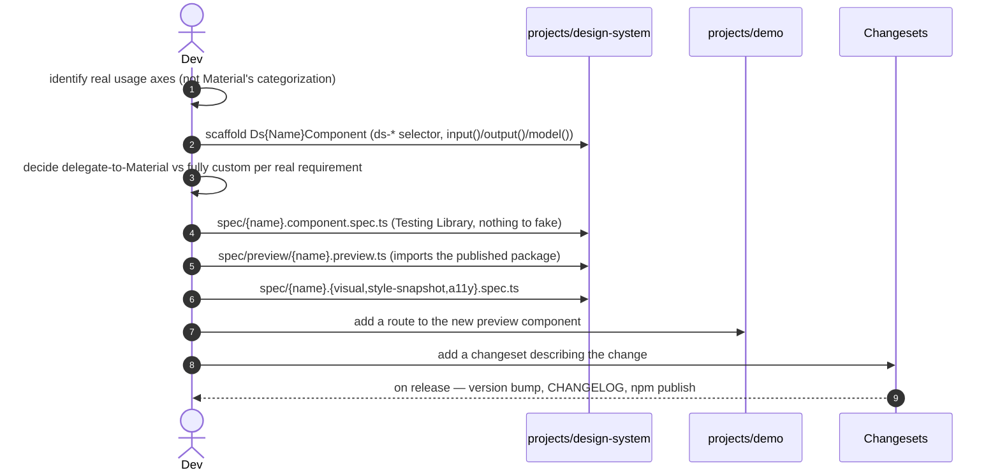

> **The single plateau of the `design-system` catalog** — built from scratch, composing all four common solutions (`solution-design-system-structure`, `-tokens`, `-components`, `-ui-testing`). No VPs ([variability map](skills/angular/architecture/v3.1/design-system/variability-map.md)); VP1 `MultiTenantTheming` is aspirational. This lives in **its own repository**, separate from the Nx platform monorepo — it is a standalone product (an npm package), not a stage the monolith chain passes through. `plateau-online-monolith` onward, `plateau-platform-host`, and `plateau-embeddable-app` all consume the package produced here.

# Core Principles

- **Angular CLI, not Nx.** A two-project repo does not pay for Nx's affected-builds / boundary-enforcement / federation generators.
- **The library is versioned and released independently of every consumer, via Changesets** — a misclassified breaking change is far less likely to slip out under a non-major version.
- **Material's own M3 `--mat-sys-*` tokens are consumed directly** wherever they model a concept; a small `--ds-*` layer exists only for genuine gaps (status/priority colour, spacing, radius). Every colour token uses native `light-dark()` — no JavaScript theme toggle.
- **Every component fully encapsulates Angular Material** — its own `ds-*` selector, a signal-based (`input()`/`output()`/`model()`) API designed around real usage axes, and a per-component decision to delegate to Material internally or build fully custom. No Material selector, input, or type reaches the public surface — checked against the *built* `types/*.d.ts`, since ng-packagr emits `protected` members too.
- **A single, fixed brand palette everywhere** — multi-tenant theming is deferred until a real requirement appears.
- **Every component is tested at four independent layers** — behavioural (Testing Library, nothing to fake), visual (Playwright screenshot vs `projects/demo`), style-snapshot (curated computed-CSS properties, paired with the screenshot), accessibility (`@axe-core/playwright`) — with no Storybook, no Chromatic.

# Capabilities

- **packaging & release** — plain Angular CLI multi-project workspace (library + demo), ng-packagr build producing Angular Package Format output, Changesets-driven versioning and CHANGELOG; the `demo` project is never published.
- **theming** — one `mat.theme()` at the root, native `light-dark()` for light/dark with no JS, `--ds-*` tokens for the handful of concepts Material doesn't model. Shipped as package assets (`design-system/styles/theme`, `.../custom-tokens`).
- **components** — signal-based, fully encapsulated `ds-*` components; internal implementation decided per component (delegate to Material vs custom). Form controls implement `ControlValueAccessor`.
- **preview** — every shipped component gets a live example page in `projects/demo` (one route per component, deep-linkable per state) instead of Storybook. Preview components are authored in the library under `spec/preview/` and import the *published* package.
- **testing** — four spec layers per component under `src/lib/{component}/spec/`, a shared `readVisualStyleProperties` helper, Playwright baselines committed to `spec/snapshot/`.

# Structure

See [`structure/`](structure/plateau-design-system--repo-design-system.skill.md) — [`repo-design-system`](structure/plateau-design-system--repo-design-system.skill.md) (the CLI workspace, ng-packagr, Changesets, workspace-level rules) + two projects, [`project-design-system`](structure/design-system/plateau-design-system--project-design-system.skill.md) (the publishable library) and [`project-demo`](structure/demo/plateau-design-system--project-demo.skill.md) (the preview app / visual-a11y target), plus class skills: [`class-theme`](structure/design-system/classes/plateau-design-system--class-theme.skill.md), [`class-custom-tokens`](structure/design-system/classes/plateau-design-system--class-custom-tokens.skill.md), [`class-component-name`](structure/design-system/classes/plateau-design-system--class-component-name.skill.md), [`class-read-visual-style-properties`](structure/design-system/classes/plateau-design-system--class-read-visual-style-properties.skill.md), and the four spec patterns ([component-spec](structure/design-system/classes/plateau-design-system--class-component-name-component-spec.skill.md), [visual-spec](structure/design-system/classes/plateau-design-system--class-component-name-visual-spec.skill.md), [style-snapshot-spec](structure/design-system/classes/plateau-design-system--class-component-name-style-snapshot-spec.skill.md), [a11y-spec](structure/design-system/classes/plateau-design-system--class-component-name-a11y-spec.skill.md)).

# Example

See [`example/`](plateau-design-system.skill/example/) — a plain Angular CLI workspace: `projects/design-system` with `styles/theme.scss` + `styles/custom-tokens.scss`, `DsButtonComponent` (delegates to `matButton`) and `DsStatusChipComponent` (fully custom, `--ds-color-status-*`), each with all four spec layers + a `spec/preview/` component; `projects/demo` consumes the built package and routes to the previews; Changesets config with `demo` ignored. **`ng build design-system` (Angular Package Format) + `ng test design-system` (Vitest, 2 files / 7 tests) + `ng build demo` (production) + `tsc -p tsconfig.e2e.json` (Playwright specs typecheck) all green;** `grep -r "@angular/material" dist/design-system/types/` returns nothing. The Playwright runner can't fork workers in the sandbox this was built in, so `spec/snapshot/` baselines are generated where CI runs. See the [example README](plateau-design-system.skill/example/README.md) for the catalog corrections this build fed back.

# Intersection registry

Per [`delta-conflict-analysis.md`](skills/angular/architecture/v3.1/delta-conflict-analysis.md) — canonical, no resolver:

- [`design-system-repository`](registry/design-system-repository.md) — `solution-design-system-structure` `.create` + `-tokens` / `-components` / `-ui-testing` `.extend`. `FMN`/`TMN`, `source: ordering-only`, **N = 4 — benign** (a two-project repo where each of its four common solutions adds one distinct, member-disjoint piece — the analogue of `monolith-repository`).

# Usecases

## Add a new component to the library



## A visual regression is caught, then explained

```mermaid
sequenceDiagram
    autonumber
    actor Dev
    participant PW as Playwright
    participant CI
    Dev->>CI: PR with an unintended CSS change to a dark-mode branch
    CI->>PW: run {name}.visual.spec.ts (dark scheme) against projects/demo
    PW-->>CI: fail — pixel diff exceeds threshold
    CI->>PW: run {name}.style-snapshot.spec.ts (paired)
    PW-->>CI: fail — names the exact property: backgroundColor #1565c0 -> #90caf9
    Note over Dev: the behavioural Testing Library spec still passed — DOM unchanged; the style-snapshot says *what* moved before any baseline is updated
```

## A consuming application picks up a release

```mermaid
sequenceDiagram
    autonumber
    actor App as Consuming app (monolith / platform-host / embeddable)
    participant NPM as design-system (npm)
    App->>NPM: bump the design-system dependency
    App->>App: @use 'design-system/styles/theme' + '.../custom-tokens' once at the root
    App->>App: use ds-* components; no Angular Material knowledge required
    Note over App,NPM: a breaking change only reaches App at the version it explicitly opts into — Changesets flagged it major
```
