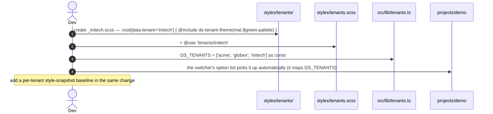
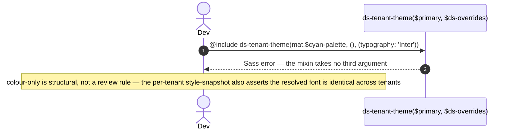

> **The `design-system` catalog's `MultiTenantTheming` plateau (VP1 = Yes).** Composes [`plateau-design-system`](skills/angular/architecture/v3.1/design-system/plateau/plateau-design-system/plateau-design-system.skill/plateau-design-system.skill.md) (all four common solutions) and adds **one** solution — [`solution-design-system-multi-tenant-theming`](skills/angular/architecture/v3.1/solutions/solution-design-system-multi-tenant-theming.skill/solution-design-system-multi-tenant-theming.skill.md) of the [design-system Variability Map](skills/angular/architecture/v3.1/design-system/variability-map.md). **No new project.** Still a separate repository — a plain Angular CLI multi-project workspace, published as an independently versioned npm package.

# What this plateau adds over its parent

The parent is the design system as an ng-packagr npm package — one `mat.theme()`, a `--ds-*` token layer, signal-based `ds-*` components that fully encapsulate Angular Material, an unpublished `projects/demo`, Changesets, four-layer component testing. Read that skill for the baseline. `plateau-multi-tenant-design-system` adds one capability:

**VP1 — MultiTenantTheming (`solution-design-system-multi-tenant-theming`):**

- **A `styles/tenants/` layer**:
  - **`_tenant-theme.scss`** — `@mixin ds-tenant-theme($primary, $ds-overrides)`, the **one place** `mat.theme()` is called for a tenant. It passes only the `color` key (so `styles/theme.scss` stays the sole source of typography, density, and Material base styles) with `theme-type: color-scheme` hard-coded (so `light-dark()` still resolves the scheme inside a tenant).
  - **`_{tenant}.scss`** — one file per tenant, a `:root[data-tenant='<id>']` block that `@include`s the mixin with the tenant's Material palette and any tenant-specific `--ds-color-*` overrides.
  - **`tenants.scss`** — the aggregator, shipped as a `ng-package.json` asset (alongside the `styles/tenants/` directory), consumed as `@use 'design-system/styles/tenants'` **after** `theme`.
- **`src/lib/tenants.ts`** — `DS_TENANTS` (`as const` tuple) + `DsTenant` union, exported from `public-api`. The valid-tenant contract: the consuming app sets `document.documentElement.dataset.tenant` to a `DsTenant`, not a free string.
- **The base `theme.scss` is unchanged** — it is the no-`data-tenant` default brand.
- **Tenant selection stays a consuming-app concern** — the library ships no runtime `applyTenant()`, no per-tenant CSS bundle. `projects/demo` carries a `<select>` tenant switcher purely to model and exercise that responsibility.

# Core Principles

- A tenant is a **colour palette** scoped to `:root[data-tenant='<id>']`, emitted through the shared `ds-tenant-theme` mixin — never typography, density, spacing, or radius. See [`tenant-palette-scope`](skills/angular/architecture/v3.1/solutions/solution-design-system-multi-tenant-theming.skill/adr/tenant-palette-scope.md).
- The active tenant is picked by a CSS `[data-tenant]` attribute the consuming app sets — no JavaScript rewrites `--mat-sys-*` / `--ds-*` values, no per-tenant compiled bundle. See [`tenant-resolution-strategy`](skills/angular/architecture/v3.1/solutions/solution-design-system-multi-tenant-theming.skill/adr/tenant-resolution-strategy.md).
- `styles/theme.scss` is unchanged and is the no-attribute default; typography / density / base styles are emitted once, there.
- Every tenant colour uses `light-dark()`; the scheme still resolves inside whichever tenant is active.
- Components never learn about tenants — they consume `--mat-sys-*` / `--ds-*`; only the values behind the tokens vary under the attribute.
- A new tenant is three edits in one change: `_<id>.scss`, a `@use` line in `tenants.scss`, an entry in `DS_TENANTS`.

# Capabilities

- **swappable brands** — the package ships a `tenants` stylesheet; a consuming app `@use`s it once and sets one `<html>` attribute to switch.
- **a typed tenant contract** — `DS_TENANTS` / `DsTenant` exported; `data-tenant` is set against a known union.
- **colour-only variation, structurally** — a tenant file physically cannot change the font scale or density (the mixin exposes no such parameter); brand consistency on everything but colour is guaranteed, not reviewed.
- **light/dark preserved per tenant**, no JS.
- **federation-friendly** — the tenants stylesheet is part of the one shared design-system package; a federated remote inherits the host's `<html>` attribute and therefore the host's active tenant, for free.
- Everything the parent plateau provides — ng-packagr APF packaging, Changesets releases, `--mat-sys-*`/`--ds-*` token consumption, full Material encapsulation checked against the built `.d.ts`, four-layer component testing with no Storybook/Chromatic.

# Structure

See [`structure/`](structure/plateau-multi-tenant-design-system--repo-multi-tenant-design-system.skill.md) — the parent plateau's workspace skills carried forward, with `solution-design-system-multi-tenant-theming` merged into the repo skill and `projects/design-system` ([`project-design-system`](structure/design-system/plateau-multi-tenant-design-system--project-design-system.skill.md)): the new `styles/tenants/` layer ([`class-tenant-theme`](structure/design-system/classes/plateau-multi-tenant-design-system--class-tenant-theme.skill.md), [`class-tenant-palette`](structure/design-system/classes/plateau-multi-tenant-design-system--class-tenant-palette.skill.md)) and the [`class-tenants`](structure/design-system/classes/plateau-multi-tenant-design-system--class-tenants.skill.md) `DsTenant` module; plus [`project-demo`](structure/demo/plateau-multi-tenant-design-system--project-demo.skill.md) gaining the tenant switcher. [`class-theme`](structure/design-system/classes/plateau-multi-tenant-design-system--class-theme.skill.md) is noted unchanged. No new project.

# Example

See [`example/`](plateau-multi-tenant-design-system.skill/example/) — the parent Angular CLI workspace, evolved: `projects/design-system` gains `styles/tenants/` (`_tenant-theme.scss` + `_acme.scss` + `_globex.scss` + `tenants.scss`), `src/lib/tenants.ts` (+ spec), the `ng-package.json` asset entries and the `DsTenant` export; `projects/demo` gains the `<select>` tenant switcher and `@use 'design-system/styles/tenants'`; `status-chip` gains a per-tenant style-snapshot spec. **`ng build design-system` (APF — `styles/tenants/**` shipped, `DsTenant` in the typings, no Material leak) + `ng test design-system` (Vitest, 3 files / 9 tests) + `ng build demo` (root CSS carries `:root[data-tenant='acme']` / `[data-tenant='globex']`) + `tsc -p tsconfig.e2e.json` all green.** The Playwright runner can't fork workers in the sandbox this was built in, so `spec/snapshot/` baselines are generated where CI runs. See the [example README](plateau-multi-tenant-design-system.skill/example/README.md) for the catalog corrections this build fed back (chief among them: the tenants asset must resolve as `styles/tenants.scss`, and "a tenant varies colour only" is now an assertion in the per-tenant spec).

# Intersection registry

Per [`delta-conflict-analysis.md`](skills/angular/architecture/v3.1/delta-conflict-analysis.md) — canonical, no resolver:

- [`design-system-repository`](registry/design-system-repository.md) — `solution-design-system-structure` `.create` + `-tokens` / `-components` / `-ui-testing` / **`-multi-tenant-theming`** `.extend`. `FMN`/`TMN`, `source: ordering-only` (VP1 depends on `tokens`). **N = 5 here — benign** (VP1's contribution is entirely in new files under a new `styles/tenants/` directory + `src/lib/tenants.ts`; `styles/theme.scss` is untouched — it structurally cannot collide with the base token/component/test conventions).

# Usecases

## A consuming application enables tenants

```mermaid
sequenceDiagram
    autonumber
    actor App as Consuming app
    participant HTML as <html>
    participant CSS as design-system/styles/tenants
    participant Cmp as ds-* component
    App->>App: @use 'design-system/styles/theme'; then @use '.../tenants';
    App->>App: resolve tenant for this user (claim / API / subdomain)
    App->>HTML: document.documentElement.dataset.tenant = 'globex'  (typed DsTenant)
    HTML->>CSS: :root[data-tenant='globex'] wins the cascade
    CSS-->>Cmp: --mat-sys-primary now the globex value (light-dark() still resolves the scheme)
    Note over Cmp: component source unchanged — it only reads --mat-sys-* / --ds-*
```

## A new tenant is added



## A tenant tries to change the font (rejected at the type level)


