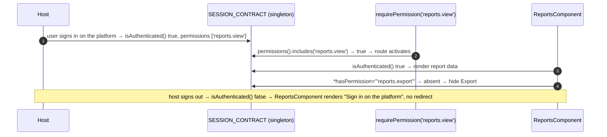
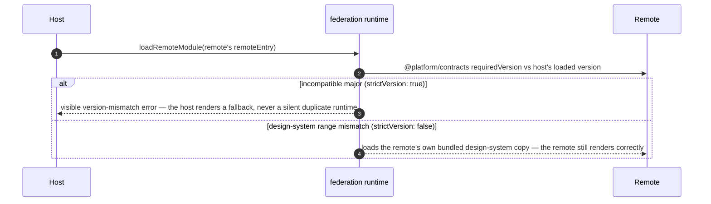

> **The `embeddable-app` catalog's single plateau — built from scratch (`parent_plateaus: []`).** A remote is not a continuation of the platform chain: its own internal architecture is unconstrained (the aspirational `RemoteInternalArchitecture` VP would `parent_plateaus` a monolith plateau; not built). This plateau prescribes the common `FederationRemoteContract` plus VP1 `RemoteSessionConsumption` = Yes and VP2 `RemoteDesignSystemConsumption` = Yes (both "near-universal but optional" — the [embeddable-app variability map](skills/angular/architecture/v3.1/embeddable-app/variability-map.md)). A **separate repository**, any tooling — a plain Angular CLI workspace is enough.

# Core Principles

- The remote exposes a Native Federation `remoteEntry` and **one** exposed module (`./Routes` — a `Routes` array).
- Angular and `@platform/contracts` are `singleton: true, strictVersion: true` — host and remote run one runtime, one contract instance.
- The exposed module's routes are **root-relative only** — the host assigns the mount segment; the remote never references it (hierarchical route ownership one level down).
- **No import of `platform-shell` internals in either direction** — the only contract is `@platform/contracts` + the federation boundary.
- **VP1** — session/permission state is read exclusively through `SESSION_CONTRACT`: no login flow, no local session copy; `isAuthenticated() === false` → a not-authenticated state, never a redirect (the host owns login). Authorization is a permission string.
- **VP2** — `design-system` is `singleton: true, strictVersion: false` with this team's accurate `requiredVersion`; a mismatch falls back to a bundled copy and never blocks this remote's deploy.

# Capabilities

- Any team, any workspace tool, ships a mountable remote by satisfying one small contract.
- Independent CI/CD — the remote builds, tests, and deploys on its own schedule.
- A permission-aware UI with zero auth code — one session model shared with the host, permission strings meaning the same everywhere.
- Shares the host's design-system instance when versions align (smaller payload, identical styling), an isolated copy otherwise.

# Structure

See [`structure/`](structure/plateau-embeddable-app--repo-embeddable-app.skill.md) — [`repo-embeddable-app`](structure/plateau-embeddable-app--repo-embeddable-app.skill.md) (the Native Federation remote baseline + the two consumption VPs; one flat app, so there is no dedicated project tier) and class skills [`class-remote-routes`](structure/classes/plateau-embeddable-app--class-remote-routes.skill.md) (the exposed `REMOTE_ROUTES`), [`class-require-permission`](structure/classes/plateau-embeddable-app--class-require-permission.skill.md) (the session-consumption guard), [`class-has-permission-directive`](structure/classes/plateau-embeddable-app--class-has-permission-directive.skill.md) (`*hasPermission`).

# Example

See [`example/`](plateau-embeddable-app.skill/example/) — a **limited trivial remote**. A Native Federation remote (`ng add … --type remote`) exposing `./Routes`; `requirePermission('reports.view')` reading `SESSION_CONTRACT`; a `ReportsComponent` that renders a not-authenticated state when the host session is anonymous and gates an Export button on `*hasPermission="'reports.export'"`; `@platform/contracts` + Angular declared strict singletons. **`ng test` (2 files / 6 tests) + `ng build` (`remoteEntry.json` exposes `./Routes`, shares `@platform/contracts` as a strict singleton) all green.** The full host↔remote `loadRemoteModule` round trip is the platform-host example's federation smoke e2e (written, not run). See the [example README](plateau-embeddable-app.skill/example/README.md).

# Intersection registry

Per [`delta-conflict-analysis.md`](skills/angular/architecture/v3.1/delta-conflict-analysis.md) — canonical, no resolver:

- [`embeddable-repository`](registry/embeddable-repository.md) — `solution-federation-remote` `.create` + `solution-session-consumption` (VP1) / `solution-remote-design-system-consumption` (VP2) `.extend`. `FMN`/`TMN`, `source: ordering-only`, **N = 3 — benign** (the analogue of `monolith-repository` / `design-system-repository`; the `element/repository` retag is recorded in the analysis).

# Usecases

## Scaffold and register a mountable remote

```mermaid
sequenceDiagram
    autonumber
    actor Team
    participant Repo as remote repo (any tooling)
    participant CI
    participant Manifest as platform remotes manifest
    Team->>Repo: federation.config.mjs — name, exposes { './Routes' }, @platform/contracts + Angular strict singletons
    Team->>Repo: remote.routes.ts — REMOTE_ROUTES, root-relative only
    CI->>CI: build → remoteEntry.json ; test ; deploy (own pipeline)
    CI->>Manifest: publish { name, remoteEntryUrl, exposedModule: './Routes' }
    Note over Manifest: the host picks it up on the next manifest refresh — no host rebuild
```

## The remote renders per the host's session



## Version-incompatible contract (failure path)


