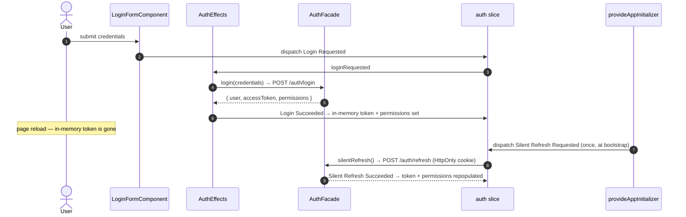
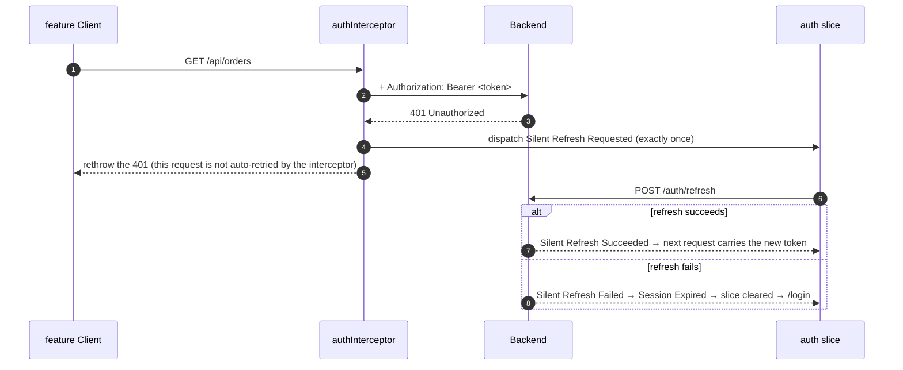
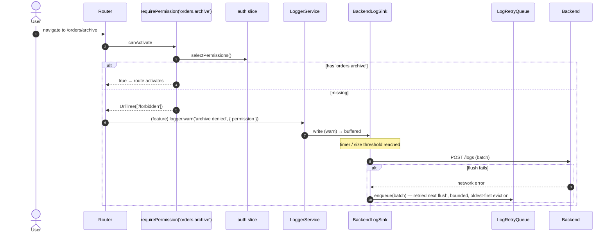

> **Fifth and last plateau of the `monolith` catalog — and [`plateau-platform-host`](skills/angular/architecture/v3.1/platform-host/variability-map.md)'s parent.** Composes [`plateau-offline-full-monolith`](skills/angular/architecture/v3.1/monolith/plateau/plateau-offline-full-monolith/plateau-offline-full-monolith.skill/plateau-offline-full-monolith.skill.md) (online + VP1 + VP4 + VP5) and adds **two** solutions — [`solution-logging-global`](skills/angular/architecture/v3.1/solutions/solution-logging-global.skill/solution-logging-global.skill.md) (**VP6 — BackendLogDelivery**) and [`solution-authentication`](skills/angular/architecture/v3.1/solutions/solution-authentication.skill/solution-authentication.skill.md) (**VP7 — Authentication**) of the [monolith Variability Map](skills/angular/architecture/v3.1/monolith/variability-map.md). VP1–VP7 = Yes; VP8 (PersistedState) is aspirational. Still one deployable unit — Module Federation is `platform-host`, not here.

# What this plateau adds over its parent

The parent chain is the connected app + performance-tuned routing + offline read **and** write resilience (VP5 — with a per-entity `syncStatus` state machine on the feature store's rows, driven by the `ReplayOrchestrator`'s `onReplayStart` / `onReplayResult` callbacks) + console logging. Read those skills for the baseline. `plateau-multiuser-monolith` adds two cross-cutting capabilities:

**VP6 — BackendLogDelivery (`solution-logging-global`):**

- **`BackendLogSink`** joins `ConsoleLogSink` on the existing `LOG_SINKS` multi-provider token — **no `LoggerService` call site changes**. Only `warn` / `error` / `report` reach it; entries are batched and flushed on a timer / size threshold, with a `navigator.sendBeacon` flush on `pagehide`.
- **`LogRetryQueue`** — a Dexie/IndexedDB queue bounded by count **and** age **and** size (each enforced independently, oldest-first eviction). A failed flush is enqueued, never dropped; a retry cycle stops at the first failure.
- **`LoggerService.report()`** — a new level that always reaches `BackendLogSink` regardless of `MIN_LOG_LEVEL` (a routing marker, not a severity), still subject to the never-log-sensitive-data rule.
- **`GlobalErrorHandler`** in `apps/platform-shell` — routes every uncaught exception through `LoggerService.error` with only `message` / `stack`, registered once at the composition root.

**VP7 — Authentication (`solution-authentication`):**

- **An `auth` slice** in `libs/shared/state` (classical NgRx `createFeature`): in-memory `accessToken` (never `localStorage` / `sessionStorage`), `permissions` (strings, never roles), `refreshInProgress`; `selectIsLoggedIn` / `selectCurrentUser` / `selectAccessToken` / `selectPermissions`. Closes delta-conflict Finding 4 (second half).
- **`AuthFacade`** beside the slice — the login / silent-refresh / logout HTTP round trips via `http-core`.
- **`authInterceptor`** — attaches `Authorization: Bearer <token>`; on a 401 dispatches exactly one `Silent Refresh Requested` (never an immediate logout); never intercepts the refresh call itself.
- **Bootstrap silent refresh** — `app.config.ts` dispatches one `Silent Refresh Requested` via `provideAppInitializer`, before any authenticated request. Reload recovery is this flow, never token persistence.
- **`libs/shared/auth-ui`** (new Nx project, `type:store`) — the `requirePermission(permission)` guard factory (`CanActivateFn & CanMatchFn`, redirects to `/forbidden`), the `*hasPermission` structural directive, and the login form + forbidden page mounted at `/login` and `/forbidden`.
- **Feature attachment** — a feature restricts one of its own routes with `canActivate: [requirePermission('...')]` in `{feature}.routes.ts`; a control is gated with `*hasPermission="'...'"`. The shell never centralizes a permission guard.

# Core Principles

- The access token lives **only** in the `auth` slice's in-memory state — reload recovery is silent-refresh-on-bootstrap, never persistent storage. The refresh token is an `HttpOnly` cookie the client never reads.
- Every authorization check is a **permission string**, never a role name — in a guard (`requirePermission`) or a directive (`*hasPermission`). Hiding UI is a convenience; the real boundary is server-side.
- A permission guard is attached at the feature's own route, never in the shell — consistent with hierarchical route ownership.
- `BackendLogSink` is added on the same `LOG_SINKS` seam as `ConsoleLogSink` — no call-site rework. Only `warn` / `error` / `report` are worth the network; a failed flush is retried from a bounded queue, never dropped.
- `GlobalErrorHandler` is a composition-root concern (it *is* the app's `ErrorHandler`), so it lives in `apps/platform-shell`, not `libs/shared/logging`.

# Capabilities

- Users authenticate; the session survives a page reload via a silent refresh, without the token ever touching disk.
- A 401 mid-session triggers one transparent refresh-and-recover before the user sees an error.
- Routes and controls are gated by granular permission strings, reusing one permission model for both.
- `warn` / `error` / `report` logs and every uncaught exception reach the backend, batched, resilient to a brief outage, with no call-site changes.
- Everything the parent chain provides — state tiering + global store, performance-tuned routing, Signal Forms, the Facade/Client data layer, the Workbox SW + `connectivity` slice, the Dexie offline write queue + replay orchestrator, four-layer testing, bundle budgets.

# Structure

See [`structure/`](structure/plateau-multiuser-monolith--repo-multiuser-monolith.skill.md) — the parent chain's workspace skills carried forward, with `solution-logging-global` merged into the repo skill, `apps/platform-shell` ([`class-global-error-handler`](structure/platform-shell/classes/plateau-multiuser-monolith--class-global-error-handler.skill.md)) and `libs/shared/logging` ([`class-backend-log-sink`](structure/shared-logging/classes/plateau-multiuser-monolith--class-backend-log-sink.skill.md), [`class-log-retry-queue`](structure/shared-logging/classes/plateau-multiuser-monolith--class-log-retry-queue.skill.md), [`class-logger-service`](structure/shared-logging/classes/plateau-multiuser-monolith--class-logger-service.skill.md)); and `solution-authentication` merged into `libs/shared/state` ([`class-auth-store`](structure/shared-state/classes/plateau-multiuser-monolith--class-auth-store.skill.md), [`class-auth-interceptor`](structure/shared-state/classes/plateau-multiuser-monolith--class-auth-interceptor.skill.md)), the generic feature routes / feature project / form component skills, and one **new project** [`project-shared-auth-ui`](structure/shared-auth-ui/plateau-multiuser-monolith--project-shared-auth-ui.skill.md) with [`class-has-permission-directive`](structure/shared-auth-ui/classes/plateau-multiuser-monolith--class-has-permission-directive.skill.md) and [`class-permission-guard`](structure/shared-auth-ui/classes/plateau-multiuser-monolith--class-permission-guard.skill.md).

# Example

See [`example/`](plateau-multiuser-monolith.skill/example/) — the parent Nx workspace, evolved: `libs/shared/logging` gains `backend-log-sink.ts` + `log-retry-queue.ts` (Dexie) + `LoggerService.report()`; `apps/platform-shell` gains `global-error-handler.ts`; `libs/shared/state` gains the `auth/` folder (slice + `AuthFacade` + `authInterceptor`); `libs/shared/auth-ui` is a new project (`*hasPermission`, `requirePermission`, login form, forbidden page); `orders.routes.ts` guards an `archive` route and `order-form.component.ts` gates a control with `*hasPermission`. **`npm test` (Vitest, 28 files / 95 tests) + `npm run lint` (12 projects) + `nx build platform-shell --configuration=production` (initial 454 kB) + `nx build-sw platform-shell` (9 files precached) all green.** See the [example README](plateau-multiuser-monolith.skill/example/README.md) for the five catalog corrections this build fed back.

# Intersection registry

Per [`delta-conflict-analysis.md`](skills/angular/architecture/v3.1/delta-conflict-analysis.md) — all canonical, no resolvers:

- [`shared-state-project`](registry/shared-state-project.md) — `solution-global-store` `.create` + `offline-first` / `offline-sync` / **`authentication`** `.extend` (the `auth` slice), `TMN`, `source: constraint` (every slice-adding VP requires VP2). **N = 4 here — benign** (the `store.config.ts` seam extended once per distinct slice). **Closes delta-conflict Finding 4** — `solution-authentication` now carries `Implementation/GlobalStore/shared-state.project.extend.md`.
- [`shared-logging-project`](registry/shared-logging-project.md) — `solution-logging-base` `.create` + `solution-logging-global` `.extend`, `TMN`, `source: constraint` (VP6 requires the base logging seam). Canonical — `BackendLogSink` is added on the `LOG_SINKS` token the base built for exactly this.
- [`platform-shell-project`](registry/platform-shell-project.md) — the composition root, now `.extend`ed by **`logging-global`** (`GlobalErrorHandler`) and **`authentication`** (interceptor + bootstrap refresh + `/login` `/forbidden`) on top of `app-routing` / `performance-tuned-routing` / `offline-first`. `FMN`/`TMN`, `source: ordering-only`, **N ≥ 5 — benign** (each `.extend` adds one distinct bootstrap wiring; no two edit the same statement).
- [`feature-routes-ts`](registry/feature-routes-ts.md) — `app-routing` `.create` + `performance-tuned-routing` (VP1) + `offline-sync` (VP5 parent-route `providers`) + **`authentication`** (VP7 `canActivate`) `.extend`. `FMN`/`TMN`, `source: ordering-only`, benign — each writes a distinct route or property, none rewrites another's.

# Usecases

## Login, then a page reload

## A 401 mid-session

## A permission-guarded route and a batched backend log

