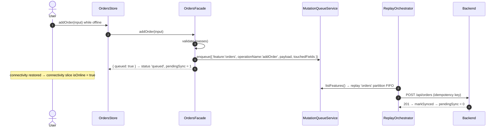
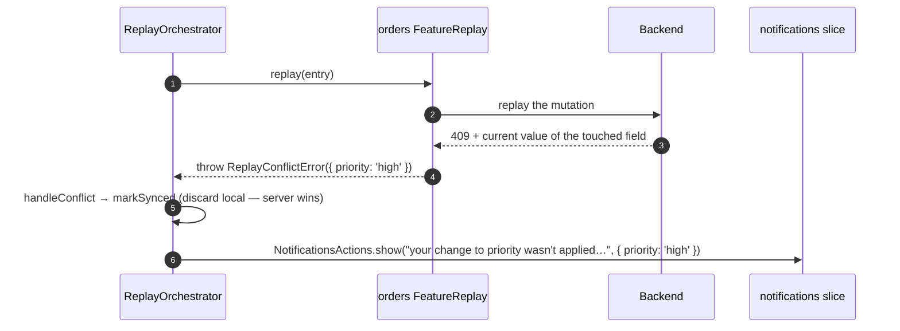

> **Fourth plateau of the `monolith` catalog — the owner's current app.** Composes [`plateau-offline-read-monolith`](skills/angular/architecture/v3.1/monolith/plateau/plateau-offline-read-monolith/plateau-offline-read-monolith.skill/plateau-offline-read-monolith.skill.md) (online + VP1 + VP4) and adds exactly one solution — [`solution-offline-sync`](skills/angular/architecture/v3.1/solutions/solution-offline-sync.skill/solution-offline-sync.skill.md) — realizing **VP5 (OfflineWriteQueue, per feature) = Yes** of the [monolith Variability Map](skills/angular/architecture/v3.1/monolith/variability-map.md). VP1–VP5 = Yes; VP6–VP8 = No. Next: `plateau-multiuser-monolith` (VP6 + VP7). **Reads and writes both survive offline.**

# What this plateau adds over its parent

The parent chain is the connected app + performance-tuned routing + offline **read** resilience (Workbox SW, `connectivity` slice, `OfflineTransportError`). Read those skills for the baseline. `plateau-offline-full-monolith` adds a **durable write queue**, all from `solution-offline-sync`:

- **`libs/shared/offline-sync`** (new Nx project, `type:store`): a Dexie `MutationQueueService` — partitioned by feature, FIFO within a partition, each entry with a stable idempotency key (generated once at enqueue) and its `touchedFields`. A `ReplayOrchestrator` replays every partition **concurrently** on connectivity restoration; a stuck partition never blocks another. `handleConflict` is a single overridable seam — **server-wins** by default, surfaced field-scoped. `MutationReplayRegistry` holds per-feature replay handlers.
- **A `notifications` slice** in `libs/shared/state` (VP5 — closes delta-conflict Finding 4). `ReplayOrchestrator` dispatches `NotificationsActions.show(...)` on a conflict.
- **Facade queueing opt-in**: for an operation the Facade explicitly marks queueable, `OfflineTransportError` triggers `MutationQueueService.enqueue` + a `{ queued: true, idempotencyKey, optimistic }` return instead of a throw. Business validation always fails first — a validation failure is never queued.
- **A per-entity `syncStatus` state machine** on the feature store's rows — `queued → sending → (synced | failed | conflict)` — driven by two `FeatureReplay` lifecycle callbacks (`onReplayStart` / `onReplayResult`) the `ReplayOrchestrator` calls around every replay. `PendingSyncIndicatorComponent`'s count is *derived* from those rows; `{feature}.store.ts`'s `hydratePending()` rebuilds the optimistic rows from the persisted Dexie queue on a cold start.
- **Per-feature replay registration**: `{feature}.offline-sync.ts` registers a `FeatureReplay` via `provideFeatureReplay(...)` placed in the feature's own **route `providers`** — so no feature code enters the initial bundle. The shell's `app.config.ts` only calls `provideOfflineSync()`.
- **`PendingSyncIndicatorComponent`** in `libs/shared/ui` — presentational (`count` input), fed a count *derived* from the feature store's rows that carry a `syncStatus`.

# Core Principles

- Dexie is a storage/reactivity layer only — replay calls the app's own Facade methods, never a generic document-sync protocol.
- The queue is partitioned by feature; FIFO within a partition; partitions replay independently and concurrently.
- Every queued mutation carries a stable idempotency key, generated once at enqueue and reused across every replay.
- Queueing is opt-in per operation — never implicit for every method; validation failures are never queued.
- Conflict resolution is server-wins, compared only against the fields the queued command intended to change — no full entity snapshot is stored. `handleConflict` is one clearly-separated seam a future solution can override.
- The user-facing pending surface is a **per-entity `syncStatus`** on the feature's own rows, not just a count — and it survives a cold restart (`hydratePending()` rebuilds it from the queue).

# Capabilities

- Mutations attempted offline are queued and auto-replayed on reconnect, for operations a Facade opts in.
- Reactive "pending sync" UI, updating as the queue changes.
- A struggling feature only stalls its own partition, not the whole app's sync.
- Idempotent replay — a retried command that actually succeeded but lost its response is not double-applied.
- Server-wins conflict resolution with field-scoped detail, without storing full entity snapshots.
- Everything the parent chain provides — state tiering + global store, performance-tuned routing, Signal Forms, the Facade/Client data layer, the Workbox SW + `connectivity` slice, console logging, four-layer testing, bundle budgets.

# Structure

See [`structure/`](structure/plateau-offline-full-monolith--repo-offline-full-monolith.skill.md) — the parent chain's workspace skills carried forward, with `solution-offline-sync`'s contributions merged into the repo skill, `apps/platform-shell`, `libs/shared/state`, `libs/shared/ui`, the generic `{feature}.facade.ts` class skill, and one **new project** [`project-shared-offline-sync`](structure/shared-offline-sync/plateau-offline-full-monolith--project-shared-offline-sync.skill.md), plus new class skills: [`class-mutation-queue-service`](structure/shared-offline-sync/classes/plateau-offline-full-monolith--class-mutation-queue-service.skill.md), [`class-replay-orchestrator`](structure/shared-offline-sync/classes/plateau-offline-full-monolith--class-replay-orchestrator.skill.md), [`class-notifications-store`](structure/shared-state/classes/plateau-offline-full-monolith--class-notifications-store.skill.md), [`class-pending-sync-indicator-component`](structure/shared-ui/classes/plateau-offline-full-monolith--class-pending-sync-indicator-component.skill.md).

# Example

See [`example/`](plateau-offline-full-monolith.skill/example/) — the parent Nx workspace, evolved: `libs/shared/offline-sync` (Dexie DB + `MutationQueueService` + `ReplayOrchestrator` + `MutationReplayRegistry` + `provide{OfflineSync,FeatureReplay}`); the `notifications` slice + spec; `orders.facade.ts` enqueues on `OfflineTransportError`; `orders.offline-sync.ts` registers the replay handler in `ORDERS_ROUTES`' route providers; `OrdersStore` tracks `pendingSync`; `<ui-pending-sync-indicator>` in the order form. **`npm test` (Vitest, 20 files / 67 tests) + `npm run lint` (11 projects) + `nx build platform-shell --configuration=production` + `nx build-sw platform-shell` all green.** `dexie` + `fake-indexeddb` (dev) added.

# Intersection registry

Per [`delta-conflict-analysis.md`](skills/angular/architecture/v3.1/delta-conflict-analysis.md) — canonical, no resolver:

- [`feature-facade-ts`](registry/feature-facade-ts.md) — `solution-api-http-layer` `.create` + `solution-offline-sync` `.extend` (queueing branch), `TMN`, `source: constraint` (VP5 requires VP3).
- The parent's [`shared-state-project`](skills/angular/architecture/v3.1/monolith/plateau/plateau-offline-read-monolith/registry/shared-state-project.md) group reaches **N = 3** here (global-store + offline-first + offline-sync) — a benign N≥3 bucket (the `store.config.ts` seam extended once per slice). `solution-offline-sync` now carries its own `shared-state.project.extend` (delta-conflict Finding 4, closed).

# Usecases

## Mutation attempted offline, later synced



## Conflict during replay (server wins)



## One feature's queue is stuck, others proceed

```mermaid
sequenceDiagram
    autonumber
    participant Orch as ReplayOrchestrator
    Orch->>Orch: replayAllPartitions() — Promise.all over partitions
    par orders partition
        Orch->>Orch: replay succeeds, entries cleared
    and flaky partition
        Orch->>Orch: first replay throws → stop this partition (no tight retry)
    end
    Note over Orch: flaky retries on the next connectivity-restoration event; orders was unaffected
```
