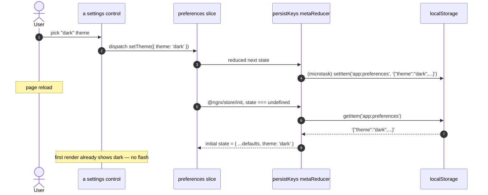
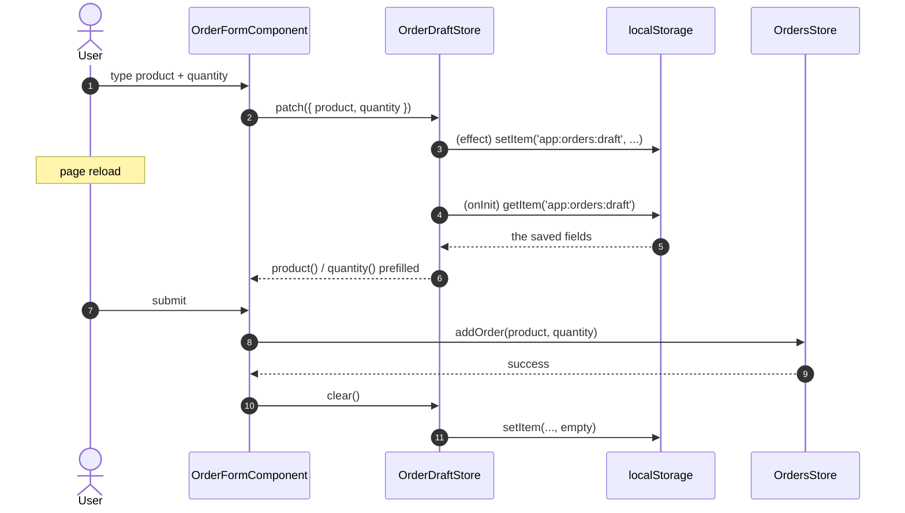

> **Sixth and last plateau of the `monolith` catalog.** Composes [`plateau-multiuser-monolith`](skills/angular/architecture/v3.1/monolith/plateau/plateau-multiuser-monolith/plateau-multiuser-monolith.skill/plateau-multiuser-monolith.skill.md) (online + VP1 + VP4 + VP5 + VP6 + VP7) and adds **one** solution — [`solution-persisted-state`](skills/angular/architecture/v3.1/solutions/solution-persisted-state.skill/solution-persisted-state.skill.md) (**VP8 — PersistedState**) of the [monolith Variability Map](skills/angular/architecture/v3.1/monolith/variability-map.md). VP1–VP8 = Yes. **No new Nx project.** Still one deployable unit — Module Federation is `platform-host`, not here.

# What this plateau adds over its parent

The parent chain is the connected app + performance-tuned routing + offline read and write resilience + console + backend logging + authentication. Read those skills for the baseline. `plateau-persisted-state-monolith` adds one cross-cutting capability:

**VP8 — PersistedState (`solution-persisted-state`):**

- **A `persistence/` folder in `libs/shared/state`** — mechanism only, no slice config:
  - **`persistKeys(config)`** — a per-feature `MetaReducer` factory. On the `@ngrx/store` init action, while the slice state is still `undefined`, it reads `storage.getItem(config.key)`, parses it, intersects the result with `config.keys`, and merges it into the initial state — **synchronously, before any selector emits**. On every later action it reduces normally and writes `pick(nextState, keys)` back, debounced to one `queueMicrotask` per tick. Both the parse and the write are `try/catch` and never throw.
  - **`SENSITIVE_STATE_KEYS`** (`accessToken`, `refreshToken`, …) + **`assertPersistable(config)`** — called inside `persistKeys()` and `withPersistedDraft()` at construction; **throws** if the allow-list names any sensitive key, failing the app on boot and the test suite in CI.
  - **`withPersistedDraft(config)`** — the feature-tier counterpart: a `signalStoreFeature` whose `withHooks({ onInit })` rehydrates the allow-listed keys before the first template read and registers an `effect()` that persists them on change.
- **A persisted `preferences` slice** — classical NgRx `createFeature`, all-scalar (`theme` / `density` / `lastFeatureTab`), registered via the three-arg `provideState(preferencesFeature.name, preferencesFeature.reducer, { metaReducers: [persistKeys(...)] })`. The reference persisted slice: flat, no effects, allow-list equal to every field.
- **An opt-in `{Feature}DraftStore`** — a feature with a form worth keeping across a reload adds a dedicated `signalStore` + `withPersistedDraft` holding only the editable fields, cleared on submit success. Never `withPersistedDraft` on the feature's main list/detail store.
- **The `auth` slice is never given a persistence metaReducer** — the in-memory-token rule from VP7 stands, made structural: the slice holding the token is simply not a persistence target.

# Core Principles

- Persistence is opt-in per slice / per feature store, declaring a **finite key allow-list** — never `*`, never the whole slice.
- Rehydration happens once, before the first render that reads the state — a synchronous metaReducer for a slice, `withHooks({ onInit })` for a feature store, never a post-render patch. See [`rehydration-timing`](skills/angular/architecture/v3.1/solutions/solution-persisted-state.skill/adr/rehydration-timing.md).
- `localStorage` is the default backend (`sessionStorage` for per-tab, Dexie for a large draft). See [`storage-backend-choice`](skills/angular/architecture/v3.1/solutions/solution-persisted-state.skill/adr/storage-backend-choice.md).
- No token / PII key is ever on an allow-list; `assertPersistable()` enforces it at construction. The `auth` slice carries no `metaReducers`.
- The `persistence/` folder holds mechanism only — the `key` / `keys` config lives at each `store.config.ts` (or draft store) call site.
- The three-arg `provideState(name, reducer, config)` is the only overload that applies `metaReducers` — `provideState(feature, config)` silently drops it.

# Capabilities

- User UI preferences (theme, list density, last-opened feature tab) survive a browser session, rehydrated with no flash of default state.
- An in-progress form survives a reload — the user comes back to their half-filled entry — and the draft clears on a successful submit.
- A misconfigured persistence allow-list (a token key, a PII key) fails the app on boot and CI, not silently at runtime.
- Everything the parent chain provides — state tiering + global store, performance-tuned routing, Signal Forms, the Facade/Client data layer, the Workbox SW + `connectivity` slice, the Dexie offline write queue + replay orchestrator with per-entity `syncStatus`, backend log delivery + retry queue + `GlobalErrorHandler`, in-memory-token authentication with permission strings, four-layer testing, bundle budgets.

# Structure

See [`structure/`](structure/plateau-persisted-state-monolith--repo-persisted-state-monolith.skill.md) — the parent chain's workspace skills carried forward, with `solution-persisted-state` merged into the repo skill and `libs/shared/state` ([`project-shared-state`](structure/shared-state/plateau-persisted-state-monolith--project-shared-state.skill.md)): the new `persistence/` folder ([`class-persisted-state`](structure/shared-state/classes/plateau-persisted-state-monolith--class-persisted-state.skill.md), [`class-with-persisted-draft`](structure/shared-state/classes/plateau-persisted-state-monolith--class-with-persisted-draft.skill.md)) and the persisted [`class-preferences-store`](structure/shared-state/classes/plateau-persisted-state-monolith--class-preferences-store.skill.md); plus the generic feature project skill gaining the opt-in [`class-feature-draft-store`](structure/feature-feature/classes/plateau-persisted-state-monolith--class-feature-draft-store.skill.md). No new project.

# Example

See [`example/`](plateau-persisted-state-monolith.skill/example/) — the parent Nx workspace, evolved: `libs/shared/state` gains `persistence/` (`persisted-state.ts` + `with-persisted-draft.ts` + spec) and `preferences/` (slice + spec), `store.config.ts` registers `preferences` with the persist metaReducer, and `orders/feature` gains `orders-draft.store.ts` (+ spec) wired into `order-form.component.ts`. **`npm test` (Vitest, 31 files / 115 tests) + `npm run lint` (12 projects) + `nx build platform-shell --configuration=production` (initial 458 kB) + `nx build-sw platform-shell` all green;** `apps/platform-shell-e2e` typechecks. See the [example README](plateau-persisted-state-monolith.skill/example/README.md) for the three catalog corrections this build fed back (chief among them: `provideState(feature, { metaReducers })` silently ignores the config).

# Intersection registry

Per [`delta-conflict-analysis.md`](skills/angular/architecture/v3.1/delta-conflict-analysis.md) — canonical, no resolver:

- [`shared-state-project`](registry/shared-state-project.md) — `solution-global-store` `.create` + `offline-first` / `offline-sync` / `authentication` / **`persisted-state`** `.extend`. `TMN`, `source: constraint` (every slice-adding VP requires VP2). **N = 5 here — benign** (the `store.config.ts` seam extended once per distinct slice; VP8's contribution is a feature-local metaReducer on the `preferences` registration only, structurally unable to collide with the others).

# Usecases

## A preference survives a reload



## A half-filled form survives a reload



## A misconfigured allow-list is rejected

```mermaid
sequenceDiagram
    autonumber
    actor Dev
    participant Cfg as store.config.ts
    participant PK as persistKeys()
    participant Guard as assertPersistable()
    Dev->>Cfg: provideState(authFeature.name, authFeature.reducer, { metaReducers: [persistKeys({ keys: ['accessToken'] })] })
    Cfg->>PK: construct
    PK->>Guard: assertPersistable({ keys: ['accessToken'] })
    Guard-->>PK: throw "refusing to persist sensitive key(s): accessToken"
    Note over Dev: app fails to bootstrap; the persisted-state.spec.ts case fails in CI
```
