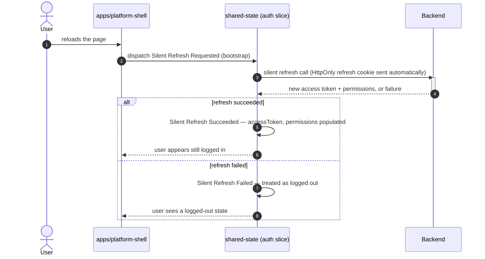
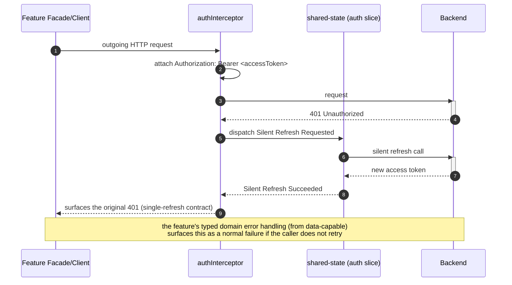
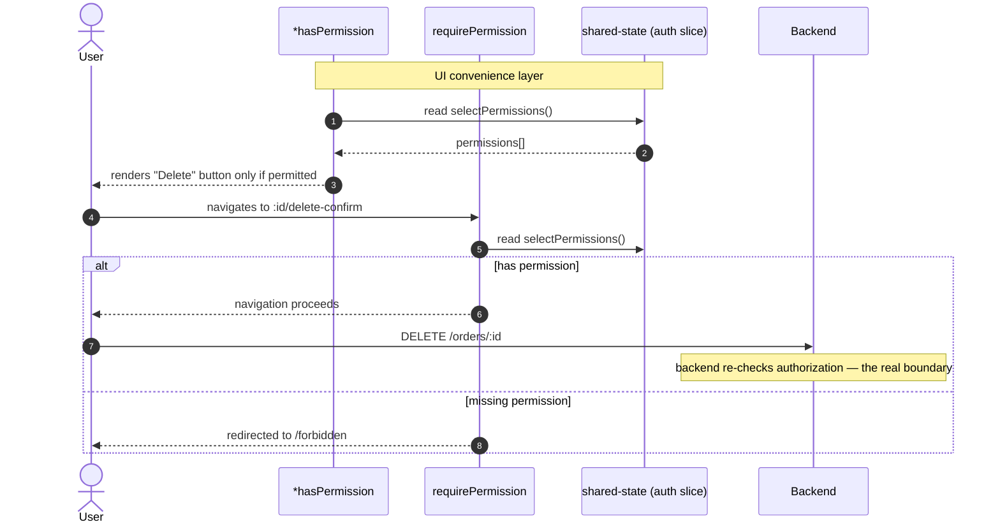

> Fourth plateau in the main application's chain. Previous: [[skills/angular/architecture/plateau/data-capable/plateau-data-capable.skill.md|data-capable]]. Next: [[skills/angular/architecture/plateau/observable/plateau-observable.skill.md|observable]].

# Core Principles

- Everything from [[skills/angular/architecture/plateau/data-capable/plateau-data-capable.skill.md|data-capable]] carries over unchanged: hierarchical routing, selective preloading, Signal Forms, and the Facade/Client-layered data-access pattern
- The access token lives only in memory, inside `shared-state`'s auth slice; the refresh token lives only in an `HttpOnly`/`Secure`/`SameSite` cookie the client never reads — no token value ever touches `localStorage`/`sessionStorage`
- Every authorization check — guards, the UI directive — is expressed as a permission string, never a role name
- Route guards live inside the feature whose route they protect, consistent with hierarchical route ownership — never centralized in the shell
- Hiding UI with a permission check is a convenience, not a security boundary; the backend remains the actual authorization boundary
- A single global interceptor is the only place a request is decorated with the `Authorization` header, and the only place a 401 triggers a silent refresh

# Capabilities

- structure, state management, routing, forms, data access
  - Unchanged from [[skills/angular/architecture/plateau/data-capable/plateau-data-capable.skill.md|data-capable]]
- authentication & session
  - No token value ever persists in `localStorage`/`sessionStorage`, closing off the most common XSS-driven token theft vector
  - Silent, transparent session recovery after a page reload or a transient 401, without forcing the user to re-authenticate
  - A single permission model reused by route guards and a structural UI directive — no parallel authorization logic to keep in sync
- authorization
  - Feature routes protect themselves with `requirePermission(...)` guards attached at their own route definitions
  - `*hasPermission` conditionally renders UI based on the current session's permission set

# Usecases

## App bootstrap recovers a session after reload

## A request transparently recovers from an expired access token

## Restricting a destructive action to a permission

