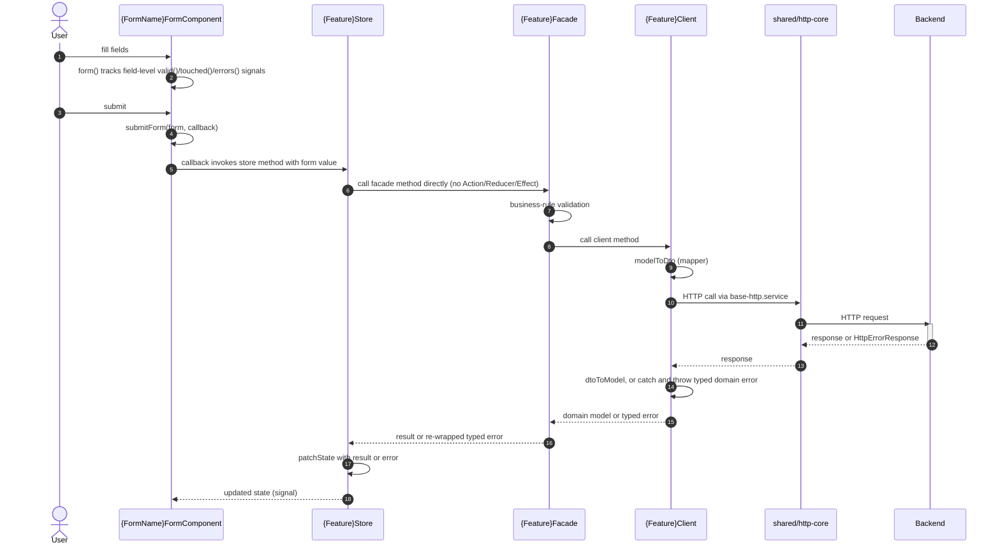
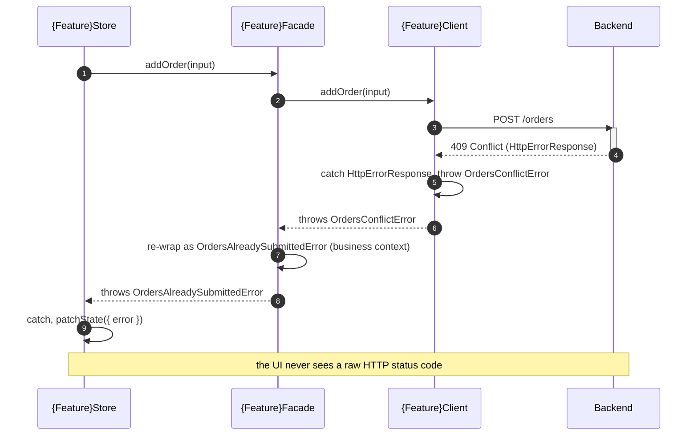

> Third plateau in the main application's chain. Previous: [[skills/angular/architecture/plateau/navigable/plateau-navigable.skill.md|navigable]]. Next: [[skills/angular/architecture/plateau/authenticated/plateau-authenticated.skill.md|authenticated]].

# Core Principles

- Everything from [[skills/angular/architecture/plateau/navigable/plateau-navigable.skill.md|navigable]] carries over unchanged: hierarchical route ownership, selective preloading, and the three-tier state placement rule
- New forms are built with Signal Forms (`form()`/`FieldTree`) by default; existing Reactive Forms are never force-migrated, only touched opportunistically
- A form's submission always goes through `submitForm()`, whose callback calls into the owning feature's data-access Facade — never `HttpClient` directly from a component
- Every feature's `data-access` lib is internally layered: **Facade** (public API, business validation) → **Client** (internal transport + DTO mapping, never exported) → shared `libs/shared/http-core` base service
- A raw `HttpErrorResponse` never escapes a feature's Client — every caller works with that feature's own typed domain errors
- For feature-scoped operations the Signal Store method calls the Facade directly; no Action/Reducer/Effect is introduced. Global/cross-cutting state keeps its existing classical NgRx chain, unchanged

# Capabilities

- structure
  - `nx affected` runs CI tasks only for projects impacted by a change; enforced module boundaries via Nx tags
- state management
  - Component Signal → feature Signal Store → global NgRx Store tiering, unchanged from foundation
- routing
  - Hierarchical, root-relative route ownership; selective preloading; `loadComponent` sub-splitting — unchanged from navigable
- forms
  - Fine-grained, synchronous field-level validity/touched/error state with no manual `valueChanges` subscriptions
  - A single submission pattern (`submitForm()`) reporting success/failure without hand-rolled pre-submit validity checks
  - Non-trivial field schemas are extractable into their own `{form-name}.form.ts` once cross-field logic grows
- data access
  - Business validation (Facade) stays testable in isolation from transport/DTO concerns (Client)
  - Common HTTP concerns (base URL, timeout, retry) live once in `libs/shared/http-core`, not reimplemented per feature
  - Every DTO ↔ domain model field conversion is an explicit, unit-testable mapper function

# Usecases

## Fill in and submit a feature form

## A transport failure becomes a typed domain error

