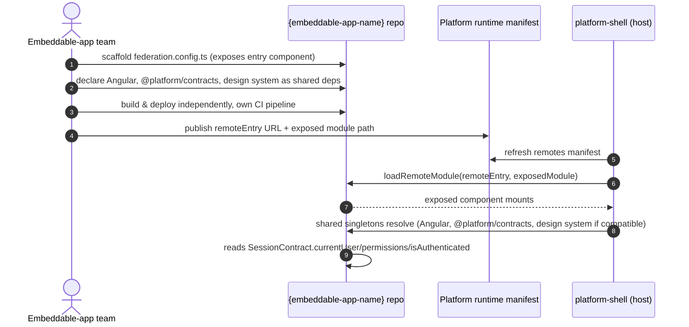
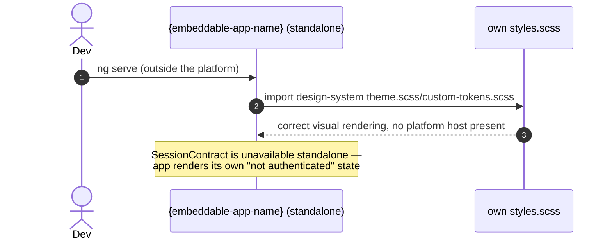

> This is a sibling plateau to [[skills/angular/architecture/plateau/platform/plateau-platform.skill.md|platform]], not a continuation of the main application's own plateau chain. It lives in its own repository — separate from both the main Nx platform monorepo and the design-system repository — owned and deployed independently by its own team. Any independently deployed application in this architecture, regardless of which team builds it, must conform to this plateau's structure to be embeddable. It becomes loadable by the platform host once the [[skills/angular/architecture/plateau/platform/plateau-platform.skill.md|platform]] plateau exists (`apps/platform-shell` turned into a Native Federation dynamic host).

# Core Principles

- An embeddable app repository is not required to adopt Nx or any platform-specific tooling — it only needs to satisfy the federation contract: `remoteEntry`, exposed module, and the shared singleton dependencies described below
- The only contract with the platform is `@platform/contracts` plus the federation `remoteEntry`/exposed-module boundary — no import of platform-shell internals in either direction
- Angular and `@platform/contracts` are shared as strict `singleton: true` dependencies; the design system is shared as a version-negotiated singleton (`singleton: true`, `strictVersion: false`) — sharing happens automatically when each side's declared version range is compatible, falling back to an isolated copy otherwise
- The app is a session consumer only: it reads `SessionContract` (`currentUser`, `permissions`, `isAuthenticated`) from `@platform/contracts` and never implements its own login flow or maintains its own copy of session state
- The app builds, tests, and deploys entirely on its own CI/CD pipeline, independent of the platform's own release schedule

# Capabilities

- federation
  - Exposes one or more entry points (typically a top-level component) via a Native Federation remote config, discoverable by the platform's runtime remote registry — no platform code change needed to onboard
- design-system consumption
  - Declares its own accurate `requiredVersion` range for the design system; automatically shares the platform's instance when ranges are compatible, isolates when they aren't, with no manual coordination beyond keeping that range current
  - Imports the design system's theme in its own root styles for correct standalone local development, understanding this is redundant — not incorrect — once mounted inside the platform in production
- session
  - Reads the platform's authenticated session and permissions through `SessionContract`, with no login screen or session state of its own
  - Renders its own "not authenticated" state when loaded without a session, rather than attempting authentication itself
- independence
  - Own CI pipeline, own deploy target, own choice of internal tooling (Nx optional) — ships on its own schedule with no coordination required for routine releases

# Usecases

## Onboard a new embeddable app repository

## Run the embeddable app standalone during local development

