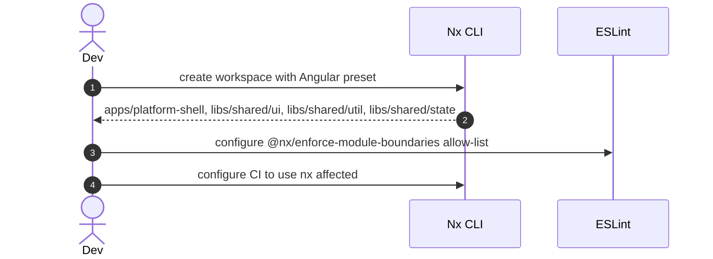
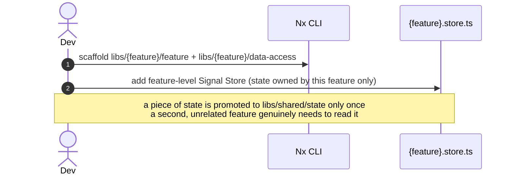

> First plateau in the main application's chain. Next: [[skills/angular/architecture/plateau/navigable/plateau-navigable.skill.md|navigable]].

# Core Principles

- `apps/` are deployable units, `libs/` are reusable code — nothing else lives at top level
- Every business feature is split into at least a `feature` lib and a `data-access` lib from the start
- Every lib exposes a narrow public API through a single `index.ts` barrel; internals are never imported directly
- Boundaries between features/layers are enforced by Nx tags (`type:*`, `scope:*`) via `@nx/enforce-module-boundaries`, not by convention
- State lives at the smallest tier that satisfies its real consumers: component Signal → feature Signal Store → global NgRx Store — promoted upward only when a second, unrelated consumer genuinely needs it

# Capabilities

- structure
  - `nx affected` runs CI tasks only for projects impacted by a change
  - A dependency graph (`nx graph`) that reflects the real architecture, enforced by lint, not just folder convention
- state management
  - No NgRx boilerplate for purely local UI state
  - Feature-level state stays encapsulated inside its owning feature, with no cross-feature state leakage
  - A single, auditable source of truth (`libs/shared/state`) ready for the future auth, notifications, and offline-sync solutions to build on

# Usecases

## Bootstrap the workspace

## Add a new business feature

