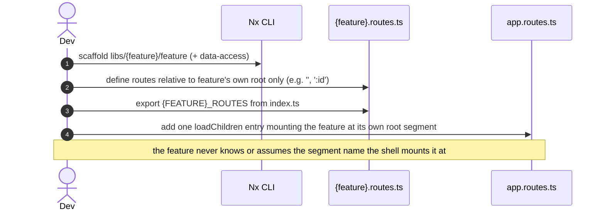
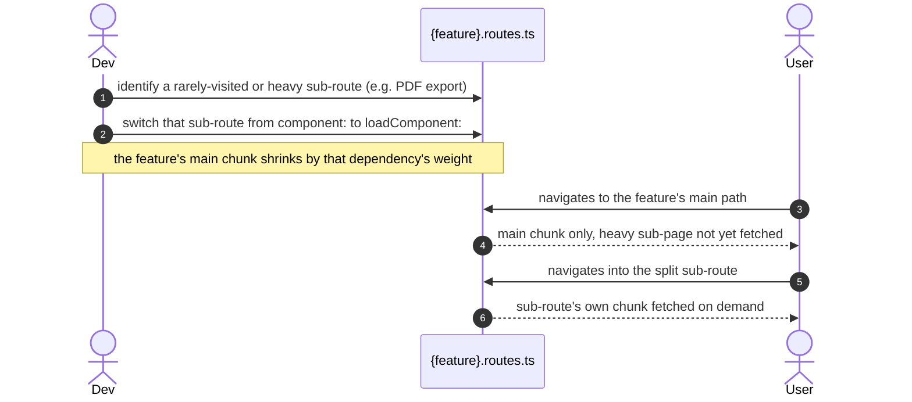

> Second plateau in the main application's chain. Previous: [[skills/angular/architecture/plateau/foundation/plateau-foundation.skill.md|foundation]]. Next: [[skills/angular/architecture/plateau/data-capable/plateau-data-capable.skill.md|data-capable]].

# Core Principles

- `apps/` are deployable units, `libs/` are reusable code; state lives at the smallest tier that satisfies its real consumers (component Signal → feature Signal Store → global NgRx Store) — carried over unchanged from [[skills/angular/architecture/plateau/foundation/plateau-foundation.skill.md|foundation]]
- Routes are owned hierarchically: the shell only ever knows first-level root segments; a feature only ever knows paths relative to its own root, and never bakes its own mount segment into its own route definitions
- The parent (the shell, at this plateau) assigns the mount segment at the point of mounting, via one `loadChildren` entry per root segment — the child never assumes where it will be mounted
- Every routable feature's `Routes` are part of its public API, exported from `index.ts` alongside its Signal Store
- Preloading is opt-in, never the default: `loadChildren` makes every feature lazy by default, and only a deliberately reviewed subset of top-level segments is marked for background preloading, exclusively at the mounting point
- `loadComponent` is a second, finer-grained split *inside* an already-lazy feature chunk, applied only where a sub-route is heavy or rarely visited — not a default

# Capabilities

- structure
  - `nx affected` runs CI tasks only for projects impacted by a change
  - A dependency graph (`nx graph`) that reflects the real architecture, enforced by lint
- state management
  - No NgRx boilerplate for purely local UI state; feature state stays encapsulated; a single auditable global store (`libs/shared/state`)
- routing
  - Any feature can be mounted, remounted, or moved without changing its own code — it never knows its own URL prefix
  - One consistent mounting mechanism (`loadChildren` against an exported `Routes` array) for every directly-owned feature
  - A single root `app.routes.ts` in `apps/platform-shell` stays a flat list of one-root-segment-per-feature entries, never a nested route tree
- performance
  - A custom `SelectivePreloadingStrategy` warms up only the small set of features explicitly marked worth it, leaving everything else purely on-demand
  - Enforced (`error`-level) bundle budgets on the initial bundle and every feature's own lazy chunk catch regressions in CI
  - Heavy or rarely-visited sub-pages inside a feature are split into their own `loadComponent` chunk without affecting the feature's main chunk

# Usecases

## Add a new routed feature



## Mark a high-traffic feature for background preloading

```mermaid
sequenceDiagram
    autonumber
    actor Dev
    participant Shell as app.routes.ts
    participant Strategy as SelectivePreloadingStrategy
    actor User

    Dev->>Shell: add data: { preload: true } to a feature's mounting entry
    User->>Shell: navigates to the initial route
    Shell->>Strategy: initial navigation settles
    Strategy->>Strategy: check route.data.preload for every mounted segment
    Strategy-->>Shell: fetch only flagged features' chunks, in the background
    Note over User,Strategy: navigating into the flagged feature later is instant;<br/>everything else stays purely on-demand
```

## Split a heavy sub-page out of a feature's chunk


