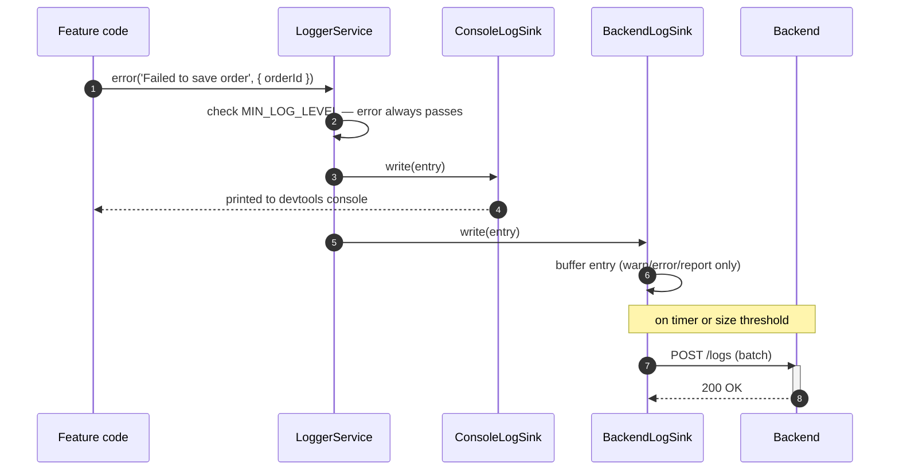
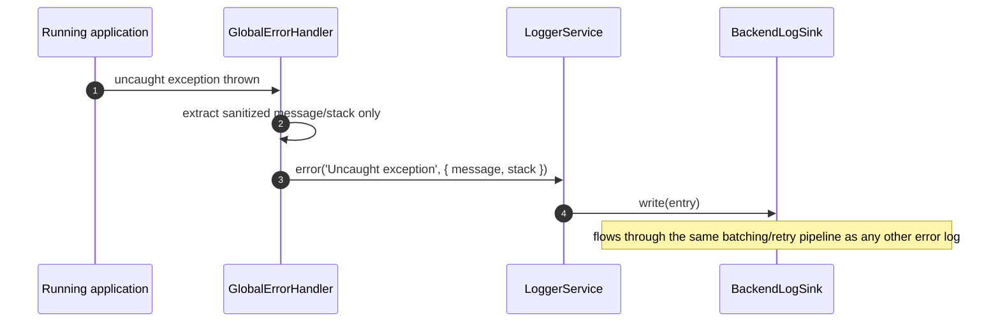
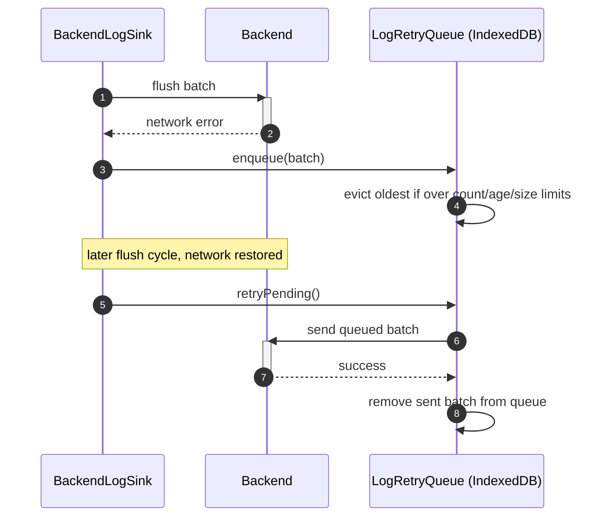

> Fifth plateau in the main application's chain. Previous: [[skills/angular/architecture/plateau/authenticated/plateau-authenticated.skill.md|authenticated]]. Next: [[skills/angular/architecture/plateau/tested/plateau-tested.skill.md|tested]].

# Core Principles

- Everything from [[skills/angular/architecture/plateau/authenticated/plateau-authenticated.skill.md|authenticated]] carries over unchanged: session lifecycle, permission-based authorization, hierarchical routing, Signal Forms, and the Facade/Client-layered data-access pattern
- All logging goes through `LoggerService` — no direct `console.*` calls anywhere else in the application
- A log entry is always structured: a message plus a context object, never a single interpolated string
- `LoggerService` forwards every entry to a pluggable list of `LogSink`s; only `warn`/`error`/`report()` entries reach the backend sink, `debug`/`info` stay local to the console sink
- Sensitive data (tokens, passwords, PII) is never logged, at any level — a hard rule, not a per-call-site judgment
- A failed backend batch send is never dropped outright — it is persisted to a bounded, IndexedDB-backed retry queue and retried
- Every uncaught exception is captured by a single global `ErrorHandler` and routed through `LoggerService.error`, reaching the backend the same way any other error log does

# Capabilities

- structure, state management, routing, forms, data access, authentication & authorization
  - Unchanged from [[skills/angular/architecture/plateau/authenticated/plateau-authenticated.skill.md|authenticated]]
- logging
  - Structured log context (feature name, relevant IDs) is filterable/queryable from day one
  - Production builds automatically drop `debug`/`info` noise while keeping `warn`/`error`
  - One consistent entry point (`LoggerService`) with zero call-site rewrites when the backend sink was added
- observability
  - Backend visibility into frontend failures, without needing every code path to explicitly opt in
  - Resilience to brief network outages via a persisted, bounded retry queue — a failed batch is retried, not silently dropped
  - Uncaught exceptions are captured automatically by a global `ErrorHandler`, with no reliance on explicit instrumentation everywhere
  - A reliable unload-time flush (`sendBeacon`) so buffered entries aren't lost when a tab closes mid-batch

# Usecases

## A feature logs a structured event that reaches the backend

## An uncaught exception is captured and reported

## A backend outage does not lose log entries

