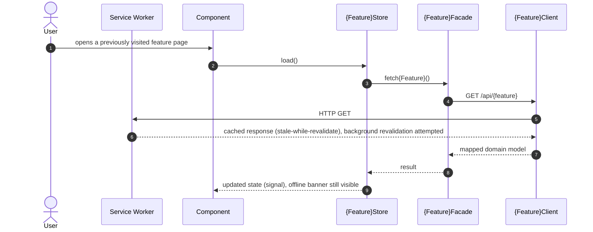
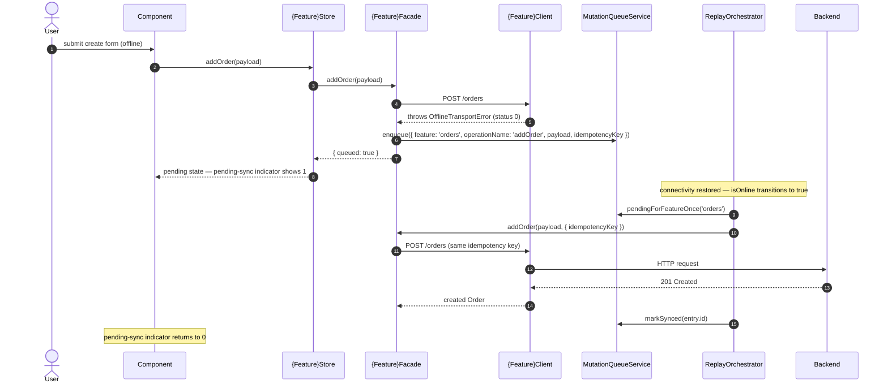

> Previous plateau in the main application's chain: [[skills/angular/architecture/plateau/tested/plateau-tested.skill.md|tested]] (the "online-monolith" milestone: routing, forms, HTTP layer, auth, logging, testing — 10 solutions). This plateau adds `solution-offline-first` and `solution-offline-sync` on top, unchanged otherwise. Next: [[skills/angular/architecture/plateau/platform/plateau-platform.skill.md|platform]] (the final plateau, which re-includes the two Module-Federation-specific slices deferred here — see "Deferred to the platform plateau" in [[skills/angular/architecture/plateau/offline-app/structure/repo-offline-app.skill.md|repo-offline-app]] — and adds embeddability/design-system-application in full).

# Core Principles

- Every read stays available while the network is unreliable: a Workbox service worker precaches the app shell, serves static assets cache-first, and serves API GET reads stale-while-revalidate — auth and every mutation remain strictly network-only, never cached
- Connectivity is a first-class, accurate signal (`isOnline`, combining `navigator.onLine` with a periodic health check), not a per-feature guess
- A feature's Client distinguishes "we're offline" (`OfflineTransportError`) from "the server rejected this" — a network-level failure is never conflated with a domain error
- A Facade explicitly, per operation, opts a mutation into a durable, per-feature-partitioned write-queue instead of failing outright when offline
- Replay is automatic on connectivity restoration, FIFO within a feature, concurrent across features, with a server-wins conflict default and one clean seam for future custom resolution
- The user is never left guessing: an offline banner and a per-feature pending-sync count make both read-staleness and write-queueing visible

# Capabilities

- read resilience
  - app shell precached; static design-system assets cache-first; API GET reads stale-while-revalidate; auth/mutations always network-only
  - an accurate `isOnline` signal in `libs/shared/state`, available to every feature
- write resilience
  - a Dexie-backed, per-feature-partitioned mutation queue with a stable idempotency key per queued command
  - automatic replay on connectivity restoration; a stuck feature's replay never blocks another feature's
  - server-wins conflict handling by default, behind a single overridable seam
- UX feedback
  - a shell-level offline banner, backed by the shared `connectivity` slice
  - a per-feature pending-sync indicator reactively backed by the mutation queue
- everything the `tested` plateau already provides — Nx module boundaries, three-tier state, hierarchical routing with selective preloading, Signal Forms, Facade/Client/Mapper HTTP layering, in-memory-token auth with permission-based guards/directives, structured logging with a backend sink, and a layered Vitest/Playwright test strategy — unchanged

# Usecases

## Read a feature while offline

## Attempt a mutation while offline, then sync automatically

