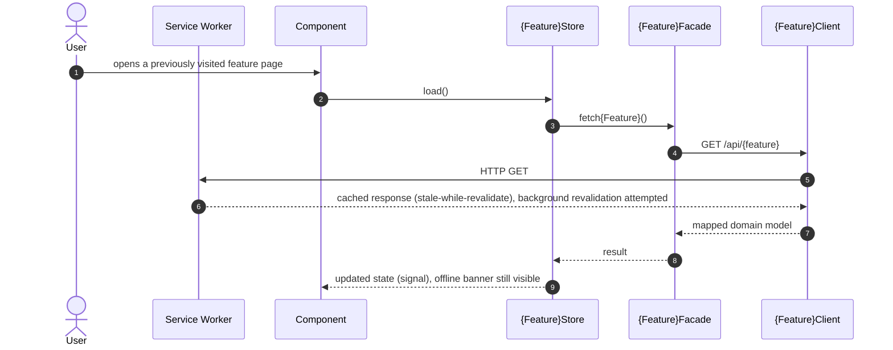
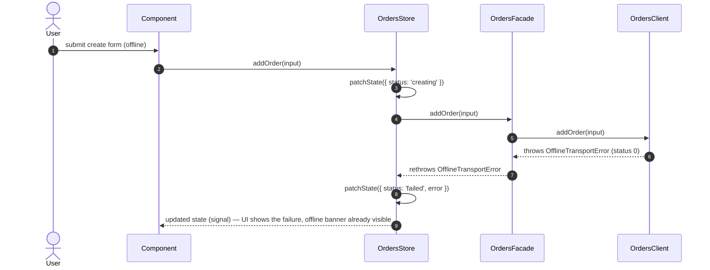

> Parent: [[skills/angular/architecture/plateau/plateau-online-monolith/plateau-online-monolith.skill.md|online-monolith]] (structure, state, routing, forms, HTTP layer, console logging, testing — 7 solutions). This plateau adds `solution-lazy-loading-routing` and `solution-offline-first` on top, unchanged otherwise. Next: [[skills/angular/architecture/plateau/plateau-offline-monolith/plateau-offline-monolith.skill.md|offline-monolith]], which adds the durable write-queue that lets a mutation attempted while offline be replayed later instead of failing outright. Still no authentication (that arrives at [[skills/angular/architecture/plateau/plateau-multiuser-app/plateau-multiuser-app.skill.md|multiuser-app]], the last plateau), no Module Federation, no backend log delivery.

# Core Principles

- Feature chunks are lazy-loaded by default; only a small, deliberately reviewed subset of top-level segments is background-preloaded via `data: { preload: true }`, set exclusively at the mounting point
- Every read stays available while the network is unreliable: a Workbox service worker precaches the app shell, serves static assets cache-first, and serves API GET reads stale-while-revalidate — auth and every mutation remain strictly network-only, never cached
- Connectivity is a first-class, accurate signal (`isOnline`, combining `navigator.onLine` with a periodic health check) exposed from `libs/shared/state`, not a per-feature guess
- A feature's Client distinguishes "we're offline" (`OfflineTransportError`) from "the server rejected this" — a network-level failure is never conflated with a domain error
- A mutation attempted while genuinely offline still fails immediately at this plateau — there is no queue yet; the user sees the failure via the offline banner and the rejected Facade call
- When a feature has multiple distinct data facets, each facet owns its own Facade/Client/Mapper trio, grouped under `facade/`, `client/`, and `mapper/` with files named `{feature}_N.{kind}.ts`; the `index.ts` exports every Facade and its public errors, never any Client or Mapper.

# Capabilities

- lazy loading
  - every routable feature is its own chunk; a custom `PreloadingStrategy` warms up only routes explicitly opted in
  - bundle budgets (`error` threshold) catch an accidental non-lazy import before it reaches production
- read resilience
  - app shell precached; static design-system assets cache-first; API GET reads stale-while-revalidate; auth/mutations always network-only
  - an accurate `isOnline` signal in `libs/shared/state`, available to every feature via `selectIsOnline`
- write awareness
  - a mutation's Client call throws the shared `OfflineTransportError` when offline, letting the Facade and UI distinguish it from a server-side rejection — without yet queueing it
- UX feedback
  - a shell-level offline banner, backed by the shared `connectivity` slice
- everything the `online-monolith` plateau already provides — Nx module boundaries, three-tier state, hierarchical routing, Signal Forms, Facade/Client/Mapper HTTP layering, console-only structured logging, and a layered Vitest/Playwright test strategy — unchanged

# Usecases

## Read a feature while offline

## Attempt a mutation while offline — fails immediately (no queue yet)

