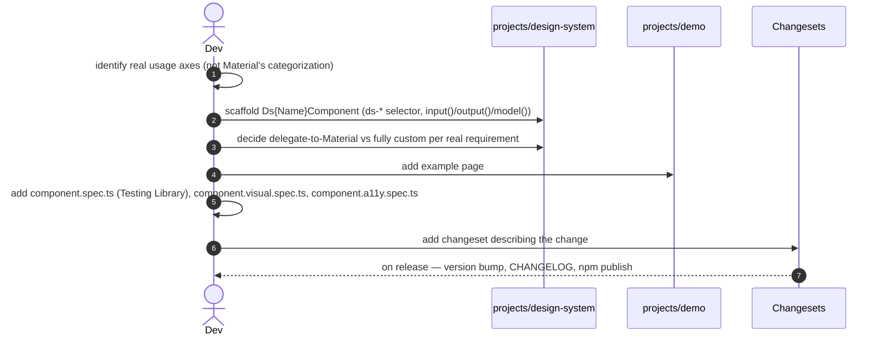

> This plateau lives in its own repository, separate from the main Nx platform monorepo. It is a standalone product (an npm package), not a stage that the main application's own plateau chain passes through. The main application's [[skills/angular/architecture/plateau/plateau-online-monolith/plateau-online-monolith.skill.md|online-monolith]] plateau onward consumes this package directly as an npm dependency; federation-aware consumption (version-negotiated sharing between the platform host and embeddable apps) is added by [[skills/angular/architecture/plateau/plateau-platform-monolith/plateau-platform-monolith.skill.md|platform-monolith]].

# Core Principles

- The design system is versioned and released independently of every consumer, via Changesets — a misclassified breaking change is far less likely to slip out under a non-major version
- Angular Material's own M3 `--mat-sys-*` tokens are consumed directly wherever they already model a concept; a small `--ds-*` layer exists only for genuine domain-specific gaps (status/priority colors, spacing, radius)
- Every component fully encapsulates Angular Material — its own `ds-*` selector, signal-based (`input()`/`output()`/`model()`) API, and independently designed usage axes, with no Material type ever reaching the public surface
- A single, fixed brand palette is used everywhere for now; multi-tenant theming is explicitly deferred until a real requirement appears
- Every component is tested at three independent layers — behavioral (Testing Library, no dependency to fake), visual (Playwright screenshot against `projects/demo`), and accessibility (`@axe-core/playwright`) — with no Storybook, no Chromatic

# Capabilities

- packaging & release
  - Plain Angular CLI multi-project workspace (library + demo), ng-packagr build producing Angular Package Format output, Changesets-driven versioning and CHANGELOG
- theming
  - One `mat.theme()` definition applied at the root, native `light-dark()` for light/dark with no JavaScript, `--ds-*` tokens for the handful of concepts Material doesn't model
- components
  - Signal-based, fully encapsulated `ds-*` components; each one's internal implementation independently decided between delegating to Angular Material or a fully custom build
- preview
  - Every shipped component gets a live example page in the `demo` app instead of Storybook
- testing
  - Every component has a Testing Library spec with nothing to fake, a Playwright screenshot-regression spec (light + dark) against its `demo` page, and an `@axe-core/playwright` accessibility scan against the same page

# Usecases

## Add a new component to the library



## A visual regression is caught before release

```mermaid
sequenceDiagram
    autonumber
    actor Dev
    participant Demo as projects/demo
    participant PW as Playwright
    participant CI

    Dev->>Demo: unintentional CSS change breaks a component's dark-mode branch
    Dev->>CI: open PR
    CI->>PW: run {component-name}.visual.spec.ts against projects/demo
    PW->>PW: screenshot (dark scheme) diffs against committed baseline
    PW-->>CI: fail — pixel diff exceeds threshold
    Note over Dev: the behavioral Testing Library spec still passed — DOM structure unchanged; only the visual spec catches this
```

## Consuming application picks up a design-system release

```mermaid
sequenceDiagram
    autonumber
    actor App as Consuming app (platform or embeddable)
    participant NPM as design-system (npm)

    App->>NPM: bump design-system dependency to new version
    App->>App: apply theme.scss once at the app root
    App->>App: use ds-* components; no Material knowledge required
    Note over App,NPM: A breaking change only reaches App at the version App explicitly opts into — Changesets guarantees it was flagged major
```
