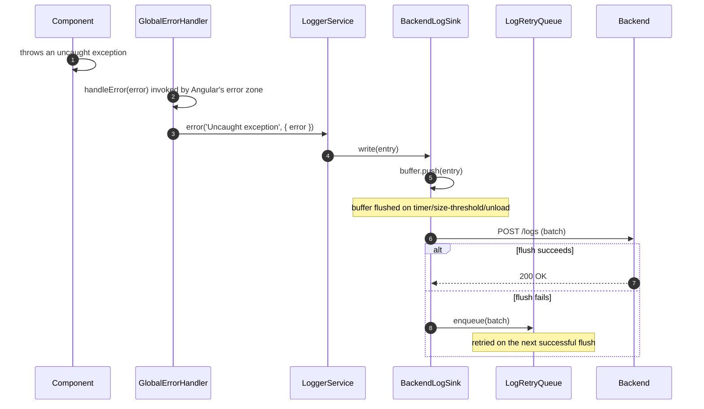

> Parent: [[skills/angular/architecture/plateau/plateau-platform-monolith/plateau-platform-monolith.skill.md|platform-monolith]] (the monolith-as-platform — 12 solutions applied so far in the main chain). This plateau adds `solution-logging-global` on top, unchanged otherwise. Next: [[skills/angular/architecture/plateau/plateau-multiuser-app/plateau-multiuser-app.skill.md|multiuser-app]], the final plateau in the chain. Still no authentication — every user remains implicitly trusted until then.

# Core Principles

- `warn`/`error`/`report()` log entries reach the backend, batched, without any call site needing to change
- A failed batch send is never silently dropped — it is handed to a persisted retry queue and replayed on the next successful flush
- `report()` lets a call site intentionally mark a non-error event as worth tracking on the backend, without inflating its severity to `warn`/`error`
- Every uncaught exception anywhere in the platform shell is captured by a single, application-root `GlobalErrorHandler` and routed through `LoggerService.error` — nothing crashes silently in production
- Sensitive data (tokens, passwords, PII) is never logged, at any level, by any sink — unchanged from earlier plateaus

# Capabilities

- backend log delivery
  - `BackendLogSink` batches and POSTs `warn`/`error`/`report()` entries, flushing on a timer, a size threshold, or page unload (via `navigator.sendBeacon`)
  - a failed flush is retried via a persisted `LogRetryQueue`, not dropped
- global error capture
  - `GlobalErrorHandler`, registered once at the application root, routes every uncaught exception through `LoggerService.error`
- everything the `platform-monolith` plateau already provides — a Native Federation dynamic host, version-negotiated design-system sharing, and federated-remote read resilience — unchanged
- everything earlier plateaus already provide — Nx module boundaries, three-tier state, hierarchical routing, Signal Forms, Facade/Client/Mapper HTTP layering, lazy loading, offline read/write resilience, and a layered Vitest/Playwright test strategy — unchanged

# Usecases

## An uncaught exception is captured and reaches the backend

