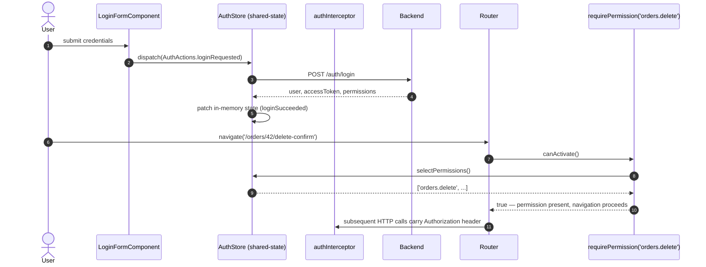
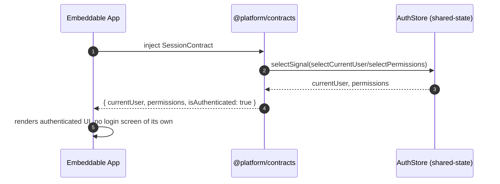

> Parent: [[skills/angular/architecture/plateau/plateau-monitored-app.skill/plateau-monitored-app.skill|monitored-app]] (a monitored, federated, offline-capable platform — 16 solutions applied so far in the main chain). This plateau adds `solution-authentication` on top — the last solution in the main chain. **Final plateau**: every user is now authenticated, and the application is ready to scale to many users. See also the sibling [[skills/angular/architecture/plateau/plateau-embeddable-app.skill/plateau-embeddable-app.skill|embeddable-app]] plateau — an embeddable app mounted before this plateau existed saw `SessionContract.isAuthenticated: false`; from here on it sees a real session.

# Core Principles

- Session state (current user, access token, permissions) lives in a single auditable NgRx slice, never duplicated in any feature
- The access token is in-memory-only — never persisted to `localStorage`/`sessionStorage` — surviving a page reload only via a silent-refresh-on-bootstrap flow
- Authorization is always expressed as permission strings, never role names, checked identically whether the check happens in a route guard or a UI `*hasPermission` directive
- A route-level permission guard is attached at the feature's own route, using a shared `requirePermission` factory — never centralized in the shell, consistent with hierarchical route ownership
- The platform host is the sole source of truth for `SessionContract`; every embeddable app reads it read-only and never implements its own login flow

# Capabilities

- authentication
  - full session lifecycle: login, silent refresh on bootstrap and on 401, logout, session expiry — all through one auditable NgRx slice
  - `authInterceptor` attaches the access token to every outgoing request and transparently recovers from a single expired-token 401 via silent refresh
- authorization
  - `requirePermission(...)` route guards, attached per-feature at the routes they protect
  - `*hasPermission` structural directive for permission-gated UI, sharing the exact same permission set the guards use
- platform session sharing
  - `SessionContract` (`currentUser`, `permissions`, `isAuthenticated`) is published from the platform host's auth slice through `@platform/contracts`, readable by every mounted embeddable app with no login flow of its own
- everything the `monitored-app` plateau already provides — backend log delivery with retry, global error capture — unchanged
- everything earlier plateaus already provide — Nx module boundaries, three-tier state, hierarchical routing, Signal Forms, Facade/Client/Mapper HTTP layering, lazy loading, offline read/write resilience, Native Federation platform embeddability, and a layered Vitest/Playwright test strategy — unchanged

# Usecases

## Log in, then access a permission-guarded route

## Embeddable app reads the platform session

