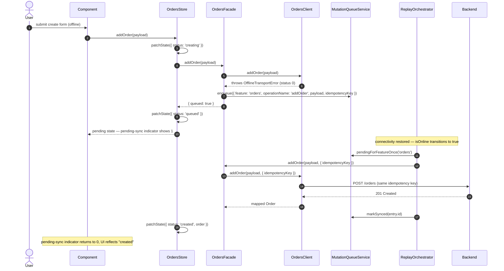

> Parent: [[skills/angular/architecture/plateau/plateau-async-monolith/plateau-async-monolith.skill.md|async-monolith]] (lazy-loaded routing plus read resilience — 2 solutions on top of `online-monolith`'s 7). This plateau adds `solution-offline-sync` on top, unchanged otherwise. Next: [[skills/angular/architecture/plateau/plateau-platform-monolith/plateau-platform-monolith.skill.md|platform-monolith]], where the monolith is split into independent, embeddable modules. Still no authentication (that arrives at [[skills/angular/architecture/plateau/plateau-multiuser-app/plateau-multiuser-app.skill.md|multiuser-app]], the last plateau), no Module Federation, no backend log delivery.

# Core Principles

- A Facade explicitly, per operation, opts a mutation into a durable, per-feature-partitioned write-queue instead of failing outright when offline
- Replay is automatic on connectivity restoration, FIFO within a feature, concurrent across features, with a server-wins conflict default and one clean seam for future custom resolution
- The user is never left guessing: a per-feature pending-sync count, alongside the existing offline banner, makes write-queueing visible
- Everything `async-monolith` already provides — lazy-loaded chunks, selective preloading, service-worker read resilience, an accurate `isOnline` signal — is unchanged

# Capabilities

- write resilience
  - a Dexie-backed, per-feature-partitioned mutation queue with a stable idempotency key per queued command
  - automatic replay on connectivity restoration; a stuck feature's replay never blocks another feature's
  - server-wins conflict handling by default, behind a single overridable seam
- UX feedback
  - a per-feature pending-sync indicator reactively backed by the mutation queue, alongside the shell-level offline banner
- everything the `async-monolith` plateau already provides — lazy-loaded feature chunks with selective preloading, a Workbox service worker for read resilience, an accurate `isOnline` connectivity signal, and `OfflineTransportError`-aware Clients — unchanged
- everything the `online-monolith` plateau already provides — Nx module boundaries, three-tier state, hierarchical routing, Signal Forms, Facade/Client/Mapper HTTP layering, console-only logging, and a layered Vitest/Playwright test strategy — unchanged

# Usecases

## Attempt a mutation while offline, then sync automatically

