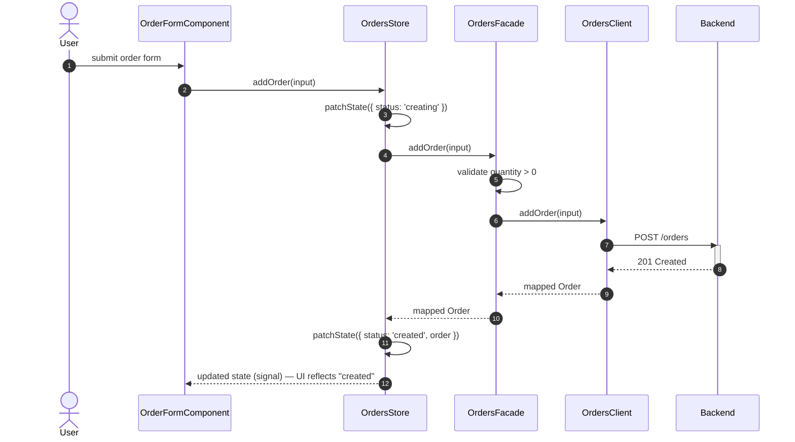
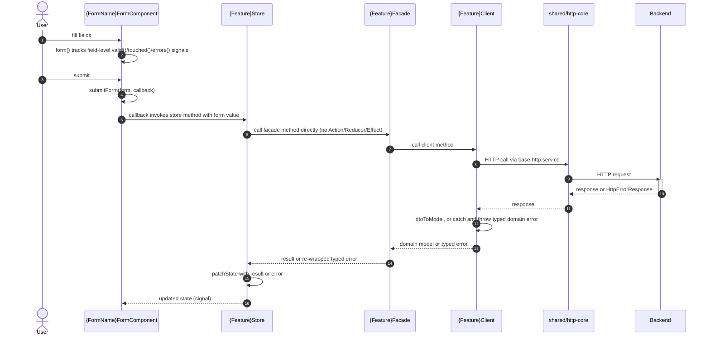

> First plateau in the main application's chain (no parent — built from scratch). Next: [[skills/angular/architecture/plateau/plateau-async-monolith/plateau-async-monolith.skill.md|async-monolith]]. This is the **"online-monolith"** milestone: everything the application needs to run online, end to end, as a single deployable unit — structure, state, navigation, forms, data flow with optimistic updates, console logging, and a real test suite. No lazy-loading yet, no offline resilience, no platform/embeddability, no backend log delivery, and — deliberately — no authentication: every user is implicitly trusted until [[skills/angular/architecture/plateau/plateau-multiuser-app/plateau-multiuser-app.skill.md|multiuser-app]], the final plateau in this chain. The [[skills/angular/architecture/plateau/plateau-design-system/plateau-design-system.skill.md|design-system]] npm package is already a real dependency of `apps/platform-shell`.

# Core Principles

- `apps/` are deployable units, `libs/` are reusable code — nothing else lives at top level
- State lives at the smallest tier that satisfies its real consumers: component Signal → feature Signal Store → global NgRx Store — promoted upward only when a second, unrelated consumer genuinely needs it
- Routes are owned hierarchically: the shell only knows first-level root segments; a feature only knows paths relative to its own root
- New forms are built with Signal Forms by default; submission always goes through `submitForm()`, whose callback calls into the owning feature's data-access Facade
- Every feature's `data-access` lib is layered Facade (public API, business validation) → Client (internal transport + DTO mapping) → shared `libs/shared/http-core`; a raw `HttpErrorResponse` never escapes a Client
- For feature-scoped operations, the Signal Store calls the Facade directly — no Action/Reducer/Effect — which is what makes an optimistic "creating…" → "created" status transition a simple `patchState` around a Facade call, not an NgRx round trip
- Everything logs through `LoggerService`, currently forwarding only to the console — no direct `console.*` call anywhere else
- Every Nx project runs unit/component tests via Vitest; `HttpTestingController` is used only inside a feature's own Client spec

# Capabilities

- structure
  - `nx affected` runs CI tasks only for projects impacted by a change; enforced module boundaries via Nx tags
- state management
  - No NgRx boilerplate for purely local UI state; feature state stays encapsulated; a single auditable global store skeleton (`libs/shared/state`)
- routing
  - Any feature can be mounted, remounted, or moved without changing its own code — it never knows its own URL prefix
- forms
  - Fine-grained, synchronous field-level validity/touched/error state with no manual `valueChanges` subscriptions
- data access
  - A component action (e.g. "create order") reflects immediately as a pending/optimistic status in the UI via the Signal Store, then resolves to a final status once the Facade/Client round trip completes
  - Common HTTP concerns (base URL, timeout, retry) live once in `libs/shared/http-core`
  - Every DTO ↔ domain model field conversion is an explicit, unit-testable mapper function
- observability
  - A single, structured logging entry point, ready for a future backend sink to be added with zero call-site rewrites
- testing
  - Every component has a fast, DOM-accurate Testing Library spec, faking its Signal Store — no browser, no HTTP
  - Every feature's Client has exactly one place `HttpTestingController` verifies the real request shape and DTO mapping
  - A small number of critical, cross-cutting user journeys are covered end-to-end via Playwright

# Usecases

## Optimistic create — status flips from "creating" to "created"

## Fill in and submit a feature form

