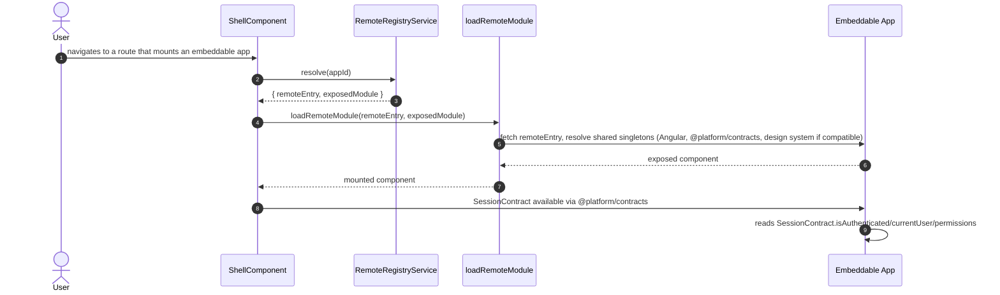

> Parent: [[skills/angular/architecture/plateau/plateau-offline-monolith/plateau-offline-monolith.skill.md|offline-monolith]] (full offline-capable PWA — 10 solutions applied so far in the main chain). This plateau adds `solution-platform-embeddability` and `solution-design-system-application` on top. Next: [[skills/angular/architecture/plateau/plateau-monitored-app/plateau-monitored-app.skill.md|monitored-app]]. See also the sibling [[skills/angular/architecture/plateau/plateau-embeddable-app/plateau-embeddable-app.skill.md|embeddable-app]] plateau — the baseline structure any independently deployed application must follow to be loadable here. Still no authentication (that arrives at [[skills/angular/architecture/plateau/plateau-multiuser-app/plateau-multiuser-app.skill.md|multiuser-app]], the last plateau — `SessionContract` has nothing real to share yet, so an embeddable app mounted at this stage sees `isAuthenticated: false`), no backend log delivery.

# Core Principles

- The monolith becomes a platform without becoming a distributed monolith: the host never knows about a specific embeddable app at build time — only the federation contract shape and `@platform/contracts`
- Remote discovery is a runtime concern (Dynamic Federation manifest), never compiled into the host, so a new embeddable app can be onboarded without a platform rebuild
- Angular and `@platform/contracts` are shared as strict `singleton: true` dependencies between host and every mounted remote; the design system is shared as a version-negotiated singleton, falling back to an isolated copy when ranges are incompatible
- Read resilience extends to federated remote chunks: a temporarily unreachable embeddable app still mounts from its last-cached version, the same mechanism already established for the rest of the app

# Capabilities

- federation
  - the platform host discovers, loads, and mounts independently built and deployed embeddable apps at runtime via `loadRemoteModule`
  - onboarding a new embeddable app requires no platform code change, only a runtime manifest entry
- shared runtime
  - one Angular instance, one `@platform/contracts` instance, shared across host and every compatible remote
  - the design system is shared when a remote's declared version range is compatible with the platform's, isolated otherwise — no manual coordination beyond keeping that range current
- read resilience for remotes
  - a federated remote's chunks are cached stale-while-revalidate, so a temporarily unreachable embeddable app's deploy doesn't immediately break its mount point
- everything the `offline-monolith` plateau already provides — lazy-loaded chunks, selective preloading, service-worker read resilience for the app's own content, an accurate `isOnline` signal, and durable, replayable mutation queueing — unchanged
- everything the `online-monolith` plateau already provides — Nx module boundaries, three-tier state, hierarchical routing, Signal Forms, Facade/Client/Mapper HTTP layering, console-only logging, and a layered Vitest/Playwright test strategy — unchanged

# Usecases

## Mount an embeddable app (happy path)



## Embeddable app's deploy is temporarily unreachable (failure path)

```mermaid
sequenceDiagram
    autonumber
    actor User
    participant Shell as ShellComponent
    participant SW as Service Worker
    participant Registry as RemoteRegistryService
    participant Remote as Embeddable App (unreachable)

    User->>Shell: navigates to a route that mounts an embeddable app
    Shell->>Registry: resolve(appId)
    Registry-->>Shell: { remoteEntry, exposedModule }
    Shell->>SW: fetch remoteEntry
    SW-->>Shell: cached remoteEntry (stale-while-revalidate), background revalidation attempted
    Note over Shell: remote mounts from its last-cached version;<br/>if never cached before, the shell shows a fallback slot instead of crashing
```
