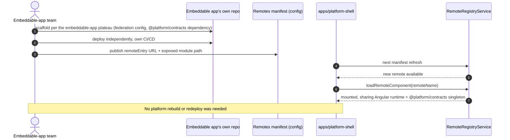
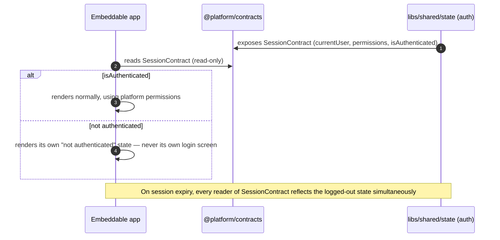
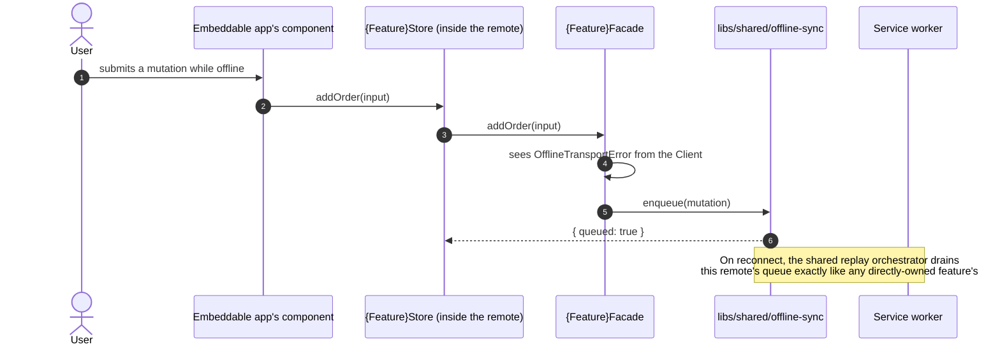

> Final plateau in the main application's chain. Parent: [[skills/angular/architecture/plateau/offline-app/plateau-offline-app.skill.md|offline-app]]. There is no next plateau in this chain — every one of the 17 solutions under `skills/angular/architecture/solutions/` is fully applied here (see [[skills/angular/architecture/plateau/platform/structure/repo-platform.skill.md|repo-platform]]'s "No further deferrals" section for the full accounting). This plateau has a **sibling**, not a successor: [[skills/angular/architecture/plateau/embeddable-app/plateau-embeddable-app.skill.md|embeddable-app]] — the baseline structure any independently deployed, separately repositoried application must follow to be loadable by the host modeled here. The [[skills/angular/architecture/plateau/design-system/plateau-design-system.skill.md|design-system]] plateau is a third, independent product this plateau consumes as a version-negotiated npm dependency.
>
> `created_by` lists five solutions, not two, even though this plateau's delta is really "add embeddability + federation-aware design-system consumption": `solution-app-routing`, `solution-authentication`, and `solution-offline-first` reappear here because each of them has a narrow, Module-Federation-specific slice that every earlier plateau in this chain deliberately deferred (see each earlier plateau's own repo skill for the deferral note). Those three solutions genuinely contribute new delta content at *this* plateau — their base slices were already applied earlier and are not repeated.

# Core Principles

- Everything from [[skills/angular/architecture/plateau/offline-app/plateau-offline-app.skill.md|offline-app]] carries over unchanged: read resilience, offline mutation queueing with retry/conflict handling, structured logging, session-based auth, hierarchical routing, Signal Forms, and the Facade/Client data-access pattern
- `apps/platform-shell` never knows about a specific embeddable app at build time — only the shape of `@platform/contracts` and the federation `remoteEntry` contract; the list of available remotes is always resolved at runtime
- A feature never knows or cares whether it is mounted directly by the shell or one level deeper inside an embeddable module — the hierarchical, root-relative routing contract is identical either way
- An embeddable app reads the platform's session exclusively through `@platform/contracts`' read-only `SessionContract` — it never implements its own login flow
- The design system is shared as a version-negotiated (not strict) federation singleton — an embeddable app on an older design-system version degrades to its own isolated copy rather than failing to load

# Capabilities

- structure, state management, routing, forms, data access, authentication & authorization, logging & observability, testing, offline read/write resilience
  - Unchanged from [[skills/angular/architecture/plateau/offline-app/plateau-offline-app.skill.md|offline-app]]
- platform embeddability
  - A new embeddable app can be onboarded by updating a runtime manifest alone — no platform rebuild or redeploy
  - Independent release cycles per embeddable app, with real-time, low-friction state/event exchange with the platform via `@platform/contracts`
  - A failure to load one remote never takes down the shell or any other already-loaded remote
- design-system consumption
  - The platform and every embeddable app share one deduplicated design-system instance whenever their declared version ranges are compatible, with graceful per-consumer fallback when they aren't
  - Only the platform ships the theme's CSS in production; every embedded component inherits it via the shared document

# Usecases

## Onboard a new embeddable app

## Embeddable app reads the platform session

## Offline-aware mutation inside an embedded remote

