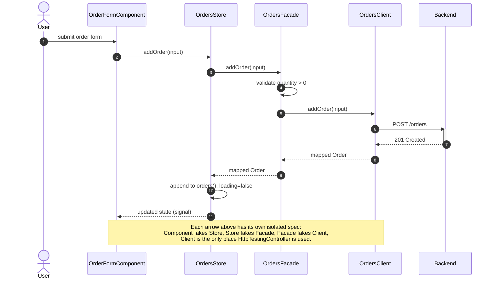
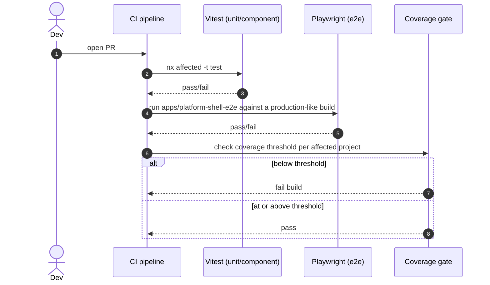

> Sixth plateau in the main application's chain, and the **"online-monolith" milestone**. Previous: [[skills/angular/architecture/plateau/observable/plateau-observable.skill.md|observable]]. Next: [[skills/angular/architecture/plateau/offline-app/plateau-offline-app.skill.md|offline-app]]. This is also where the [[skills/angular/architecture/plateau/design-system/plateau-design-system.skill.md|design-system]] plateau's npm package becomes a real, plain dependency of `apps/platform-shell` (see `platform-shell`'s own project skill) — federation-aware consumption is deferred to the future "platform" plateau, same as Module Federation itself.

# Core Principles

- Everything from [[skills/angular/architecture/plateau/observable/plateau-observable.skill.md|observable]] carries over unchanged: structured logging, session lifecycle, permission-based authorization, hierarchical routing, Signal Forms, and the Facade/Client-layered data-access pattern
- Every Nx project runs its unit/component tests via Vitest; end-to-end tests are Playwright specs in a dedicated `apps/platform-shell-e2e` project
- Every test fakes exactly the layer directly beneath the unit under test — `HttpTestingController` is used only inside a feature's Client spec, never above it
- CI enforces a minimum code-coverage threshold per project as a hard failure, not a warning

# Capabilities

- structure, state management, routing, forms, data access, authentication & authorization, logging & observability
  - Unchanged from [[skills/angular/architecture/plateau/observable/plateau-observable.skill.md|observable]]
- testing
  - Every component has a fast, DOM-accurate Testing Library spec, faking its Signal Store — no browser, no HTTP
  - Every feature's Client has exactly one place `HttpTestingController` verifies the real request shape and DTO mapping
  - Every feature's Facade and Signal Store are tested by faking the layer directly below them, never HTTP
  - A small number of critical, cross-cutting user journeys are covered end-to-end via Playwright against the real built application
  - Coverage regressions fail CI outright, surfacing a genuine drop in tested code immediately

# Usecases

## Optimistic create with full test coverage across every layer

## CI gate on a pull request

