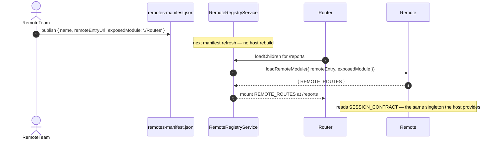
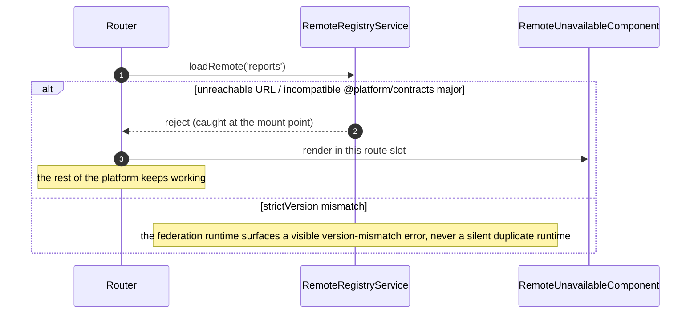
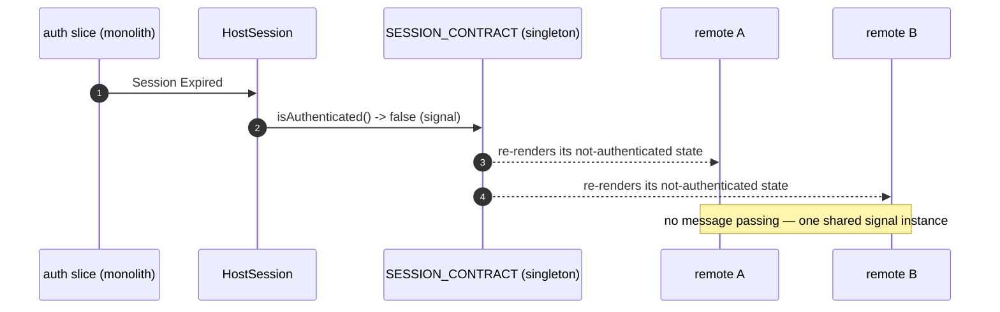

> **The `platform-host` catalog's single plateau.** Composes [`plateau-multiuser-monolith`](skills/angular/architecture/v3.1/monolith/plateau/plateau-multiuser-monolith/plateau-multiuser-monolith.skill/plateau-multiuser-monolith.skill.md) **cross-catalog** via `parent_plateaus` — every monolith VP (VP1–VP7) is answered by that plateau. This plateau adds **only the federation delta**: the two common `platform-host` features (`RuntimeRemoteFederation`, `PlatformContracts`) plus all three `platform-host` VPs = Yes (VP1 `HostDesignSystemConsumption`, VP2 `SessionSharing` — satisfiable because monolith VP7 = Yes, VP3 `FederatedReadResilience` — because monolith VP4 = Yes). See the [platform-host variability map](skills/angular/architecture/v3.1/platform-host/variability-map.md).

# What this plateau adds over its parent

The parent is the full multiuser monolith — state tiering + global store, performance-tuned routing, Signal Forms, the Facade/Client data layer, the Workbox SW + offline read/write, backend log delivery, authentication with in-memory tokens and permission-string guards, four-layer testing. Read that plateau for all of it. `plateau-platform-host` turns `apps/platform-shell` into a **Native Federation dynamic host**:

- **`RuntimeRemoteFederation`** (`solution-federation-host`) — `apps/platform-shell` gains `type:host`, a `federation.config.mjs`, `src/main.ts` calls `initFederation(...)` before bootstrap, and a `RemoteRegistryService` resolves remotes from a **runtime manifest** (onboard a remote by updating config, no host rebuild). A failed remote load degrades to a fallback slot, never a shell-wide crash. `@platform/contracts` + Angular are `singleton: true, strictVersion: true` — an incompatible major on a remote is a visible load-time failure.
- **`PlatformContracts`** (`solution-platform-contracts`) — `@platform/contracts` is its **own repository / published npm package**, types + DI tokens only, no implementation. The one build-time contract; neither side imports the other's internals.
- **VP2 `SessionSharing`** (`solution-session-sharing`) — the host is the **only** provider of `SESSION_CONTRACT`, a read-only signal view over `libs/shared/state`'s `auth` slice. A login or session expiry propagates to every mounted remote through the one shared instance, no polling, no message passing.
- **VP1 `HostDesignSystemConsumption`** (`solution-host-design-system-consumption`) — `design-system` is a `singleton: true, strictVersion: false` shared dependency (version-negotiated, never lockstep); `apps/platform-shell` is the only production consumer that imports the theme at the document root.
- **VP3 `FederatedReadResilience`** (`solution-federation-host`'s SW extend) — a 5th stale-while-revalidate rule for federated remote chunks, origins from the same manifest, registered after the network-only rule. Present **only** because the parent monolith has `OfflineReadResilience`.

# Core Principles

- The host never depends on a remote's internals at build time — only `@platform/contracts` + the federation `remoteEntry` boundary.
- Remote discovery is a **runtime** concern (Dynamic Federation) — which remotes exist and where they are served is resolved from configuration, never compiled in.
- Angular and `@platform/contracts` are `strictVersion: true` singletons; `design-system` is `strictVersion: false` (a mismatched consumer falls back to its own copy rather than failing to load).
- `SESSION_CONTRACT` is read-only from a remote's point of view — the host alone establishes and clears a session.
- The 5th SW rule is conditional on the composed monolith having offline-first — `RuntimeRemoteFederation` itself has no offline dependency.

# Capabilities

- Onboard an independently built, independently deployed remote by updating a manifest — no platform rebuild.
- A failed/incompatible remote degrades to a fallback slot; the rest of the platform keeps working.
- Every mounted remote reads the current user + permissions from one shared session, with zero auth code of its own.
- Host and in-range remotes share one deduplicated design-system instance and one theme.
- A temporarily unreachable remote still mounts from cache (when the monolith has offline-first).
- Everything the multiuser monolith provides.

# Structure

See [`structure/`](structure/plateau-platform-host--repo-platform-host.skill.md) — the **federation delta only** (matching how the variability map is scoped). [`repo-platform-host`](structure/plateau-platform-host--repo-platform-host.skill.md) (the `type:host` tag + shared-dep rules), [`project-platform-shell`](structure/platform-shell/plateau-platform-host--project-platform-shell.skill.md) (the shell's federation extend), [`repo-platform-contracts`](structure/platform-contracts/plateau-platform-host--repo-platform-contracts.skill.md) (the separate package), and class skills [`class-remote-registry-service`](structure/platform-shell/classes/plateau-platform-host--class-remote-registry-service.skill.md), [`class-host-session`](structure/platform-shell/classes/plateau-platform-host--class-host-session.skill.md), [`class-service-worker`](structure/platform-shell/classes/plateau-platform-host--class-service-worker.skill.md). Every monolith project comes from [`plateau-multiuser-monolith`'s `structure/`](skills/angular/architecture/v3.1/monolith/plateau/plateau-multiuser-monolith/structure/plateau-multiuser-monolith--repo-multiuser-monolith.skill.md).

# Example

See [`example/`](plateau-platform-host.skill/example/) — a **limited federation smoke test**, not the full monolith. A Native Federation dynamic host (`ng add … --type dynamic-host`), `@platform/contracts` (its own tiny package, vendored as a tarball), `RemoteRegistryService` (runtime manifest → `loadRemoteModule`, rejects for a missing remote), `HostSession` (the sole `SESSION_CONTRACT` provider), a remote mounted at `/reports` via `loadChildren` → `REMOTE_ROUTES` with a fallback on failure. **`ng test` (2 files / 6 tests) + `ng build` (Native Federation host — `remoteEntry.json` shares `@platform/contracts` + Angular as strict singletons) + `tsc -p tsconfig.e2e.json` all green;** the two-server Playwright smoke test is written, not run. See the [example README](plateau-platform-host.skill/example/README.md) for the catalog corrections this build fed back.

# Intersection registry

Per [`delta-conflict-analysis.md`](skills/angular/architecture/v3.1/delta-conflict-analysis.md) — canonical, no resolvers:

- [`platform-shell-project`](registry/platform-shell-project.md) — the cross-catalog N≥3 point where `federation-host` / `session-sharing` / `host-design-system-consumption` join the monolith's own six shell extenders. `FMN`/`TMN`, `source: ordering-only`, **benign** (Finding 5: this intersection lives in a platform-host plateau, not the monolith map).
- [`platform-contracts`](registry/platform-contracts.md) — `solution-platform-contracts` `.create` + `solution-session-sharing` `.extend` (the `SessionContract` shape). `TMN`, `source: constraint` (VP2 requires `PlatformContracts`), N = 2, benign.

# Usecases

## Onboard and mount a remote (happy path)

## Remote fails / incompatible contract (failure path)

## Session propagates to every remote

