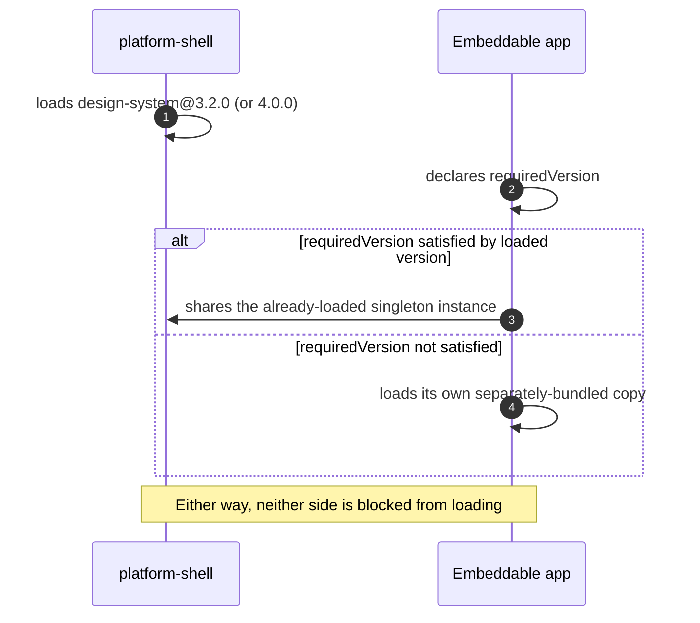

# Goal

- Let the platform and every independently deployed embeddable app consume the design system without being forced into lockstep version upgrades
- Get the benefit of a single, deduplicated design-system instance whenever consumers' versions happen to align, without making that alignment mandatory
- Avoid redundant theme application across every consumer, given the platform and every embeddable app share one JS runtime and one DOM document (per Native Federation)

# Capabilities

- An embeddable-app team can ship on their own schedule, on their own design-system version, without being blocked by a platform upgrade they haven't yet adopted
- Teams that do stay within the platform's currently targeted version range automatically get a smaller payload and guaranteed visual consistency, with no extra configuration beyond declaring their supported range
- Only one consumer (the platform shell) needs to ship the theme's CSS in production — every embeddable app's mounted components inherit it via the shared document, with no redundant CSS payload

# Core Principles

- The design system is shared as a federation singleton with version negotiation (`singleton: true`, `strictVersion: false`) — not a strict, error-on-mismatch singleton, and not fully independent per consumer
- Each consumer (platform, every embeddable app) declares its own accurate `requiredVersion` range; sharing happens automatically when ranges are compatible, and falls back to an isolated copy when they aren't
- `apps/platform-shell` is the only consumer required to apply the global theme in production; every embeddable app still imports the theme for its own standalone local development, understanding this is redundant (not incorrect) once mounted inside the platform
- Neither mechanism requires manual coordination beyond each team keeping their own declared version range and theme import up to date

# Adr

- [[skills/angular/architecture/solutions/solution-design-system-application.skill/adr/design-system-version-negotiation|Version-negotiated singleton instead of a strict singleton or fully independent per-consumer versions]]
  - Selected variant: version-negotiated singleton — chosen to avoid forcing embeddable-app teams into lockstep upgrades while still capturing the sharing benefit when versions align
- [[skills/angular/architecture/solutions/solution-design-system-application.skill/adr/theme-application-scope|Platform-shell applies the theme in production; embeddable apps apply it only for standalone development]]
  - Selected variant: platform-shell-only in production — a direct consequence of the shared-document architecture Native Federation already provides

# Requirements

SOLUTION:
- [[skills/angular/architecture/solutions/solution-design-system-structure.skill/solution-design-system-structure.skill.md|Дизайн-система: структура]]
  - The design system consumed here is the npm package that solution publishes
- [[skills/angular/architecture/solutions/solution-design-system-tokens.skill/solution-design-system-tokens.skill.md|Дизайн-система: токены и theming]]
  - `theme.scss`/`custom-tokens.scss`, applied per this solution's scope rules
- [[skills/angular/architecture/solutions/solution-platform-embeddability.skill/solution-platform-embeddability.skill.md|Встраиваемость платформы]]
  - This solution extends both plateaus that solution established — the platform host's federation config, and every embeddable app's own federation config

NPM:
- The design system package (per "Дизайн-система: структура")
  - Declared as a version-negotiated shared dependency in both the platform's and every embeddable app's federation config

# Template Skill Mutations

REPOSITORY:
- [[skills/angular/architecture/solutions/solution-design-system-application.skill/Implementation/PlatformHost/platform-shell.federation.extend|apps/platform-shell]] - extend - declare the design system as a version-negotiated shared dependency, apply the theme at the root
- [[skills/angular/architecture/solutions/solution-design-system-application.skill/Implementation/EmbeddableApp/federation.extend|Embeddable app (generic pattern)]] - extend - declare `requiredVersion` for the design system, import the theme for standalone development only

# Workflow

## Compatible versions — shared instance (happy path)

1. The platform currently targets design-system version `3.2.0`.
2. An embeddable app declares `requiredVersion: ^3.0.0` in its own federation config.
3. Since `3.2.0` satisfies `^3.0.0`, the embeddable app shares the platform's already-loaded design-system instance — no separate bundle is fetched, and its components render with exactly the same styling as the platform's own.

## Incompatible versions — isolated fallback (happy path, graceful degradation)

1. The platform upgrades to design-system version `4.0.0` (a breaking change).
2. An embeddable app has not yet updated its own `requiredVersion: ^3.0.0` declaration.
3. Since `4.0.0` does not satisfy `^3.0.0`, that embeddable app falls back to loading its own bundled copy of design-system `3.x` — its components continue to render correctly on the version it was actually built against, without blocking its own deployment or affecting the platform or any other embeddable app.

## Theme applied once, inherited everywhere (happy path)

1. `apps/platform-shell` applies `theme.scss`/`custom-tokens.scss` at the document root in production.
2. An embeddable app is mounted into the shell via `loadRemoteModule` (per the "Встраиваемость платформы" solution); its components render into the same DOM document.
3. Those components inherit the platform's already-set CSS custom properties automatically — no separate theme application was needed for them to render correctly.

## Embeddable app run standalone during development (steady state)

1. A developer on an embeddable-app team runs their app outside the platform, for local development.
2. Their own `styles.scss` (importing the design system's theme) applies the theme directly, since there is no platform document to inherit from in this context.
3. The app renders correctly and consistently with how it will look once mounted inside the platform in production.

# Rules

## MUST
- [[skills/angular/architecture/solutions/solution-design-system-application.skill/Implementation/PlatformHost/platform-shell.federation.extend#MUST|PlatformHost/platform-shell.federation.extend]]
- [[skills/angular/architecture/solutions/solution-design-system-application.skill/Implementation/EmbeddableApp/federation.extend#MUST|EmbeddableApp/federation.extend]]

## SHOULD
- [[skills/angular/architecture/solutions/solution-design-system-application.skill/Implementation/EmbeddableApp/federation.extend#SHOULD|EmbeddableApp/federation.extend]]

# Anti-patterns

- [[skills/angular/architecture/solutions/solution-design-system-application.skill/Implementation/PlatformHost/platform-shell.federation.extend|See platform-shell.federation.extend.md]] — setting `strictVersion: true`, reintroducing lockstep coupling.
- [[skills/angular/architecture/solutions/solution-design-system-application.skill/Implementation/EmbeddableApp/federation.extend|See federation.extend.md]] — declaring an unbounded `requiredVersion`; never updating it after initial setup.

# Check list

- [ ] The design system is declared `singleton: true`, `strictVersion: false` in both the platform's and every embeddable app's federation config
- [ ] Every embeddable app's `requiredVersion` accurately reflects the version range it has actually been built and tested against
- [ ] Only `apps/platform-shell` applies the theme in production; every embeddable app's own theme import is understood to serve standalone development only
- [ ] A version mismatch results in graceful, isolated fallback for the mismatched consumer alone — never a hard failure blocking the platform or other embeddable apps
