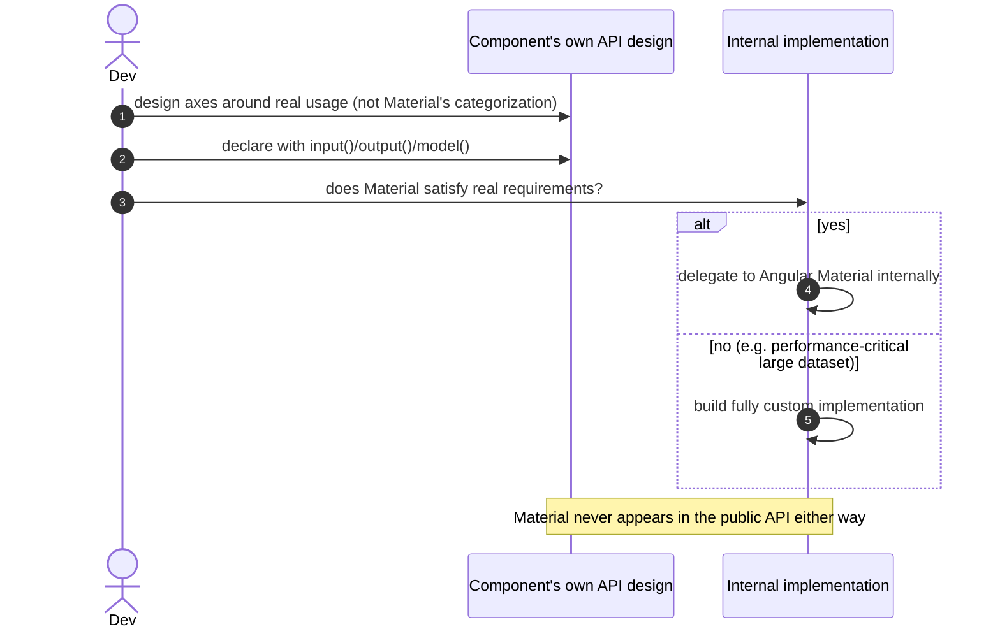

# Goal

- Give every design system component a consistent, modern authoring style (signal-based inputs/outputs/model), aligned with the rest of the platform's commitment to Signals
- Ensure application developers never need to know Angular Material's own API, selectors, or category model to use a design system component
- Let each component's internal implementation freely delegate to Material or be fully custom, decided by real requirements rather than a blanket rule in either direction

# Capabilities

- Consuming applications are fully insulated from Angular Material API changes across versions — the design system's own API absorbs them
- Component APIs are organized around real usage needs (e.g. a button's variant/action/dropdown axes) rather than however Material happens to categorize its own components
- Complex components (e.g. a large-dataset tree) can have a fully custom internal implementation without that decision leaking into or complicating the component's public API
- One consistent, modern component-authoring style across the whole library — no per-component judgment about decorators vs signals

# Core Principles

- Every component uses `input()`, `output()`, and `model()` exclusively — no `@Input()`/`@Output()` decorators, no `EventEmitter`
- Every component has its own `ds-*` selector and an independently designed API — never a direct passthrough or 1:1 mirror of an underlying Material component's inputs
- No Angular Material type, selector, or enum ever appears in this library's public API surface
- Internally, a component may delegate to Angular Material or be fully custom-built — decided per component, based on whether Material's own implementation meets the real functional/performance/accessibility requirements, defaulting to delegation unless a specific gap justifies going custom
- Any component participating in forms implements `ControlValueAccessor`, per the "Формы" solution's Signal Forms compatibility requirement

# Adr

- [[skills/angular/architecture/solutions/solution-design-system-components.skill/adr/component-api-authoring-style|Signal-based input()/output()/model() exclusively, instead of decorators]]
  - Selected variant: signal-based API — chosen for consistency with the platform's broader Signals commitment and `output()`'s improved type safety over `EventEmitter`
- [[skills/angular/architecture/solutions/solution-design-system-components.skill/adr/component-encapsulation-strategy|Full API encapsulation with independently designed axes, internal implementation decided per component, instead of a thin passthrough wrapper or no wrapping at all]]
  - Selected variant: full encapsulation — chosen so application developers never need Material's own API, and so a Material version bump never forces a design-system API change

# Requirements

SOLUTION:
- [[skills/angular/architecture/solutions/solution-design-system-structure.skill/solution-design-system-structure.skill.md|Дизайн-система: структура]]
  - Components live inside `projects/design-system`, the publishable library project
- [[skills/angular/architecture/solutions/solution-design-system-tokens.skill/solution-design-system-tokens.skill.md|Дизайн-система: токены и theming]]
  - Every component consumes `--mat-sys-*`/`--ds-*` tokens per that solution's rules, rather than hardcoding style values

NPM:
- @angular/material
  - Used internally by components that delegate to it, per this solution's per-component decision rule — never exposed through this library's public API

# Template Skill Mutations

REPOSITORY:
- [[skills/angular/architecture/solutions/solution-design-system-components.skill/Implementation/Repository.extend|Repository]] - extend - add the `ds-*` selector convention, signal-based API requirement, and the ControlValueAccessor/internal-implementation rules

Artifact-level:
- [[skills/angular/architecture/solutions/solution-design-system-components.skill/Implementation/ComponentLayer/{component-name}.component.ts.create|{component-name} (generic pattern, with a worked ds-button example)]] - create - applied to every component added to the library

# Workflow

## Authoring a new component (happy path)

1. The component's real usage needs are identified first — what axes of variation actually matter for this application (as with the button's variant/size/color/action/dropdown), independent of how Angular Material happens to categorize anything similar.
2. The component is scaffolded with a `ds-*` selector and `input()`/`output()`/`model()` for its public API, per this solution's authoring style.
3. The internal implementation is decided: does Angular Material's own equivalent (if one exists) satisfy the real requirements? If yes, delegate to it internally. If not (as with a large-dataset tree needing different performance characteristics), build a fully custom implementation.
4. If the component participates in forms, it implements `ControlValueAccessor`.
5. A demo page is added to `projects/demo`, per the "Дизайн-система: структура" solution.

## Angular Material version bump (steady state)

1. A new Angular Material version changes or removes an input on a component this library uses internally.
2. Only the internal implementation of the affected design-system component needs to change; its own public API and every consuming application remain unaffected.

## Naming an input identically to Material's own (anti-pattern, caught in review)

1. A new component's input is named and typed identically to the Material component it wraps internally (e.g. reusing Material's own `color` enum verbatim).
2. This is flagged against [[skills/angular/architecture/solutions/solution-design-system-components.skill/Implementation/ComponentLayer/{component-name}.component.ts.create#Anti-patterns]] — mirroring Material's categorization this closely defeats the point of encapsulation, even without directly re-exporting Material's type.
3. Fix: design the input around this application's own real usage instead.

# Rules

## MUST
- [[skills/angular/architecture/solutions/solution-design-system-components.skill/Implementation/Repository.extend#MUST|Repository]]
- [[skills/angular/architecture/solutions/solution-design-system-components.skill/Implementation/ComponentLayer/{component-name}.component.ts.create#MUST|ComponentLayer/{component-name}.component.ts.create]]

## SHOULD
- [[skills/angular/architecture/solutions/solution-design-system-components.skill/Implementation/Repository.extend#SHOULD|Repository]]
- [[skills/angular/architecture/solutions/solution-design-system-components.skill/Implementation/ComponentLayer/{component-name}.component.ts.create#SHOULD|ComponentLayer/{component-name}.component.ts.create]]

# Anti-patterns

- [[skills/angular/architecture/solutions/solution-design-system-components.skill/Implementation/Repository.extend|See Repository.extend.md]] — exposing a Material type/enum through the public API; defaulting to a custom implementation without first checking if Material suffices.
- [[skills/angular/architecture/solutions/solution-design-system-components.skill/Implementation/ComponentLayer/{component-name}.component.ts.create|See {component-name}.component.ts.create.md]] — naming an input identically to Material's own corresponding input and enum.

# Check list

- [ ] Every component uses `input()`/`output()`/`model()`, never decorators or `EventEmitter`
- [ ] No component's public API exposes any Angular Material type, selector, or enum
- [ ] Every component's API is organized around this application's real usage axes, not mirrored from Material
- [ ] Every form-participating component implements `ControlValueAccessor`
- [ ] Each component's internal implementation choice (delegate vs custom) reflects an actual evaluation of Material's fit, not a default in either direction
