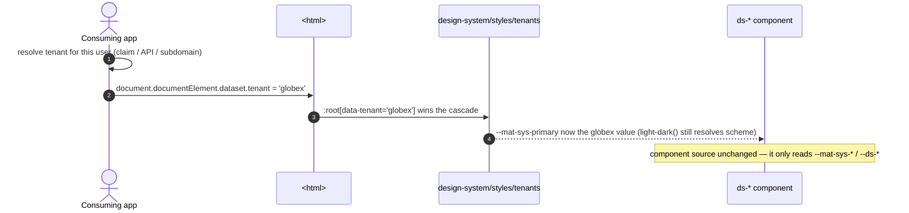

# Goal
- Generalize the single fixed brand palette `solution-design-system-tokens` establishes into a set of swappable per-tenant palettes.
- Resolve a tenant's palette with a single CSS attribute on the document root, applied by the consuming application — no JavaScript token rewriting, no per-tenant bundles.
- Keep every existing `--mat-sys-*` / `--ds-*` consumption unchanged — only the palette values behind the tokens vary per tenant, and only colour.

# Capabilities
- **swappable brands** — `styles/tenants/` ships one file per tenant; a consuming app `@use`s `design-system/styles/tenants` once and sets `document.documentElement.dataset.tenant` to switch.
- **a typed tenant contract** — `DS_TENANTS` / `DsTenant` exported from the package; the consumer sets `data-tenant` against a known union, not a free string.
- **colour-only variation** — a tenant changes the Material colour system tokens (and tenant-specific `--ds-*` colours) and nothing else; typography, density, spacing, radius, and Material base styles stay identical across brands, structurally.
- **light/dark preserved per tenant** — `light-dark()` still resolves the scheme inside whichever tenant is active; no JS.
- **federation-friendly** — the tenants stylesheet is part of the one shared design-system package; a federated remote inherits the host's `<html>` attribute and therefore the host's active tenant, for free.

# Core Principle
- Each tenant is a colour palette in `projects/design-system/styles/tenants/_{tenant}.scss`, scoped to `:root[data-tenant='<id>']`, emitted through the shared `ds-tenant-theme` mixin — the one place `mat.theme()` is called for a tenant.
- The base `theme.scss` is unchanged — it is the default brand (no `data-tenant`) and the sole source of typography, density, and Material base styles.
- The active tenant is picked by a CSS attribute set by the consuming app; the design system ships no runtime `applyTenant()` — per [[skills/angular/architecture/v3.1/solutions/solution-design-system-multi-tenant-theming.skill/adr/tenant-resolution-strategy.md|tenant-resolution-strategy]].
- A tenant file varies **colour only** — the mixin exposes a palette and `--ds-*` colour overrides, nothing else — per [[skills/angular/architecture/v3.1/solutions/solution-design-system-multi-tenant-theming.skill/adr/tenant-palette-scope.md|tenant-palette-scope]].
- Components never learn about tenants — they consume tokens as before; the token *values* are what change under the attribute.
- `HybridDesignTokens` (`solution-design-system-tokens`) is "the single-tenant variant" of the `Theming` VP this solution generalizes.

# Adr
- [[skills/angular/architecture/v3.1/solutions/solution-design-system-multi-tenant-theming.skill/adr/tenant-resolution-strategy.md|tenant-resolution-strategy]] — a CSS `[data-tenant]` attribute on `<html>`, set by the consuming app; no runtime JS token rewriting, no per-tenant CSS bundles, no build-time baking. Rejected: a runtime `applyTenant()` (the JS toggle the base ADR forbids); per-tenant compiled stylesheets (FOUC + orchestration); per-tenant app bundles (breaks federation single-instance, multiplies CI).
- [[skills/angular/architecture/v3.1/solutions/solution-design-system-multi-tenant-theming.skill/adr/tenant-palette-scope.md|tenant-palette-scope]] — a tenant changes only the Material colour tokens (via `mat.theme((color: ...))` in the shared mixin) plus `--ds-*` colours; never typography, density, or base styles. Rejected: full `mat.theme()` per tenant (bloat + drift); hand-authored `--mat-sys-*` values (fragile, no palette generation); a token JSON compiled by a custom script (extra build step).

# Boundaries
- `design-system` catalog VP1. `requires HybridDesignTokens` — it generalizes that feature's single palette; both cannot vary independently (the base theme is the default tenant).
- Does not change component authoring (`solution-design-system-components`) or the workspace / release setup (`solution-design-system-structure`) — it adds one folder and one small TS module.
- Tenant **selection** (which tenant is active for a given user or request) is a consuming-app concern — the design system only defines the id set and applies whatever attribute is set.
- Not runtime theming in general — there is no user-facing "pick your colour" feature here; a tenant is an operator/deployment-level brand.

# Requirements

SOLUTION:
- [[skills/angular/architecture/v3.1/solutions/solution-design-system-tokens.skill/solution-design-system-tokens.skill.md|solution-design-system-tokens]]
  - its `theme.scss` is the default brand and the base this solution scopes overrides against; its `light-dark-mode-strategy` ADR is why tenants must not introduce a JS toggle

NPM:
- @angular/material — `mat.theme()` / `mat.$*-palette`, already present. No new package.

# Template Skill Mutations

REPOSITORY:
- [[skills/angular/architecture/v3.1/solutions/solution-design-system-multi-tenant-theming.skill/Implementation/Repository.extend.md|Repository]] - extend - the `styles/tenants/` layer, the `[data-tenant]` selector convention, the colour-only + `light-dark()` rules, the asset + import-order requirement

PROJECT:
- [[skills/angular/architecture/v3.1/solutions/solution-design-system-multi-tenant-theming.skill/Implementation/design-system.project.extend.md|projects/design-system]] - extend - add `styles/tenants/`, the `ng-package.json` asset for `tenants.scss`, the `DsTenant` export

Artifact-level:
- [[skills/angular/architecture/v3.1/solutions/solution-design-system-multi-tenant-theming.skill/Implementation/Tenants/tenant-theme.scss.create.md|_tenant-theme.scss]] - create - the shared `ds-tenant-theme` mixin (colour only, `light-dark()` preserved)
- [[skills/angular/architecture/v3.1/solutions/solution-design-system-multi-tenant-theming.skill/Implementation/Tenants/{tenant}-palette.scss.create.md|_{tenant}.scss]] - create - the generic per-tenant palette-file pattern
- [[skills/angular/architecture/v3.1/solutions/solution-design-system-multi-tenant-theming.skill/Implementation/Tenants/tenants.ts.create.md|tenants.ts]] - create - `DS_TENANTS` tuple + `DsTenant` union

# Workflow

## Adding a tenant

1. Create `styles/tenants/_{tenant}.scss` — a `:root[data-tenant='{tenant}']` block with one `@include tenant.ds-tenant-theme($palette, $ds-colour-overrides)`.
2. Add `@use './{tenant}';` to `styles/tenants/tenants.scss`.
3. Add `'{tenant}'` to `DS_TENANTS` in `src/lib/tenants.ts`.
4. Add a preview route in `projects/demo` under each tenant so the visual/a11y specs cover it.

## A consuming application enabling tenants

1. `@use 'design-system/styles/theme';` then `@use 'design-system/styles/tenants';` in the root `styles.scss` (order matters).
2. Resolve the tenant for the current user (from a claim, an API, the subdomain) — the app's own logic.
3. Set `document.documentElement.dataset.tenant = tenant` — typed `DsTenant` — as early as possible, ideally rendered into `index.html` by the server to avoid a flash.

# Rules

## MUST
- [[skills/angular/architecture/v3.1/solutions/solution-design-system-multi-tenant-theming.skill/Implementation/Repository.extend.md#MUST|Repository.extend]]
- [[skills/angular/architecture/v3.1/solutions/solution-design-system-multi-tenant-theming.skill/Implementation/design-system.project.extend.md#MUST|design-system.project.extend]]
- [[skills/angular/architecture/v3.1/solutions/solution-design-system-multi-tenant-theming.skill/Implementation/Tenants/tenant-theme.scss.create.md#MUST|_tenant-theme.scss]]
- Never let a component reference a tenant name or a tenant-specific value directly.
  - Risk: components become tenant-aware and the token indirection that makes them reusable breaks.
  - Fix: components consume `--mat-sys-*` / `--ds-*`; only the palette file behind them varies.
- Never apply more than one tenant palette at the document root at a time.
  - Risk: two `data-tenant` values (or a tenant class plus an attribute) leave the cascade to pick, producing an inconsistent mixed palette.
  - Fix: one `data-tenant` attribute, one value; setting a new one replaces it.
- Never introduce a runtime JavaScript path that writes `--mat-sys-*` / `--ds-*` values.
  - Risk: that is the JS theme toggle the base token layer's ADR rejected, and it drifts from Material's token set.
  - Fix: the attribute is the only mechanism; per [[skills/angular/architecture/v3.1/solutions/solution-design-system-multi-tenant-theming.skill/adr/tenant-resolution-strategy.md|tenant-resolution-strategy]].

## SHOULD
- Avoid — [[skills/angular/architecture/v3.1/solutions/solution-design-system-multi-tenant-theming.skill/Implementation/Repository.extend.md|See Repository.extend.md]] — a per-tenant compiled stylesheet injected by `<link>`; a `tenant` component input.
- Avoid — [[skills/angular/architecture/v3.1/solutions/solution-design-system-multi-tenant-theming.skill/Implementation/Tenants/{tenant}-palette.scss.create.md|See {tenant}-palette.scss.create.md]] — overriding `--ds-spacing-*` / `--ds-radius-*` per tenant; a bare `mat.theme()` in a tenant file.

# Check list
- [ ] Each tenant is one `_{tenant}.scss` file scoped to `:root[data-tenant='<id>']`, going through `ds-tenant-theme`.
- [ ] Exactly one tenant palette applies at the root at any time; the base `theme.scss` is the no-attribute default.
- [ ] `light-dark()` still resolves light/dark within the active tenant.
- [ ] `DS_TENANTS` / `DsTenant` are exported; every entry has a stylesheet and a `@use` line.
- [ ] No component references a tenant name; no runtime JS writes theme tokens.
