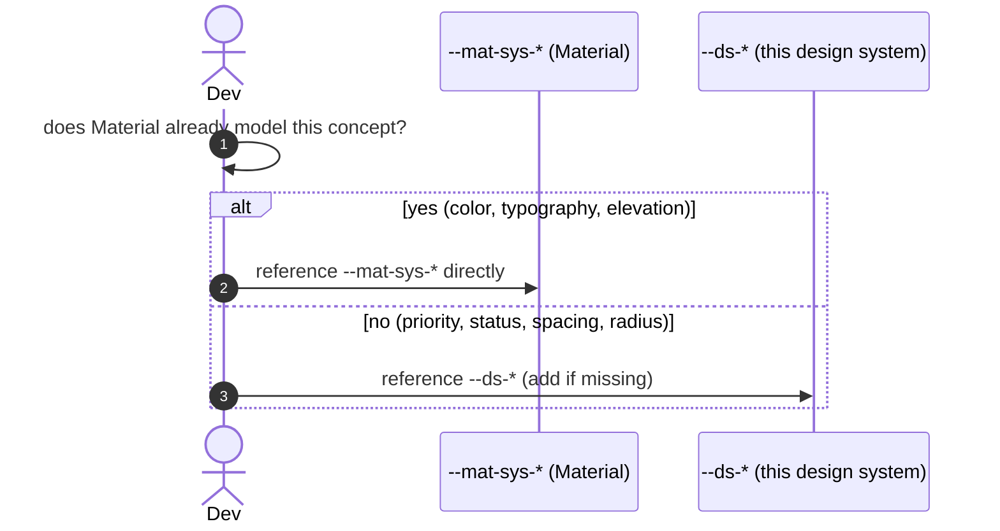

# Goal

- Give every design system component a consistent, correctly-themed set of tokens, without duplicating Angular Material's own already-semantic M3 token layer
- Cover domain-specific concepts (priority levels, workflow states) Material's own token set doesn't model, with a small, deliberately scoped custom token set
- Support light/dark mode natively, following the same mechanism Angular Material's own tokens already use
- Keep theming scope proportional to a real, current requirement (one brand) rather than speculatively building multi-tenant theming

# Capabilities

- Custom components automatically pick up any future refinement Angular Material makes to its own M3 token set, with no re-aliasing maintenance
- A small, well-scoped `--ds-*` token set gives consistent, themeable colors for domain concepts (priority, status) that would otherwise be defined ad hoc, component by component
- Light/dark mode works natively via the browser's own `light-dark()` resolution, with no JavaScript-driven theme-toggling logic for the common case
- Component styling stays upgrade-safe: token overrides go through Angular Material's own Sass override APIs, which validate token names and preserve forward compatibility

# Core Principles

- Consume `--mat-sys-*` tokens directly wherever Material's own M3 token set already models the concept — colors, typography, elevation — never build a redundant alias layer over an already-semantic token
- Define `--ds-*` custom tokens only for genuine gaps: domain-specific semantic colors (priority, workflow state), spacing scale, radius scale
- Every color token, both Material's own and this design system's custom additions, uses `light-dark()` for light/dark support
- Token values are only ever changed through Angular Material's Sass override mixins — never by hand-setting a `--mat-*` custom property directly in raw component CSS
- A single, fixed brand palette is used everywhere for now; multi-brand/per-tenant theming is explicitly deferred to a future solution, informed by real requirements if and when they appear

# Adr

- [[skills/angular/architecture/solutions/solution-design-system-tokens.skill/adr/token-consumption-strategy|Hybrid: --mat-sys-* directly + custom --ds-* tokens for gaps only, instead of a full custom semantic layer]]
  - Selected variant: hybrid — chosen because Material's M3 tokens are already a semantic layer, and aliasing them again would add indirection with no naming benefit
- [[skills/angular/architecture/solutions/solution-design-system-tokens.skill/adr/light-dark-mode-strategy|color-scheme + light-dark() instead of a hand-maintained parallel dark theme]]
  - Selected variant: native `light-dark()` — chosen for consistency with how Material's own tokens are already implemented, and because it requires no JavaScript for the common case
- [[skills/angular/architecture/solutions/solution-design-system-tokens.skill/adr/brand-theming-scope|Single fixed brand palette, multi-tenant deferred, instead of building swappable theming now]]
  - Selected variant: single palette — chosen to avoid speculative complexity against a requirement that isn't concrete yet

# Requirements

SOLUTION:
- [[skills/angular/architecture/solutions/solution-design-system-structure.skill/solution-design-system-structure.skill.md|Дизайн-система: структура]]
  - Theme and token files live inside `projects/design-system`, the publishable library project established by that solution

NPM:
- @angular/material
  - `mat.theme()`, M3 system tokens, Sass override mixins

# Template Skill Mutations

REPOSITORY:
- [[skills/angular/architecture/solutions/solution-design-system-tokens.skill/Implementation/Repository.extend|Repository]] - extend - add `theme.scss` and `custom-tokens.scss` to `projects/design-system`, establish the token-consumption and override-only rules

Artifact-level:
- [[skills/angular/architecture/solutions/solution-design-system-tokens.skill/Implementation/Tokens/theme.scss.create|theme.scss]] - create - the single `mat.theme()` definition, applied at the root selector
- [[skills/angular/architecture/solutions/solution-design-system-tokens.skill/Implementation/Tokens/custom-tokens.scss.create|custom-tokens.scss]] - create - `--ds-*` tokens for semantic status/priority colors, spacing, radius

# Workflow

## Styling a new custom component (happy path)

1. The component needs a background color for its "primary" emphasis state — this is a concept Material already models.
2. The component references `var(--mat-sys-primary)` directly in its stylesheet — no custom alias is introduced.
3. The component also needs to indicate "high priority" — a concept Material has no equivalent for.
4. The component references `var(--ds-color-priority-high)`, defined once in `custom-tokens.scss`.

## Dark mode (happy path)

1. A user's OS is set to dark mode.
2. Every `--mat-sys-*` token (defined by Material's `mat.theme()`) and every `--ds-*` token (defined in `custom-tokens.scss`) resolves to its dark variant via `light-dark()`, automatically, with no JavaScript.

## Attempting to hand-set a Material token (anti-pattern, caught in review)

1. A developer, needing a one-off visual tweak, writes `button { --mat-sys-primary: #ff0000; }` directly in a component's stylesheet.
2. This is flagged against [[skills/angular/architecture/solutions/solution-design-system-tokens.skill/Implementation/Repository.extend#MUST]] — token values must only be changed through Angular Material's Sass override mixins.
3. Fix: use `mat.theme-overrides` or the relevant component-specific override mixin instead, which validates the token name and preserves forward compatibility.

# Rules

## MUST
- [[skills/angular/architecture/solutions/solution-design-system-tokens.skill/Implementation/Repository.extend#MUST|Repository]]
- [[skills/angular/architecture/solutions/solution-design-system-tokens.skill/Implementation/Tokens/theme.scss.create#MUST|Tokens/theme.scss.create]]
- [[skills/angular/architecture/solutions/solution-design-system-tokens.skill/Implementation/Tokens/custom-tokens.scss.create#MUST|Tokens/custom-tokens.scss.create]]

## MUST NOT
- [[skills/angular/architecture/solutions/solution-design-system-tokens.skill/Implementation/Repository.extend#MUST NOT|Repository]]

# Anti-patterns

- [[skills/angular/architecture/solutions/solution-design-system-tokens.skill/Implementation/Repository.extend|See Repository.extend.md]] — aliasing an already-semantic Material token; hand-setting `--mat-*` in raw CSS.
- [[skills/angular/architecture/solutions/solution-design-system-tokens.skill/Implementation/Tokens/theme.scss.create|See theme.scss.create.md]] — applying the theme below the root selector.
- [[skills/angular/architecture/solutions/solution-design-system-tokens.skill/Implementation/Tokens/custom-tokens.scss.create|See custom-tokens.scss.create.md]] — adding a `--ds-*` token for a concept Material's palette already covers.

# Check list

- [ ] No custom component defines a `--ds-*` alias for a concept `--mat-sys-*` already models
- [ ] Every `--ds-*` token exists only for a genuine gap in Material's own token set
- [ ] Every color token (Material's and this design system's own) uses `light-dark()`
- [ ] No component or consuming application hand-sets a `--mat-*` custom property directly — all overrides go through Sass override mixins
- [ ] Exactly one brand palette is defined, applied at the root selector
