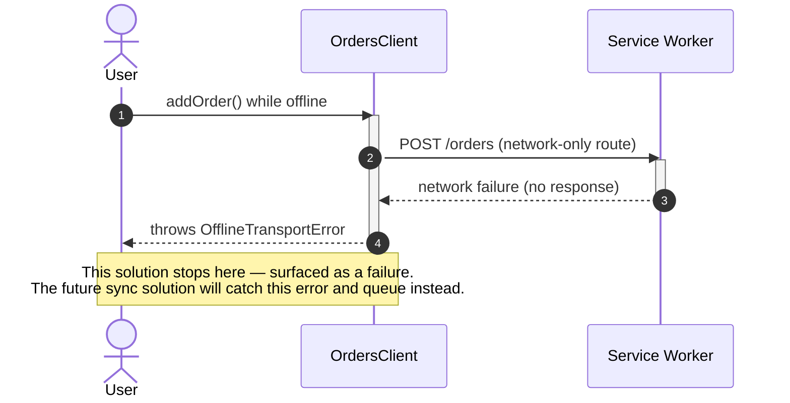

# Goal

- Make the application shell load and show last-known data even when offline (Сценарий A: read resilience), without attempting to solve offline mutation handling in this solution
- Apply the right caching strategy per content type, rather than one compromise applied everywhere
- Give the application an accurate, single source of truth for connectivity, and a clean hook (`OfflineTransportError`) for the future write-queueing solution to build on

# Capabilities

- The app shell always loads, even with no network, via an atomically-updated precached bundle
- Feature data screens show last-known-good data instantly (stale-while-revalidate) instead of a blank/error state when offline
- Federated embeddable modules (per the "Встраиваемость платформы" solution) keep working from their last-cached version if their independent deployment is temporarily unreachable
- Auth and mutation requests are never served from or written to any cache, protecting the token-handling guarantees from the "Аутентификация" solution
- A clear, accurate offline indicator, backed by more than just `navigator.onLine`

# Core Principles

- This solution's scope is read resilience only ("Сценарий A"): the app shell always loads, and API reads fall back to last-known-good cached data when offline. It deliberately does not implement write queueing, retry, or conflict handling for mutations attempted while offline — that is the explicit scope of the future "Синхронизация offline-данных" solution, which this solution only prepares a hook for
- Five distinct caching strategies apply by content type: precache (app shell), cache-first (static assets), stale-while-revalidate (API reads and federated remote chunks), network-only (auth and all non-GET requests)
- Connectivity is judged by combining `navigator.onLine` events with a periodic backend health-check — neither alone is trustworthy on its own
- Every feature's Client distinguishes a network-level failure (`OfflineTransportError`) from a genuine server-side error — this is the one architectural hook this solution adds toward the future write-queueing solution

# Adr

- [[skills/angular/architecture/solutions/solution-offline-first.skill/adr/service-worker-mechanism|Workbox instead of Angular's built-in (and now feature-frozen) Service Worker]]
  - Selected variant: Workbox — chosen because ngsw is explicitly feature-frozen by Angular's own team, and Workbox supports the per-content-type strategies and runtime caching of dynamically-resolved federation chunks this solution needs
- [[skills/angular/architecture/solutions/solution-offline-first.skill/adr/caching-strategy-per-content-type|Five strategies by content type instead of one uniform strategy]]
  - Selected variant: five strategies — chosen because auth/mutations, the app shell, static assets, API reads, and federated remote chunks each have genuinely different freshness/availability requirements
- [[skills/angular/architecture/solutions/solution-offline-first.skill/adr/connectivity-detection|navigator.onLine events + periodic health-check instead of navigator.onLine alone]]
  - Selected variant: combined signal — chosen because `navigator.onLine` alone materially misrepresents real backend reachability in common failure modes (captive portals, backend outages)

# Requirements

SOLUTION:
- [[skills/angular/architecture/solutions/solution-state-management.skill/solution-state-management.skill|State management]]
  - New `connectivity` slice added to `libs/shared/state`, following the same classical-NgRx pattern as the existing `auth` slice
- [[skills/angular/architecture/solutions/solution-api-http-layer.skill/solution-api-http-layer.skill|API/HTTP-слой]]
  - Every feature's `{feature}.client.ts` extended to throw `OfflineTransportError` on network-level failures
- [[skills/angular/architecture/solutions/solution-platform-embeddability.skill/solution-platform-embeddability.skill|Встраиваемость платформы]]
  - Federated remote chunks are runtime-cached using the same origin list as `RemoteRegistryService`

NPM:
- workbox-build, workbox-routing, workbox-strategies, workbox-precaching, workbox-expiration
  - Service worker generation and routing strategies, per [[skills/angular/architecture/solutions/solution-offline-first.skill/adr/service-worker-mechanism|Service Worker Mechanism ADR]]

# Template Skill Mutations

REPOSITORY:
- [[skills/angular/architecture/solutions/solution-offline-first.skill/Implementation/Repository.extend|Repository]] - extend - Workbox build integration, `OfflineTransportError` distinction in every feature's Client

PROJECT:
- [[skills/angular/architecture/solutions/solution-offline-first.skill/Implementation/PlatformHost/platform-shell.project.extend|apps/platform-shell]] - extend - register the generated service worker and add the Workbox build step
- [[./Implementation/GlobalStore/shared-state.project.extend.md|libs/shared/state]] - extend - register the `connectivity` slice

Artifact-level:
- [[skills/angular/architecture/solutions/solution-offline-first.skill/Implementation/ServiceWorker/service-worker.create|service-worker (sw-src.ts / sw-build.ts)]] - create - the five content-type routing rules
- [[skills/angular/architecture/solutions/solution-offline-first.skill/Implementation/GlobalStore/connectivity.store.ts.create|connectivity.store.ts]] - create - `isOnline` signal combining browser events and health-check
- [[skills/angular/architecture/solutions/solution-offline-first.skill/Implementation/DataAccess/{feature}.client.ts.extend|{feature}.client.ts (extend)]] - extend - throws `OfflineTransportError` on network-level failure, generic pattern applied to any feature's Client
- [[skills/angular/architecture/solutions/solution-offline-first.skill/Implementation/UI/offline-banner.component.ts.create|offline-banner.component.ts]] - create - shared offline indicator, mounted once at the shell level

# Workflow

## Opening the app offline (happy path — Сценарий A)

1. The user opens the application with no network connection.
2. The precached app shell loads regardless — the browser serves it entirely from the service worker's cache.
3. A feature screen requests its data; the stale-while-revalidate strategy immediately serves the last-cached response, so the user sees last-known data rather than a blank screen.
4. `OfflineBannerComponent`, reading the `connectivity` slice, shows the offline indicator.

## Network restored while viewing cached data (happy path)

1. The health-check succeeds again; `isOnline` becomes `true`; the offline banner disappears.
2. The next time a stale-while-revalidate-cached endpoint is requested, the background revalidation fetches fresh data and updates the cache for next time.

## Attempting a mutation while offline (documented limitation of this solution)

1. The user attempts to create an order while offline.
2. The Client's HTTP call fails at the network level; per this solution's extension, it throws `OfflineTransportError` instead of a generic domain error.
3. The Facade/Signal Store surfaces this as a failure to the user (e.g. "you're offline, try again once reconnected") — no queueing or automatic retry happens in this solution.
4. The future "Синхронизация offline-данных" solution will catch this same `OfflineTransportError` to decide whether to enqueue the mutation instead of surfacing it as a failure.

## Federated remote temporarily unreachable (failure path)

1. An embeddable app's independently-deployed `remoteEntry` is temporarily unreachable (that team's own outage, unrelated to the user's connectivity).
2. The stale-while-revalidate runtime-caching rule serves the last-cached version of that remote instead of failing to load it entirely.
3. Once that team's deployment is reachable again, the next load revalidates and updates the cached version.

# Rules

## MUST
- [[skills/angular/architecture/solutions/solution-offline-first.skill/Implementation/Repository.extend#MUST|Repository]]
- [[skills/angular/architecture/solutions/solution-offline-first.skill/Implementation/ServiceWorker/service-worker.create#MUST|ServiceWorker/service-worker.create]]
- [[skills/angular/architecture/solutions/solution-offline-first.skill/Implementation/GlobalStore/connectivity.store.ts.create#MUST|GlobalStore/connectivity.store.ts.create]]
- [[skills/angular/architecture/solutions/solution-offline-first.skill/Implementation/DataAccess/{feature}.client.ts.extend#MUST|DataAccess/{feature}.client.ts.extend]]
- [[skills/angular/architecture/solutions/solution-offline-first.skill/Implementation/UI/offline-banner.component.ts.create#MUST|UI/offline-banner.component.ts.create]]

## MUST NOT
- [[skills/angular/architecture/solutions/solution-offline-first.skill/Implementation/Repository.extend#MUST NOT|Repository]]

# Anti-patterns

- [[skills/angular/architecture/solutions/solution-offline-first.skill/Implementation/Repository.extend|See Repository.extend.md]] — building even a minimal mutation queue as part of this solution; caching auth/mutation endpoints with anything other than network-only.
- [[skills/angular/architecture/solutions/solution-offline-first.skill/Implementation/ServiceWorker/service-worker.create|See service-worker.create.md]] — registering routes in an order that lets a mutation be matched by the API-reads rule.
- [[skills/angular/architecture/solutions/solution-offline-first.skill/Implementation/GlobalStore/connectivity.store.ts.create|See connectivity.store.ts.create.md]] — relying on the browser's online signal alone without the health-check.
- [[skills/angular/architecture/solutions/solution-offline-first.skill/Implementation/DataAccess/{feature}.client.ts.extend|See {feature}.client.ts.extend.md]] — treating a network-level failure the same as a server error.
- [[skills/angular/architecture/solutions/solution-offline-first.skill/Implementation/UI/offline-banner.component.ts.create|See offline-banner.component.ts.create.md]] — a feature building its own local offline indicator instead of the shared one.

# Check list

- [ ] The app shell loads fully with no network connection
- [ ] API GET requests show last-known cached data when offline, via stale-while-revalidate
- [ ] Auth and every non-GET request are always `network-only`, never cached
- [ ] Federated remote chunks are runtime-cached (stale-while-revalidate), not precached
- [ ] `isOnline` reflects both `navigator.onLine` and the health-check, not either alone
- [ ] Every feature's Client throws `OfflineTransportError` for network-level failures, distinct from server-side domain errors
- [ ] No mutation queueing, retry, or persistence exists in this solution — mutations attempted offline simply fail, deferred entirely to the future "Синхронизация offline-данных" solution
