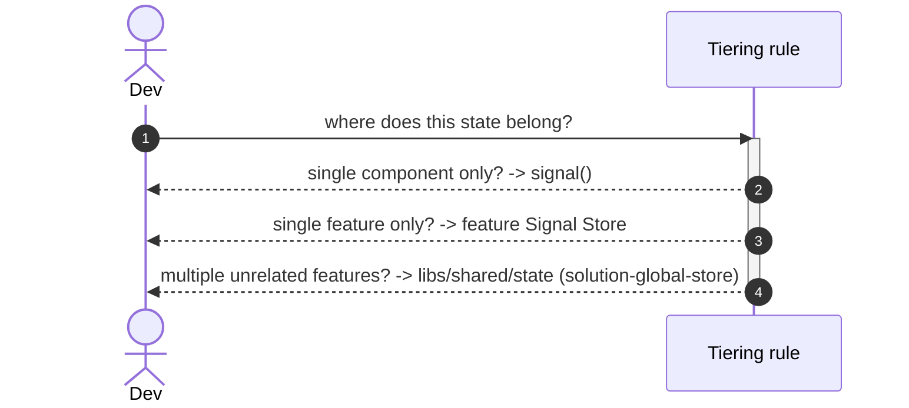

# Goal
- Give every piece of application state an unambiguous home based on its actual scope, instead of one tool stretched to fit every case.
- Keep feature-scoped state colocated with its owning feature, consistent with the module boundaries from `solution-repository-structure`.
- Provide a teachable rule — *which tier does this state belong to* — so the choice is not made ad hoc per feature.

# Capabilities
- No NgRx boilerplate for purely local UI state.
- Feature-scoped state stays encapsulated inside its owning feature's `feature` lib, with no cross-feature leakage.
- A single, greppable rule any engineer or agent can apply without judgement calls.

# Core Principle
- **Component-local state** (dialog visibility, selected tab, form draft, component-scoped loading flags) is a plain Angular `signal()` on the component — no store of any kind.
- **Feature-scoped state** (data and UI state owned by exactly one feature) is an NgRx Signal Store, colocated inside that feature's `libs/{feature}/feature` project.
- **Cross-cutting state** (read or dispatched by more than one unrelated feature — auth session, notifications, connectivity, the offline-sync queue) is the third tier, a classical NgRx Store in `libs/shared/state` — realized by [[skills/angular/architecture/v3.1/solutions/solution-global-store.skill/solution-global-store.skill.md|solution-global-store]], **not** this solution.
- State is promoted from a lower tier to a higher one **only** when a second, unrelated consumer genuinely needs it — never preemptively.
- A feature store or component never duplicates cross-cutting state locally; it always reads it through `libs/shared/state` selectors (once `solution-global-store` is present).

# Boundaries
- Assumes the `solution-repository-structure` baseline: an Nx workspace with `libs/{feature}/feature` projects. It adds no project and no repo-level structure — only the Signal Store pattern inside a feature lib and the component-Signal pattern.
- The third tier is deliberately out of scope. A module with only tiers 1–2 is a valid, common configuration (an app with no cross-cutting state). When `solution-global-store` is composed, this solution's promotion rule points at it.
- Does not decide *which* state is genuinely cross-cutting — that judgement is made by whoever applies the rule, against observed multi-feature need, not speculation.

# Adr
- [[skills/angular/architecture/v3.1/solutions/solution-state-tiering.skill/adr/state-tiering-policy.md|state-tiering-policy]] — three tiers (Signal / Signal Store / classical NgRx), promote only on a second unrelated consumer. Rejected: one tool everywhere; promote-by-default.

# Requirements

SOLUTION:
- [[skills/angular/architecture/v3.1/solutions/solution-repository-structure.skill/solution-repository-structure.skill.md|solution-repository-structure]]
  - [[skills/angular/architecture/v3.1/solutions/solution-repository-structure.skill/Implementation/Repository.create.md|libs/{feature}/feature]] - the feature-level Signal Store is colocated inside this project

NPM:
- `@ngrx/signals` — `signalStore`, `withState`, `withMethods`, `patchState` for the feature tier.

# Template Skill Mutations

PROJECT:
- [[skills/angular/architecture/v3.1/solutions/solution-state-tiering.skill/Implementation/FeatureStore/{Feature}.project.extend.md|{Feature}/feature (generic pattern)]] - extend - add a feature-level Signal Store
  - [[skills/angular/architecture/v3.1/solutions/solution-state-tiering.skill/Implementation/FeatureStore/{Feature}.project.extend/{feature}.store.ts.create.md|{feature}.store.ts]] - create - feature-level Signal Store pattern, applied by any feature-owning solution
- [[skills/angular/architecture/v3.1/solutions/solution-state-tiering.skill/Implementation/LocalState/{component-name}.component.ts.extend.md|{component-name} (generic pattern)]] - extend - component-local state via plain Signals

# Workflow

## Deciding where new state belongs (happy path)

1. Is this state owned by exactly one component (and optionally its direct children)? → plain `signal()` on the component.
2. Otherwise, is it owned by exactly one feature? → NgRx Signal Store inside that feature's `feature` lib.
3. Otherwise (more than one unrelated feature reads or dispatches it) → the third tier, `libs/shared/state` (`solution-global-store`).

## State misplacement (failure path)

1. A feature store starts caching a copy of the current user locally "for convenience".
2. On logout the global auth slice clears, but the feature's local copy does not.
3. The feature renders as if the user is still logged in — a divergence bug from skipping the rule.
4. Fix: remove the local copy; read the shared selector directly wherever needed.

# Rules

## MUST
- [[skills/angular/architecture/v3.1/solutions/solution-state-tiering.skill/Implementation/FeatureStore/{Feature}.project.extend/{feature}.store.ts.create.md#MUST|{feature}.store.ts]]
- [[skills/angular/architecture/v3.1/solutions/solution-state-tiering.skill/Implementation/LocalState/{component-name}.component.ts.extend.md#MUST|{component-name}.component.ts]]
- Never create a feature or global store for state only one component ever reads.
  - Risk: NgRx boilerplate and an indirection layer for state that a `signal()` already handles.
  - Fix: keep it a component `signal()` until a second consumer appears.
- Never let a `type:feature` project read another feature's Signal Store directly.
  - Risk: hidden cross-feature coupling that `@nx/enforce-module-boundaries` then has to be widened to allow.
  - Fix: if the data is genuinely shared, promote it to `libs/shared/state`; otherwise pass it through routing.

## SHOULD
- [[skills/angular/architecture/v3.1/solutions/solution-state-tiering.skill/Implementation/FeatureStore/{Feature}.project.extend/{feature}.store.ts.create.md#SHOULD|{feature}.store.ts]]
- Avoid promoting a component `signal()` to a feature store "in case another component needs it later" — promote on the second real consumer, not the first hypothetical one.

# Check list
- [ ] No component-local `signal()` has been promoted to a feature or global store without a second, unrelated consumer.
- [ ] Every feature-level Signal Store lives inside that feature's own `libs/{feature}/feature` project.
- [ ] No `type:feature` project imports another feature's Signal Store.
