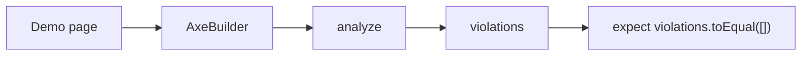

# Accessibility testing

**Accessibility testing** is an automated check that a UI component complies with the mechanically-checkable WCAG rules: contrast, correct ARIA attributes, labels on controls, and heading/landmark structure.

## What is WCAG

WCAG (Web Content Accessibility Guidelines) is an international standard developed by the W3C under the WAI initiative. It describes how to make web content usable by people with impairments (vision, hearing, motor, cognitive). **The rules are not defined by this team** — they come from a worldwide community; `@axe-core/playwright` only mechanically checks that the rendered component conforms to them. WCAG 2.1/2.2 include criteria such as a minimum contrast ratio of 4.5:1, correct ARIA roles, and labels for controls.

## Why it exists

Behavioral DOM tests may incidentally check for a `role` or `label`, but only where the test author thought of it. Visual screenshots show how a component looks, but do not measure contrast or validate ARIA. An automated accessibility scan gives a reliable safety net for the violations a machine can find on every PR, without running a screen reader or a manual audit each time.

## How it works

1. For each component state already covered by a visual test, the same demo page is opened via Playwright.
2. `AxeBuilder` from `@axe-core/playwright` injects the axe-core engine into the page and runs the analysis.
3. The result returns a `violations` array — the WCAG violations found.
4. The test asserts that `violations` is empty (or contains only explicitly documented per-rule exceptions).
5. Exceptions do not disable the whole scan — they are scoped to one specific rule with an inline explanation.



### What `violations` is

`results.violations` is an array of objects, each describing one WCAG rule that failed. The main fields:

- `id` — the rule identifier, e.g. `color-contrast`, `label`, `aria-required-attr`, `region`.
- `impact` — severity: `minor`, `moderate`, `serious`, `critical`.
- `description` — what exactly is violated.
- `help` — a short explanation, e.g. "Elements must have sufficient color contrast".
- `helpUrl` — a link to the axe-core documentation for that rule.
- `nodes` — the DOM elements where the violation was found. Each has `target` (a selector), `html` (a markup fragment), and `failureSummary` (why that element fails).

Example:

```json
[
  {
    "id": "color-contrast",
    "impact": "serious",
    "description": "Elements must have sufficient color contrast",
    "help": "Elements must have sufficient color contrast",
    "helpUrl": "https://dequeuniversity.com/rules/axe/4.9/color-contrast",
    "nodes": [
      {
        "target": ["button[type=\"button\"]"],
        "html": "<button>Save</button>",
        "failureSummary": "Fix any of the following:\n  Element has insufficient color contrast of 2.1 (foreground color: #ffffff, background color: #aaaaaa, font size: 12.0pt, font weight: normal). Expected contrast ratio of 4.5:1"
      }
    ]
  }
]
```

`expect(results.violations).toEqual([])` checks that the array is empty. If axe-core found nothing, `violations` is `[]` and the test passes. If it found at least one violation, the test fails, and the CI output shows the rule, the affected elements, and the fix recommendation.

### How `AxeBuilder` works

```typescript
import AxeBuilder from '@axe-core/playwright';

const results = await new AxeBuilder({ page }).analyze();
```

`AxeBuilder({ page })` binds axe-core to an already-open Playwright page. `analyze()` injects the axe JavaScript engine into the page, scans the DOM, and returns an object with `violations`, `passes`, `incomplete`, `inapplicable`. `violations` is the field of interest — it is the only one that collects real errors.

## How it is structured

- **Demo/preview page** — the same stable page used for the visual screenshots.
- **Accessibility spec** — `spec/{component-name}.a11y.spec.ts`, one next to each `spec/{component-name}.visual.spec.ts`.
- **AxeBuilder** — the `@axe-core/playwright` wrapper that injects axe-core into the page.
- **Violations** — the array of violations with rule, affected element, and fix recommendation.
- **Scoped exceptions** — allowed violations of one specific rule only, documented in code.
- **CI gate** — any unexpected violation breaks the build.

## Example

```typescript
// File: projects/design-system/src/lib/ds-button/spec/ds-button.a11y.spec.ts
import { test, expect } from '@playwright/test';
import AxeBuilder from '@axe-core/playwright';

test.describe('DsButtonComponent — accessibility', () => {
  test('has no automatically detectable violations (default)', async ({ page }) => {
    await page.goto('/ds-button/default');
    const results = await new AxeBuilder({ page }).analyze();
    expect(results.violations).toEqual([]);
  });
});
```

## Related concepts

- [Behavioral component testing](skills/angular/architecture/v3.1/solutions/solution-ui-testing.skill/glossary/behavioral-component-testing.md) — uses accessible roles/labels but does not exhaust WCAG.
- [Visual regression testing](skills/angular/architecture/v3.1/solutions/solution-ui-testing.skill/glossary/visual-regression-testing.md) — checks appearance, but not contrast or ARIA.
- [Style-snapshot testing](skills/angular/architecture/v3.1/solutions/solution-ui-testing.skill/glossary/style-snapshot-testing.md) — captures computed styles, but not accessibility rules.

## Sources

- [axe-core for Playwright — npm](https://github.com/dequelabs/axe-core-npm/tree/develop/packages/playwright)
- [Playwright — Accessibility Testing](https://playwright.dev/docs/accessibility-testing)
- [Deque — axe-core rules](https://github.com/dequelabs/axe-core/blob/develop/doc/rule-descriptions.md)
- [ADR: accessibility-testing-approach](skills/angular/architecture/v3.1/solutions/solution-ui-testing.skill/adr/accessibility-testing-approach.md)
- [Generic pattern for a11y specs](skills/angular/architecture/v3.1/solutions/solution-ui-testing.skill/Implementation/Testing/{component-name}.a11y.spec.ts.create.md)
- [solution-ui-testing.skill.md — the accessibility section](skills/angular/architecture/v3.1/solutions/solution-ui-testing.skill/solution-ui-testing.skill.md)
