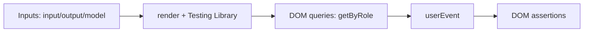

# Behavioral component testing

**Behavioral component testing** means testing a UI component through its rendered DOM: instead of checking internal signals, fields, or `fixture.componentInstance`, the test simulates user actions and asserts that the expected result or event appeared on screen.

## Why it exists

Ordinary Angular unit tests often couple to a component's internals — field names, signal names, template bindings. A refactor that preserves user-visible behaviour then breaks such tests for no real reason. The DOM level also needs no real backend, routing, or complex business mocks, so the tests stay fast and stable. This approach also forces authors to use accessible roles and labels, which nudges the component toward better accessibility.

## How it works

1. The component is rendered in isolation via Angular Testing Library, with fixed `input()`/`output()`/`model()` values.
2. If the component directly injects one immediate collaborator (a Signal Store / Facade), it is replaced with a simple fake.
3. The test finds elements via `screen.getByRole`, `getByLabelText`, `getByText` — the way a user or assistive technology would.
4. Interaction happens through `@testing-library/user-event` (`click`, `type`, …).
5. The result is asserted: text content, `disabled` state, an emitted output event, or a call on the faked collaborator.



### What `screen.getByRole('button', { name: /save/i })` does

`getByRole` is an Angular Testing Library query that finds an element by its **accessibility role**. A role is the element's semantic purpose: a plain `<button>` has role `button`, an `<input type="text">` has role `textbox`, a `<nav>` has role `navigation`, and so on. The role is what a screen reader announces, so a test that uses `getByRole` also verifies that the component exposes the right semantics.

`{ name: /save/i }` filters by the **accessible name** — the text assistive technology reads to the user. For a button that is usually the visible text inside it. The regex `/save/i` matches the substring "save" case-insensitively (`i`). If the DOM has only a button with the text "Save changes", the query finds it; if there is no such button or it has no proper name, the test fails immediately with a clear error.

### Why `userEvent.click`, not `element.click()`

`userEvent.click` simulates the real pointer event chain: `pointerdown`, `mousedown`, `pointerup`, `mouseup`, `click`. That lets the test exercise focus handling, `disabled` state, double clicks, and other behavioural details a bare `element.click()` can skip.

### Why `expect(pressed).toHaveBeenCalled()`

`pressed` is a spy (a mock function) supplied for the `(pressed)` output. This assertion checks that the component actually emitted the output event, not merely changed an internal field.

## How it is structured

- **Spec file location** — the test file is created at `spec/{component-name}.component.spec.ts`, not next to the implementation.
- **Inputs** — the static input data passed to the component.
- **Fake collaborator** — a minimal mock for the single dependency the component injects directly; HTTP, Facade, and backend are not mocked.
- **Rendering helper** — `render()` from Angular Testing Library.
- **Queries** — accessible roles/labels, not `testId` and not `fixture.debugElement`.
- **Interactions** — `userEvent` for clicks, typing, focus.
- **Assertions** — against the rendered DOM and emitted output events.

## Example

```typescript
// File: projects/design-system/src/lib/ds-button/spec/ds-button.component.spec.ts
import { render, screen } from '@testing-library/angular';
import userEvent from '@testing-library/user-event';
import { DsButtonComponent } from '../ds-button.component';

describe('DsButtonComponent', () => {
  it('renders its label and reflects the disabled input', async () => {
    await render(DsButtonComponent, { inputs: { label: 'Save', disabled: true } });
    // getByRole('button') finds the button; { name: /save/i } filters by its visible text
    expect(screen.getByRole('button', { name: /save/i })).toBeDisabled();
  });

  it('emits (pressed) when clicked', async () => {
    const pressed = vi.fn();
    await render(DsButtonComponent, {
      inputs: { label: 'Save' },
      on: { pressed },
    });

    await userEvent.click(screen.getByRole('button', { name: /save/i }));
    expect(pressed).toHaveBeenCalled();
  });
});
```

## Related concepts

- [Visual regression testing](skills/angular/architecture/v3.1/solutions/solution-ui-testing.skill/glossary/visual-regression-testing.md) — catches broken layout and dark-mode failures a DOM test cannot see.
- [Style-snapshot testing](skills/angular/architecture/v3.1/solutions/solution-ui-testing.skill/glossary/style-snapshot-testing.md) — explains *why* a visual test broke.
- [Accessibility testing](skills/angular/architecture/v3.1/solutions/solution-ui-testing.skill/glossary/accessibility-testing.md) — checks WCAG violations Testing Library does not exhaust.

## Sources

- [Angular Testing Library — official docs](https://testing-library.com/docs/angular-testing-library/intro/)
- [Which query should I use? — Testing Library](https://testing-library.com/docs/queries/about/#priority)
- [Generic pattern for component specs in this solution](skills/angular/architecture/v3.1/solutions/solution-ui-testing.skill/Implementation/Testing/{component-name}.component.spec.ts.create.md)
- [solution-ui-testing.skill.md — the overall testing-layer description](skills/angular/architecture/v3.1/solutions/solution-ui-testing.skill/solution-ui-testing.skill.md)
