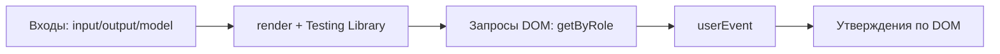

# Behavioral component testing

**Behavioral component testing** (поведенческое тестирование компонентов) — это тестирование UI-компонента через отрисованный DOM: вместо проверки внутренних сигналов, полей и `fixture.componentInstance` тест имитирует действия пользователя и проверяет, что на экране появился ожидаемый результат или событие.

## Why it exists

Обычные юнит-тесты Angular часто завязываются на внутреннее устройство компонента — имена полей, сигналов, привязку шаблона. При рефакторинге, который сохраняет пользовательское поведение, такие тесты ломаются «вхолостую». Кроме того, DOM-уровень не требует настоящего бэкенда, роутинга и сложных бизнес-моков, поэтому тесты остаются быстрыми и стабильными. Этот подход также вынуждает авторов использовать доступные роли и метки, что само по себе подталкивает к лучшей доступности.

## How it works

1. Компонент рендерится в изоляции через Angular Testing Library, с фиксированными входами `input()`/`output()`/`model()`.
2. Если компонент напрямую внедряет одного ближайшего сотрудника (Signal Store / Facade), он заменяется простым фейком.
3. Тест находит элементы через `screen.getByRole`, `getByLabelText`, `getByText` — то есть так, как это делал бы пользователь или вспомогательная технология.
4. Взаимодействие происходит через `@testing-library/user-event` (`click`, `type` и т. д.).
5. Проверяется результат: текст, состояние disabled, вызов события или вызов метода замоканного сотрудника.



## How it is structured

- **Inputs** — статические входные данные, передаваемые в компонент.
- **Fake collaborator** — минимальный мок для единственного зависимого сервиса, который компонент внедряет напрямую; HTTP, Facade и бэкенд не мокаются.
- **Rendering helper** — `render()` из Angular Testing Library.
- **Queries** — доступные роли/метки, а не `testId` и не `fixture.debugElement`.
- **Interactions** — `userEvent` для кликов, ввода, фокуса.
- **Assertions** — проверка отрисованного DOM и выходных событий.

## Example

```typescript
import { render, screen } from '@testing-library/angular';
import userEvent from '@testing-library/user-event';

describe('DsButtonComponent', () => {
  it('renders its label and reflects the disabled input', async () => {
    await render(DsButtonComponent, { inputs: { label: 'Save', disabled: true } });
    expect(screen.getByRole('button', { name: /save/i })).toBeDisabled();
  });

  it('emits (pressed) when clicked', async () => {
    const pressed = vi.fn();
    await render(DsButtonComponent, {
      inputs: { label: 'Save' },
      on: { pressed },
    });

    await userEvent.click(screen.getByRole('button', { name: /save/i }));
    expect(pressed).toHaveBeenCalled();
  });
});
```

## Related concepts

- [Visual regression testing](./visual-regression-testing.md) — ловит сломанную вёрстку и тёмную тему, которые DOM-тесты не видят.
- [Style-snapshot testing](./style-snapshot-testing.md) — объясняет, почему визуальный тест сломался.
- [Accessibility testing](./accessibility-testing.md) — проверяет WCAG-нарушения, которые Testing Library не исчерпывает.

## Sources

- [Angular Testing Library — официальная документация](https://testing-library.com/docs/angular-testing-library/intro/)
- [Generic pattern для компонентных тестов в решении](../Implementation/Testing/{component-name}.component.spec.ts.create.md)
- [solution-ui-testing.skill.md — общее описание слоёв тестирования](../solution-ui-testing.skill.md)
