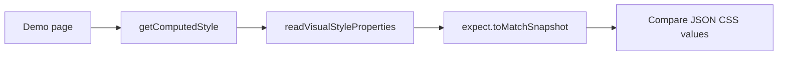

# Style-snapshot testing

**Style-snapshot testing** is a check where, instead of a pixel screenshot, a set of the component's computed CSS properties (`getComputedStyle`) is captured — turning an unexplained visual diff into a readable list of changes: `color: rgb(0,0,0) → rgb(51,51,51)`.

## Why it exists

A pixel diff says the picture changed, but not why. A developer or agent seeing a failed `.visual.spec.ts` can either spend a long time comparing images or blindly run `--update-snapshots`, risking baking a real regression into the baseline. The style-snapshot adds a structured signal: if `color`, `padding`, or `box-shadow` changed, the text diff shows it directly; if no property changed, the pixel difference is rendering noise (anti-aliasing, font hinting) that is safe to accept.

## How it works

1. Each `spec/{component-name}.visual.spec.ts` has a paired `spec/{component-name}.style-snapshot.spec.ts`.
2. The test opens the same demo page and emulates the same colour scheme.
3. A single shared helper `readVisualStyleProperties` reads a fixed list of visually significant properties (`color`, `backgroundColor`, `padding`, `border*`, `fontSize`, `lineHeight`, `opacity`, `transform`, `boxShadow`, `display`).
4. The values are serialised to JSON and compared with a committed snapshot via `toMatchSnapshot`.
5. Before updating a screenshot baseline, the style-snapshot diff is checked first: an empty diff is noise; a non-empty diff points at a specific change to confirm deliberately.



### What `readVisualStyleProperties` does

```typescript
import type { Locator } from '@playwright/test';

export const VISUAL_STYLE_PROPERTIES = [
  'color', 'backgroundColor', 'borderColor', 'borderWidth', 'borderRadius',
  'boxShadow', 'padding', 'margin', 'fontSize', 'fontWeight', 'lineHeight',
  'opacity', 'display', 'transform',
] as const;

export type VisualStyleSnapshot = Record<(typeof VISUAL_STYLE_PROPERTIES)[number], string>;

export async function readVisualStyleProperties(locator: Locator): Promise<VisualStyleSnapshot> {
  return locator.evaluate((el, properties) => {
    const computed = getComputedStyle(el);
    return Object.fromEntries(
      properties.map((property) => [property, computed[property as keyof CSSStyleDeclaration] as string]),
    ) as Record<string, string>;
  }, VISUAL_STYLE_PROPERTIES) as Promise<VisualStyleSnapshot>;
}
```

The function runs in the browser context (`locator.evaluate(...)`). It takes `VISUAL_STYLE_PROPERTIES` — one central list of property names — and for each property reads the **computed** value via `getComputedStyle(el)`. This is not a CSS class name, not a Tailwind string, and not the `style` attribute contents: it is the final value after all cascades, inheritance, CSS variables, and `light-dark()`. That is why the snapshot catches a token change even when the class stayed the same.

### What `.styles.txt` is

```typescript
expect(JSON.stringify(styles, null, 2)).toMatchSnapshot(`ds-button-default-${scheme}.styles.txt`);
```

`toMatchSnapshot` is Playwright's standard assertion for text snapshots. It works like this:

- On the first run (or with `--update-snapshots`) Playwright serialises the value and saves it to a snapshot file. In this solution `snapshotPathTemplate` in `playwright.config.ts` is configured so the files land in `spec/snapshot/` next to the test.
- On later runs Playwright reads the saved snapshot from `spec/snapshot/` and compares it with the current value.
- If the values differ, the test fails, and the output/diff shows which property changed: `color: rgb(0, 0, 0) → rgb(51, 51, 51)`.

`JSON.stringify(styles, null, 2)` makes the snapshot file a multi-line, readable JSON rather than one line. The name passed is `ds-button-default-light.styles.txt`, so the file name tells you it is the style snapshot of a specific state and colour scheme.

### About `--update-snapshots` for the style snapshot

`--update-snapshots` is a **general** Playwright flag for all snapshots in a spec: both `toHaveScreenshot` (PNG) and `toMatchSnapshot` (text). When you deliberately change the appearance you run the visual spec with `--update-snapshots`, and it updates **both** the PNG baseline **and** the text style snapshot. That is why the rule says: check the style-snapshot diff first to see exactly what changed, and only then update both snapshots with one command.

## How it is structured

- **Shared helper** — `read-visual-style-properties.ts` with the single `VISUAL_STYLE_PROPERTIES` list; lives in the project-level test-support directory, not duplicated per component.
- **Style-snapshot spec** — `spec/{component-name}.style-snapshot.spec.ts`, one next to each `spec/{component-name}.visual.spec.ts`.
- **Computed-style snapshot** — a text snapshot with the JSON property values, committed to `spec/snapshot/`.
- **Paired visual spec** — changes are compared with the changes in `spec/{component-name}.visual.spec.ts` before updating the baseline.
- **Curated property list** — the list is extended centrally, not per-component.

## Example

```typescript
// File: projects/design-system/src/lib/ds-button/spec/ds-button.style-snapshot.spec.ts
import { test, expect } from '@playwright/test';
// The helper is a single shared file in the project's test-support directory
import { readVisualStyleProperties } from '@test/read-visual-style-properties';

test.describe('DsButtonComponent — style snapshot', () => {
  for (const scheme of ['light', 'dark'] as const) {
    test(`computed style matches baseline (${scheme})`, async ({ page }) => {
      await page.emulateMedia({ colorScheme: scheme });
      await page.goto('/ds-button/default');
      const styles = await readVisualStyleProperties(page.getByTestId('ds-button'));
      expect(JSON.stringify(styles, null, 2)).toMatchSnapshot(`ds-button-default-${scheme}.styles.txt`);
    });
  }
});
```

## Related concepts

- [Visual regression testing](skills/angular/architecture/v3.1/solutions/solution-ui-testing.skill/glossary/visual-regression-testing.md) — captures the pixel picture the style snapshot pairs with.
- [Behavioral component testing](skills/angular/architecture/v3.1/solutions/solution-ui-testing.skill/glossary/behavioral-component-testing.md) — a DOM test that does not touch styles.
- [Accessibility testing](skills/angular/architecture/v3.1/solutions/solution-ui-testing.skill/glossary/accessibility-testing.md) — checks accessibility, not style values.

## Sources

- [MDN — getComputedStyle](https://developer.mozilla.org/en-US/docs/Web/API/Window/getComputedStyle)
- [Playwright — Test Snapshots](https://playwright.dev/docs/test-snapshots)
- [ADR: style-snapshot-approach](skills/angular/architecture/v3.1/solutions/solution-ui-testing.skill/adr/style-snapshot-approach.md)
- [Generic pattern for style-snapshot specs](skills/angular/architecture/v3.1/solutions/solution-ui-testing.skill/Implementation/Testing/{component-name}.style-snapshot.spec.ts.create.md)
- [The readVisualStyleProperties helper](skills/angular/architecture/v3.1/solutions/solution-ui-testing.skill/Implementation/Testing/read-visual-style-properties.ts.create.md)
- [solution-ui-testing.skill.md — the style-snapshot section](skills/angular/architecture/v3.1/solutions/solution-ui-testing.skill/solution-ui-testing.skill.md)
