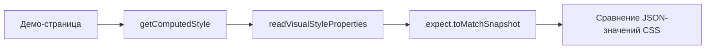

# Style-snapshot testing

**Style-snapshot testing** (тестирование стилевых снапшотов) — это проверка, при которой вместо пиксельного скриншота фиксируется набор вычисленных CSS-свойств компонента (`getComputedStyle`), чтобы превратить необъяснимый визуальный дифф в читаемый список изменений: `color: rgb(0,0,0) → rgb(51,51,51)`.

## Why it exists

Пиксельный дифф говорит, что картинка изменилась, но не объясняет почему. Разработчик или агент, видя упавший `.visual.spec.ts`, может либо долго разбирать изображения, либо бездумно запустить `--update-snapshots`, рискуя замазать реальную регрессию. Style-snapshot добавляет структурированный сигнал: если изменился `color`, `padding` или `box-shadow`, дифф текста покажет это прямо; если свойства не изменились, значит, пиксельная разница — это рендерный шум (сглаживание, хинтинг шрифтов), который безопасно принять.

## How it works

1. Каждому `.visual.spec.ts` соответствует параллельный `.style-snapshot.spec.ts`.
2. Тест открывает ту же демо-страницу и эмулирует ту же цветовую схему.
3. Через единый хелпер `readVisualStyleProperties` считывается зафиксированный список визуально значимых свойств (`color`, `backgroundColor`, `padding`, `border*`, `fontSize`, `lineHeight`, `opacity`, `transform`, `boxShadow`, `display`).
4. Значения сериализуются в JSON и сравниваются с коммитнутым снапшотом через `toMatchSnapshot`.
5. Перед обновлением baseline скриншота сначала проверяется style-snapshot дифф: пустой дифф — шум; непустой дифф — указание на конкретное изменение, которое нужно осознанно подтвердить.



## How it is structured

- **Shared helper** — `read-visual-style-properties.ts` с единым списком `VISUAL_STYLE_PROPERTIES`.
- **Style-snapshot spec** — `.style-snapshot.spec.ts`, по одному рядом с каждым `.visual.spec.ts`.
- **Computed-style snapshot** — текстовый снапшот с JSON-значениями свойств, коммитится в репозиторий.
- **Paired visual spec** — изменения сравниваются с изменениями в `.visual.spec.ts` перед обновлением baseline.
- **Curated property list** — список свойств расширяется централизованно, а не заводится отдельный набор под каждый компонент.

## Example

```typescript
import { test, expect } from '@playwright/test';
import { readVisualStyleProperties } from '../support/read-visual-style-properties';

test.describe('DsButtonComponent — style snapshot', () => {
  for (const scheme of ['light', 'dark'] as const) {
    test(`computed style matches baseline (${scheme})`, async ({ page }) => {
      await page.emulateMedia({ colorScheme: scheme });
      await page.goto('/ds-button/default');
      const styles = await readVisualStyleProperties(page.getByTestId('ds-button'));
      expect(JSON.stringify(styles, null, 2)).toMatchSnapshot(`ds-button-default-${scheme}.styles.txt`);
    });
  }
});
```

## Related concepts

- [Visual regression testing](./visual-regression-testing.md) — фиксирует пиксельную картинку, с которой работает style-snapshot.
- [Behavioral component testing](./behavioral-component-testing.md) — DOM-тест, не затрагивающий стили.
- [Accessibility testing](./accessibility-testing.md) — проверяет доступность, а не стилевые значения.

## Sources

- [MDN — getComputedStyle](https://developer.mozilla.org/en-US/docs/Web/API/Window/getComputedStyle)
- [ADR: style-snapshot-approach](../adr/style-snapshot-approach.md)
- [Generic pattern для style-snapshot спеков](../Implementation/Testing/{component-name}.style-snapshot.spec.ts.create.md)
- [Хелпер readVisualStyleProperties](../Implementation/Testing/read-visual-style-properties.ts.create.md)
- [solution-ui-testing.skill.md — раздел про style-snapshot](../solution-ui-testing.skill.md)
