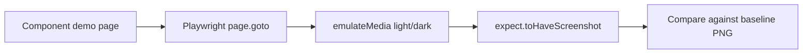

# Visual regression testing

**Visual regression testing** is an automated check that a UI component still looks the way it did before, by comparing a current screenshot of its demo page against a saved baseline image.

## Why it exists

DOM tests can check text, roles, and events, but they do not see the actual picture: jsdom/happy-dom has no rendering engine and cannot tell that the layout broke, that dark mode applied incorrectly, that contrast dropped, or that a CSS-specificity conflict arose. Visual regression testing closes that gap by fixing the component's appearance and failing CI on any noticeable deviation.

## How it works

1. For each meaningful component state, a stable demo page is created (`/ds-button/default`, `/ds-button/disabled`, …).
2. Playwright opens the page directly by that URL.
3. The colour scheme (`light`/`dark`) is emulated where relevant.
4. The test calls `expect(page).toHaveScreenshot(...)`, which compares the current screenshot with the saved baseline.
5. If the pixel difference exceeds the threshold, CI fails; the baseline is updated only deliberately, via `--update-snapshots` plus PR review.



### What `expect(page).toHaveScreenshot(...)` does

`toHaveScreenshot` is a Playwright assertion that does three things:

1. Takes a screenshot of the visible area of the page `page` refers to.
2. Compares it with a baseline file (`ds-button-default-light.png`). On the first run, if the baseline does not exist yet, Playwright either creates it (if allowed) or asks you to run with `--update-snapshots`.
3. Computes the pixel diff. If the number of differing pixels exceeds the configured threshold, the test fails and generates helper files: `actual.png` (what was rendered), `expected.png` (the old baseline), and `diff.png` (a red mask of the differences).

Before the screenshot Playwright tries to stabilise the page: it stops CSS animations, waits for transitions to finish, and clears focus. But if the demo page has dynamic content (a clock, random ordering, a UUID) the screenshot will "flicker" — such content must be removed in the preview app itself.

### About `--update-snapshots`

`--update-snapshots` is a general Playwright flag. When you deliberately change the appearance, it updates **all** snapshots in the spec: both the PNG screenshots and the text snapshots (`.styles.txt`). So before running it, look at the paired style-snapshot diff — it explains which CSS properties changed and whether the baseline should be updated.

## How it is structured

- **Demo/preview page** — a minimal app that renders the component in one state with fixed data: `apps/component-preview` (monolith) or `projects/demo` (design system).
- **Visual spec** — `.visual.spec.ts`, one per component, screenshotting each state and colour scheme.
- **Baseline image** — committed to the repository under `spec/snapshot/` next to the spec as the reference. Playwright's `snapshotPathTemplate` in `playwright.config.ts` must point at that folder.
- **Diff threshold** — configured in Playwright; filters out insignificant noise while staying sensitive to real regressions.
- **Update workflow** — the baseline changes only as part of an intentional visual change, after reviewing the diff.

## Example

```typescript
// File: projects/design-system/src/lib/ds-button/spec/ds-button.visual.spec.ts
import { test, expect } from '@playwright/test';

test.describe('DsButtonComponent — visual', () => {
  for (const scheme of ['light', 'dark'] as const) {
    test(`matches baseline (${scheme})`, async ({ page }) => {
      await page.emulateMedia({ colorScheme: scheme });
      await page.goto('/ds-button/default');
      await expect(page).toHaveScreenshot(`ds-button-default-${scheme}.png`);
    });
  }
});
```

## Related concepts

- [Behavioral component testing](skills/angular/architecture/v3.1/solutions/solution-ui-testing.skill/glossary/behavioral-component-testing.md) — checks behaviour, but does not see the picture.
- [Style-snapshot testing](skills/angular/architecture/v3.1/solutions/solution-ui-testing.skill/glossary/style-snapshot-testing.md) — explains exactly which CSS properties changed when a visual test fails.
- [Accessibility testing](skills/angular/architecture/v3.1/solutions/solution-ui-testing.skill/glossary/accessibility-testing.md) — catches WCAG violations a screenshot does not check.

## Sources

- [Playwright — Test Snapshots](https://playwright.dev/docs/test-snapshots)
- [Playwright — Screenshot Assertions](https://playwright.dev/docs/api/class-page#page-screenshot)
- [ADR: visual-regression-approach](skills/angular/architecture/v3.1/solutions/solution-ui-testing.skill/adr/visual-regression-approach.md)
- [Generic pattern for visual specs in this solution](skills/angular/architecture/v3.1/solutions/solution-ui-testing.skill/Implementation/Testing/{component-name}.visual.spec.ts.create.md)
- [solution-ui-testing.skill.md — the visual-layer description](skills/angular/architecture/v3.1/solutions/solution-ui-testing.skill/solution-ui-testing.skill.md)
