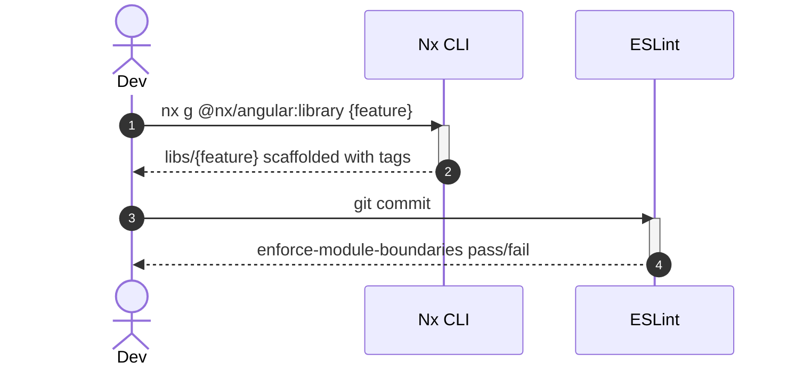

# How Apply this template
- Create a folder named `solution-{SolutionName}.skill` and put this template into it as `solution-{SolutionName}.skill.md`.
- Fill the template using:
  - `hint` blocks — instructions on how the section should be filled;
  - `example` blocks — examples of filled sections;
  - `code example` blocks — code examples.
- When the section does not apply to the solution, remove the whole section or add a note that no changes are introduced.
- Clearing template hints before finalizing the skill:
  - Remove all `hint`, `example` and `code example` blocks.
  - Remove this `# How Apply this template` block.

# Goal
```hint
List of goals that are pursued by the creation of this solution.
RECOMMENDATION:
- Prefer bullet list
```
```example
- Define a single, predictable Angular workspace structure so any engineer or AI agent can locate and place code without guessing
```

# Capabilities
```hint
What are the benefits of using this solution?
RECOMMENDATION:
- Prefer bullet list
```
```example
- Low coupling between feature libraries via enforced module boundaries
```

# Core Principles
```hint
Core principles that a solution should follow.
RECOMMENDATION:
- Prefer bullet list
- Group principles by logical sense
```
```example
- Apps are deployable units, libs are reusable code — nothing else lives at top level
- Every lib exposes a narrow public API through a single `index.ts`
```

# Adr
```hint
Use this section only if an architecture decision was made while building or editing the solution.
Record every such decision as an ADR following [[skills/common-workflow/architecture/design/adr-create.skill/adr-create.skill.md|adr-create]]: create ADR files from its template in an `adr/` folder inside the solution skill folder, list them in the `adr:` property of the YAML header, and briefly summarize each decision in the skill body with a link to its ADR.
RECOMMENDATION:
- Prefer bullet list
```
```example
- [[adr/nx-vs-angular-cli-workspace.md|Nx monorepo instead of plain Angular CLI workspace]]
  - Selected variant: Nx monorepo
```

# Requirements
```hint
List of requirements for solution applying and npm packages. Define what solution uses from dependencies.
RECOMMENDATION:
- Prefer bullet list
- Use <Link|Property Name> format in link

TEMPLATE:
SOLUTION:
- {link to requirements solution}
  - {link to requirements Nx project in solution}
    - {link to requirements file in solution} - description how does it used in solution
NPM:
- {npm package name} {version}
  - {file/artifact} - description how does it used in solution
```
```example
SOLUTION:
- [[solution-repository-structure.skill.md|Repository structure solution]]
  - [[apps-platform-shell.extended.md|apps/platform-shell]]
    - [[app-config.ts.extended.md|app.config.ts]] - register root providers required by this solution
NPM:
- @ngrx/signals
  - AuthStore - implemented as a Signal Store
```

# Template Skill Mutations
```hint
1. Create an `Implementation/` folder inside the skill folder.
2. All changes which must be made to implement this solution must be written into the `Implementation/` folder using templates from [[./Implementation Templates/|Implementation Templates]].
3. Implementation file naming rules:
   1. For Repository.template — `Repository.{change_kind}.md`
   2. For Project.template (Nx app or lib) — `{project-name}.project.{change_kind}.md`
   3. For Class.template (any TS artifact: component, service, directive, pipe, guard, interceptor, resolver, store, module) — `{name}.{artifact-type}.ts.{change_kind}.md`
4. Implementation files must be placed into the `Implementation/` folder following this structure:
   - Implementation/
     - Repository.{change_kind}.md
     - {project-name}.project.{change_kind}.md
     - {project-name}.project.{change_kind}/
       - {name}.{artifact-type}.ts.{change_kind}.md
   ATTENTION: for dynamic names like feature name or entity name prefer using `{Feature}` or `{Entity}` notation. It shows that the name is not constant.
5. Every solution skill must provide concrete implementation files, including classification, decision, policy, or taxonomy skills. If the skill selects between variants, provide an implementation file for each variant that shows the resulting code or configuration.
6. When this skill depends on other solutions, each implementation variant or section must explicitly state which dependency solution(s) are applied and which are intentionally not applied.

Add links to created files as shown below:
REPOSITORY:
- {link to repository template} - {change_kind} - {description}
PROJECT:
- {link to project template} - {change_kind} - {description}
  - {link to artifact template} - {change_kind} - {description}
```
```example
REPOSITORY:
- [[./Implementation/Repository.create.md|Repository]] - create - define apps/libs layout and Nx tags
PROJECT:
- [[./Implementation/libs-shared-ui.project.create.md|libs/shared-ui]] - create - host reusable, design-system-agnostic UI wrappers
  - [[./Implementation/libs-shared-ui.project.create/button.component.ts.create.md|button.component.ts]] - create - base button primitive
- [[./Implementation/{Feature}.project.extend.md|{Feature} lib]] - extend - add feature-level Signal Store
  - [[./Implementation/{Feature}.project.extend/{Feature}.store.ts.create.md|{Feature}.store.ts]] - create - feature-level Signal Store
```

# Workflow
```hint
Describe all major workflows that the solution covers. Do not limit the description to a single happy-path scenario.
For each workflow:
- Name the scenario (e.g., happy path, validation failure, cross-module call, retry).
- List the participants and the sequence of steps.
- Mention the outcome and any side effects.

When a workflow is best explained visually, use a Mermaid diagram.
Apply the [[skills/common-workflow/mermaid-diagram.skill.md|mermaid-diagram]] skill:
- If a sequence diagram has more than 3 lifelines, or any other diagram has more than 5 elements, place it in a separate `*.mmd` file inside a `diagrams/` subfolder next to this skill file and reference it with markdown link.
- For sequence diagrams, use step numeration and show activation/deactivation of lifelines.
- Keep diagrams focused: one diagram per workflow or per scenario.

RECOMMENDATION:
- Prefer a bullet list of workflows, each optionally followed by its diagram.
- Cover at least: success path, main failure path, and any cross-cutting path (cross-module, async, retry, etc.).
```
```example
## Add a new feature library (happy path)

1. Engineer runs an Nx generator to scaffold a new lib under `libs/{feature}`.
2. Generator applies the workspace's Nx tags (`scope:{feature}`, `type:feature`).
3. Public API is exposed through `index.ts` only.
4. `@nx/enforce-module-boundaries` lints the new lib against the tag graph on every commit.
```
````example

````

# Rules
```hint
Define MUST, SHOULD, MAY rules. Follow the Rule-section baseline in [[skills/common-workflow/skill-design.skill/skill-design.skill.md|skill-design]]:
- Use only ## MUST, ## SHOULD, ## MAY subblocks — never ## MUST NOT/## SHOULD NOT headings.
- Express a prohibition as a negatively-phrased bullet ("Never ...", "Do not ...") inside ## MUST or ## SHOULD, at whichever strength it actually carries.
- Never keep a separate # Anti-patterns section: convert each would-be anti-pattern into a negative bullet with nested `Risk:` (the consequence) and `Fix:` (the correct alternative).
- Every ## MUST bullet that states a rule carries a nested `Risk:` and `Fix:` (`Violation:` is optional); pure link bullets that aggregate implementation-file rules carry none.
- ## SHOULD bullets carry the elaboration only when the rule is non-obvious; ## MAY bullets never carry it.
- Show links to the same subblock in implementation files.
- Only add a subblock for categories that contain at least one implementation-file link or rule.
- If a category has no links and no rules, skip it — do not write an empty subblock.

MUST:
- Contain link to same subblock in implementation template
- Rules that describe a specific implementation file (component, service, project, repository) should be written in that implementation file.

SHOULD:
- Keep rules in implementation file. You can keep rules here only when moving them to an implementation file would reduce clarity or cause irrational duplication (e.g., cross-cutting concerns that span multiple files).
```

## MUST
```example
- [[./Implementation/Repository.create.md#MUST|Repository.create]]
- [[./Implementation/libs-shared-ui.project.create.md#MUST|libs-shared-ui.project.create]]
  - [[./Implementation/libs-shared-ui.project.create/button.component.ts.create.md#MUST|button.component.ts.create]]
- Never import a feature lib directly from another feature lib.
  - Risk: hidden coupling between features, breaks affected-based builds and defeats module boundaries.
  - Fix: share code through a `shared`/`util` lib or communicate through routing/events.
```

## SHOULD
```example
- [[./Implementation/Repository.create.md#SHOULD|Repository.create]]
```

## MAY
```example
- [[./Implementation/Repository.create.md#MAY|Repository.create]]
```

# Check list
```hint
What must be true before this solution is considered correctly applied?
RECOMMENDATION:
- Prefer checkbox list
```
```example
- [ ] Every lib exposes a single `index.ts` barrel as its public API
```
