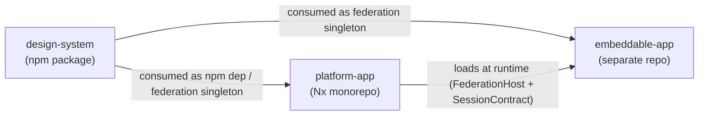

# Feature Model — Angular architecture v3.1

Built per [[skills/dotnet/architecture/v3.1/design/feature-map-create.skill/feature-map-create.skill.md|feature-map-create]], from the existing V1 Angular catalog: `skills/angular/architecture/solutions/` (18 solutions) and `skills/angular/architecture/plateau/` (8 plateaus). This describes the architectural capability space the catalog is meant to cover, not only what V1 already implements.

## Why three feature models, not one

The V1 catalog spans **three structurally different products**, each with its own repository, workspace tooling, and baseline layout. `feature-map-create` requires one concrete baseline per model, so this is three models under one catalog:

| Family | Product | Workspace | V1 plateaus | Owned by |
| --- | --- | --- | --- | --- |
| [[skills/angular/architecture/v3.1/feature/platform-app/feature-model.md\|platform-app]] | The platform web application | Nx monorepo (`apps/` + `libs/`) | online-monolith → async-monolith → offline-monolith → platform-monolith → monitored-app → multiuser-app | the platform team |
| [[skills/angular/architecture/v3.1/feature/design-system/feature-model.md\|design-system]] | An independently versioned component-library npm package | Angular CLI multi-project (`projects/design-system` + `projects/demo`) | design-system | the design-system team |
| [[skills/angular/architecture/v3.1/feature/embeddable-app/feature-model.md\|embeddable-app]] | An independently deployed app loadable by the platform host | any (Nx not required) — only the federation contract is fixed | embeddable-app | each embeddable-app team |

One [[skills/angular/architecture/v3.1/variability-map.md|Variability Map]] covers the whole catalog, with a separate Variation-Point block per family. One [[skills/angular/architecture/v3.1/delta-conflict-analysis.md|delta-conflict analysis]] covers all three.

## How the three families relate

- `design-system` is a **product in its own right**: it has no dependency on either other family, and is released on its own cadence. `platform-app` consumes it (as a plain npm dependency until `FederationHost`, then as a version-negotiated federation singleton). `embeddable-app` consumes it only as a federation singleton.
- `embeddable-app` only becomes loadable once a `platform-app` has selected `FederationHost`. Its `SessionContract` has nothing real to read until that `platform-app` also has `Authentication`.
- Three V1 solutions are **shared across families** and behave differently on each side — they are candidates for an honest split during [[skills/angular/architecture/v3.1/delta-conflict-analysis.md|delta-conflict-detection]]:
  - `solution-platform-embeddability` — host side (platform-app) vs remote-contract side (embeddable-app)
  - `solution-design-system-application` — host consumer (platform-app) vs remote consumer (embeddable-app)
  - `solution-authentication` — full auth owner (platform-app) vs session consumer (embeddable-app)
  - `solution-ui-testing` — platform component target vs design-system component target

## Shared conventions across all three families

- **Stack**: Angular (22+ where Signal Forms are used), TypeScript, standalone components, signal-based APIs (`input()`/`output()`/`model()`), no NgModules.
- **Vocabulary**: an Nx *project* is one app or one lib with a single responsibility; a *feature* is a business capability split into at least a `feature` lib (UI + routes + Signal Store) and a `data-access` lib (Facade/Client/Mapper). A lib's public surface is its `index.ts` barrel only.
- **Enforcement over convention**: module boundaries (`@nx/enforce-module-boundaries`), bundle budgets, and coverage thresholds fail CI, they are not review notes.

## Out of scope

- **This model targets the intended Program Family, not only today's catalog.** Aspirational features (no `Realized by` yet) are marked as such per family; building them is future work implied by the model.
- **Plateau Components are a different mechanism** — an optional cross-cutting capability attached at the composition root (see [[skills/common-workflow/architecture/design/plateau-component-create.skill/plateau-component-create.skill.md|plateau-component-create]]), excluded from every feature model here.
- **`IsCommon` verdicts are judgment calls**, arrived at by testing each candidate against the family's written baseline — not proofs, and not "every V1 plateau happens to include it".
- **V1 solution inaccuracies are recorded, not silently corrected.** Each family model carries an `Open questions on V1` section; the working hypothesis is stated and carried forward, and the owner reviews them as a batch (owner decision, this session).
- **Backend contracts are assumed, not modeled** — idempotency keys, field-scoped 409 detail, a health-check endpoint, a log-ingest endpoint, a refresh-cookie endpoint are all backend obligations this frontend architecture depends on but does not define.
