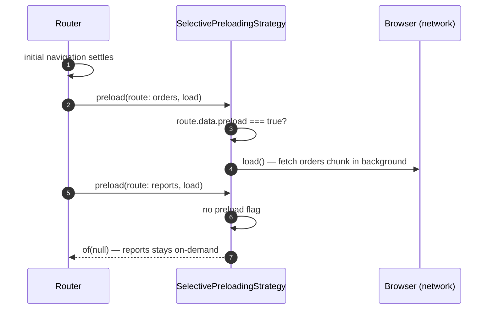
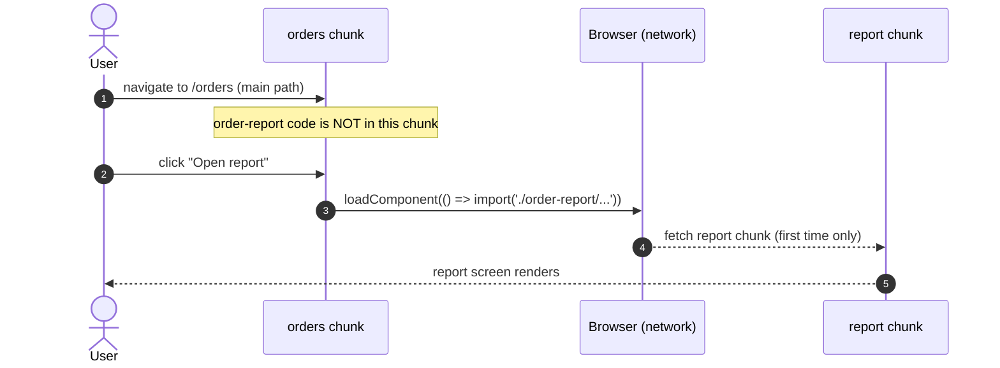
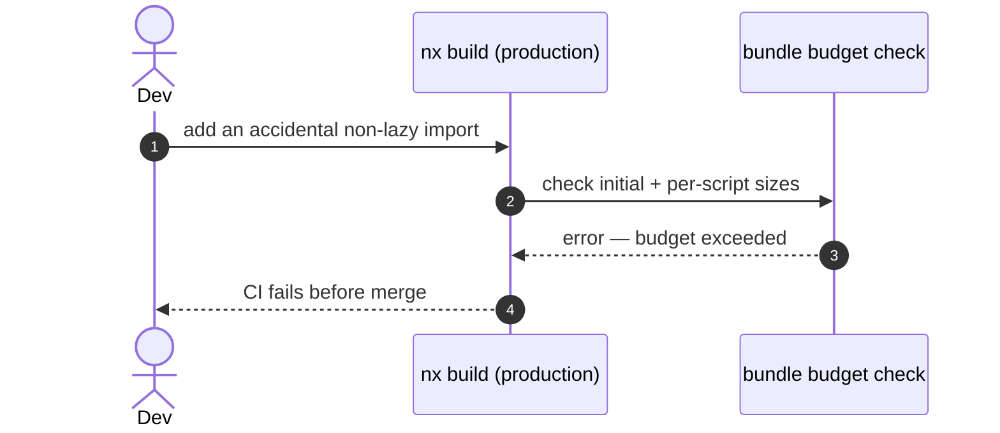

> **Second plateau of the `monolith` catalog.** Composes [`plateau-online-monolith`](skills/angular/architecture/v3.1/monolith/plateau/plateau-online-monolith/plateau-online-monolith.skill/plateau-online-monolith.skill.md) unchanged and adds exactly one solution — [`solution-performance-tuned-routing`](skills/angular/architecture/v3.1/solutions/solution-performance-tuned-routing.skill/solution-performance-tuned-routing.skill.md) — which realizes **VP1 (PerformanceTunedRouting) = Yes** of the [monolith Variability Map](skills/angular/architecture/v3.1/monolith/variability-map.md). It fixes VP1 = Yes, VP2 = Yes, VP3 = Yes; VP4–VP8 = No. Next in the chain: `plateau-offline-read-monolith` (VP4). No new Nx project is created — the delta is a `SelectivePreloadingStrategy` in `apps/platform-shell`, a `loadComponent` rule inside every feature's own routes, and `error`-level bundle budgets on the production build. Still online-only, one deployable unit, every user implicitly trusted.

# What this plateau adds over its parent

The parent — `plateau-online-monolith` — is the full connected application: Nx workspace, hierarchical routing (every feature lazy via `loadChildren`), the state-tiering rule + a classical NgRx global store, Signal Forms, a Facade/Client HTTP data-access layer with optimistic Signal-Store orchestration, console logging, and four-layer test coverage. Read its skill for that baseline; everything there still holds.

`plateau-async-monolith` changes **only how JavaScript chunks are loaded**:

- **Selective preloading** — lazy feature chunks stay on-demand by default. The shell opts a small, deliberately reviewed set of top-level segments into background preloading with `data: { preload: true }`; a custom `SelectivePreloadingStrategy` (registered once via `withPreloading(...)`) fetches only those, after the first navigation settles. Federated remote chunks are never preloaded.
- **`loadComponent` sub-splitting** — a genuinely heavy or rarely-visited sub-route inside a feature (a PDF export, a charting screen) is split into its own chunk with `loadComponent`, so the feature's main path never pays for that weight.
- **Enforced bundle budgets** — `apps/platform-shell`'s production build declares `initial` and per-script budgets with `error` thresholds, so an accidental non-lazy import that inflates the initial bundle fails CI instead of shipping unnoticed.

This is not about rendering data progressively or showing cached data offline — the parent's optimistic Signal-Store reactivity already handles non-blocking rendering, and offline caching is `plateau-offline-read-monolith` (VP4).

# Core Principles

- Every route lazily loaded via `loadChildren` is on-demand by default; preloading is opt-in, never the default.
- The decision to preload a segment belongs to whoever mounts it (the shell for top-level segments) — never to the feature itself. `data: { preload: true }` appears only at the mounting point.
- `loadComponent` is a second, finer-grained code split *inside* an already-lazy feature chunk — it does not replace the feature-level `loadChildren` split, and it is applied only where a sub-route is heavy or rare enough to be worth its own network request.
- Bundle budgets are enforced as `error` (not `warning`) on both the initial bundle and every single script.

# Capabilities

- A reviewed set of top-level sections feel instant on first navigation, without wasting bandwidth preloading rarely-used features or remote chunks.
- Heavy, rarely-used sub-pages do not inflate the chunk every visitor of a feature's main path downloads.
- A non-lazy import that accidentally grows the initial bundle fails the build immediately.
- Everything the parent plateau provides — state tiering + global store, hierarchical routing, Signal Forms, the Facade/Client data layer, console logging, four-layer testing.

# Structure

See [`structure/`](structure/plateau-async-monolith--repo-async-monolith.skill.md) — the parent's workspace skills (repo + `apps/platform-shell`, `apps/platform-shell-e2e`, `apps/component-preview`, `libs/shared/{ui,util,state,http-core,logging}`, `libs/{feature}/{feature,data-access}`) carried forward, with `solution-performance-tuned-routing`'s contributions merged into the repo skill, the `platform-shell` project skill, and the generic `{feature}.routes.ts` class skill, plus one new class skill: [`class-selective-preloading-strategy`](structure/platform-shell/classes/plateau-async-monolith--class-selective-preloading-strategy.skill.md).

# Example

See [`example/`](plateau-async-monolith.skill/example/) — the parent's runnable Nx workspace, evolved: `apps/platform-shell` gains `preloading/selective-preloading.strategy.ts` (+ spec) and `withPreloading(...)`; the `orders` route is marked `data: { preload: true }` at the shell; `orders.routes.ts` splits a `report` sub-route via `loadComponent` (its own chunk, verified in the production build output); `apps/platform-shell/project.json` carries `error`-level `initial` + `anyScript` budgets. `npm test` (Vitest) and `npm run lint` green; `nx build platform-shell --configuration=production` green with the report screen in its own lazy chunk.

# Usecases

## Background-preload a high-traffic feature

## Split a heavy sub-page out of a feature's chunk

## Bundle regression caught in CI

