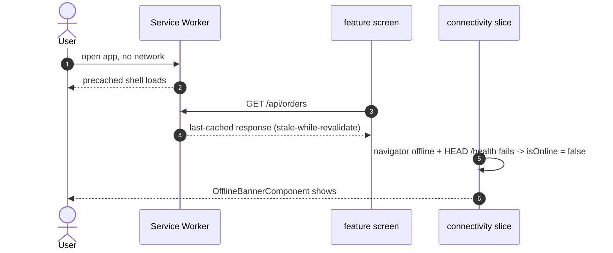
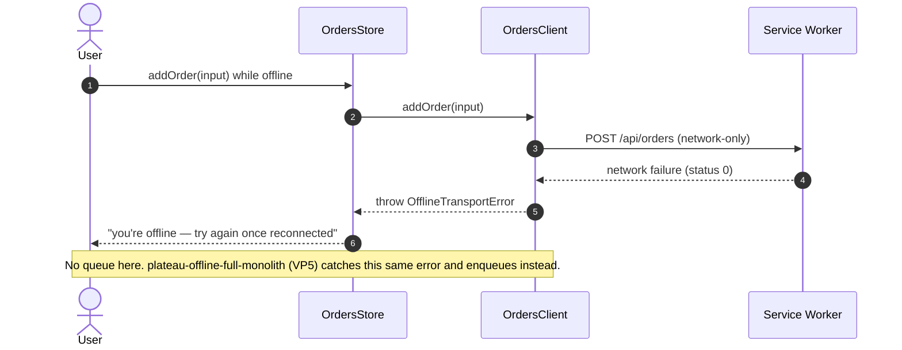

> **Third plateau of the `monolith` catalog.** Composes [`plateau-async-monolith`](skills/angular/architecture/v3.1/monolith/plateau/plateau-async-monolith/plateau-async-monolith.skill/plateau-async-monolith.skill.md) (which already carries `plateau-online-monolith` + VP1) and adds exactly one solution — [`solution-offline-first`](skills/angular/architecture/v3.1/solutions/solution-offline-first.skill/solution-offline-first.skill.md) — realizing **VP4 (OfflineReadResilience) = Yes** of the [monolith Variability Map](skills/angular/architecture/v3.1/monolith/variability-map.md). VP1–VP4 = Yes; VP5–VP8 = No. Next in the chain: `plateau-offline-full-monolith` (VP5 — the durable write queue). Scope here is **read resilience only**: the shell always loads, API GETs fall back to last-known data; a mutation attempted offline still **fails immediately** with `OfflineTransportError` — this plateau only prepares that hook. No new Nx project.

# What this plateau adds over its parent

The parent chain (`online-monolith` + `async-monolith`) is the full connected application with a tuned code-loading strategy. Read its skills for the baseline. `plateau-offline-read-monolith` adds four things, all from `solution-offline-first`:

- **A Workbox service worker** (`apps/platform-shell/src/sw-src.ts` + `sw-routes.ts` + `sw-build.mjs`, built by an `nx build-sw` step). Four content-type rules: precache the app shell and lazy chunks; cache-first for images/fonts; stale-while-revalidate for `GET /api/**`; network-only for `/auth/**` and every non-GET. The network-only rule is registered first so a mutation is never matched by the API-reads rule.
- **A `connectivity` slice** in `libs/shared/state` — the first concrete slice in the global store. `selectIsOnline` is `browserOnline && lastHealthCheckOk`: `navigator.onLine` events **and** a periodic `HEAD /health` (unauthenticated, backs off while offline). Either signal reporting offline is enough.
- **A shared `OfflineTransportError`** in `libs/shared/http-core`, thrown by every feature's Client when an `HttpErrorResponse` has `status === 0` — checked *before* any feature status-code handling. A real 4xx/5xx still maps to the feature's own domain error.
- **`OfflineBannerComponent`** in `libs/shared/ui` — presentational (`isOnline` input), mounted once at the shell, which wires it to `selectIsOnline`.

# Core Principles

- Read resilience only ("Scenario A"): the shell always loads; API reads fall back to last-known-good. Write queueing, retry and conflict handling for offline mutations are **not** here — that is `plateau-offline-full-monolith` (VP5), for which this only classifies the error.
- One caching strategy per content type — auth/mutations, the shell, static assets, and API reads have genuinely different freshness/availability needs. Auth and every non-GET are always `network-only`.
- Connectivity is judged by `navigator.onLine` events **and** a periodic backend health-check — neither alone is trustworthy (captive portals, backend outages).
- Every feature's Client distinguishes a network-level failure (`OfflineTransportError`) from a server-side error — the one architectural hook toward the future write queue.

# Capabilities

- The app shell always loads with no network, from the precached bundle.
- Feature data screens show last-known-good data instantly when offline instead of a blank/error state.
- Auth and mutation requests are never served from or written to any cache.
- An accurate offline indicator, backed by more than `navigator.onLine`.
- Everything the parent chain provides — state tiering + global store, hierarchical + performance-tuned routing, Signal Forms, the Facade/Client data layer, console logging, four-layer testing, bundle budgets.

# Structure

See [`structure/`](structure/plateau-offline-read-monolith--repo-offline-read-monolith.skill.md) — the parent chain's workspace skills carried forward, with `solution-offline-first`'s contributions merged into the repo skill, `apps/platform-shell`, `libs/shared/state`, `libs/shared/http-core`, `libs/shared/ui`, and the generic `{feature}.client.ts` class skill, plus three new class skills: [`class-connectivity-store`](structure/shared-state/classes/plateau-offline-read-monolith--class-connectivity-store.skill.md), [`class-offline-banner-component`](structure/shared-ui/classes/plateau-offline-read-monolith--class-offline-banner-component.skill.md), [`class-service-worker`](structure/platform-shell/classes/plateau-offline-read-monolith--class-service-worker.skill.md).

# Example

See [`example/`](plateau-offline-read-monolith.skill/example/) — the parent Nx workspace, evolved: the `connectivity` slice + spec; `OfflineTransportError` + the `orders.client.ts` `status === 0` branch + spec; `OfflineBannerComponent` mounted in the shell; `sw-src.ts` / `sw-routes.ts` (unit-tested predicates) / `sw-build.mjs` + the `build-sw` target + `tsconfig.sw.json`; `main.ts` registers `/sw.js` after bootstrap (prod only). `npm test` (Vitest, 15 files / 44 tests), `npm run lint` (10 projects), `npx nx build-sw platform-shell` (produces `dist/.../sw.js`) all green.

# Usecases

## Opening the app offline (Scenario A)

## A mutation attempted offline (documented limitation)

## Bundle regression / boundary check

Inherited from the parent chain: `nx build platform-shell --configuration=production` fails on the `error`-level `initial` / `anyScript` budgets; `nx run-many -t lint` enforces the `@nx/enforce-module-boundaries` allow-list.
