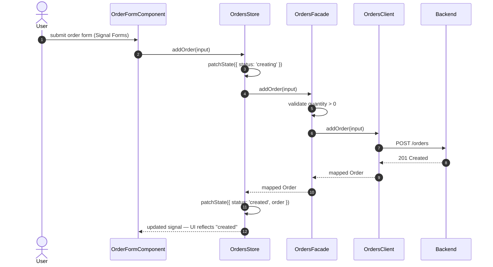
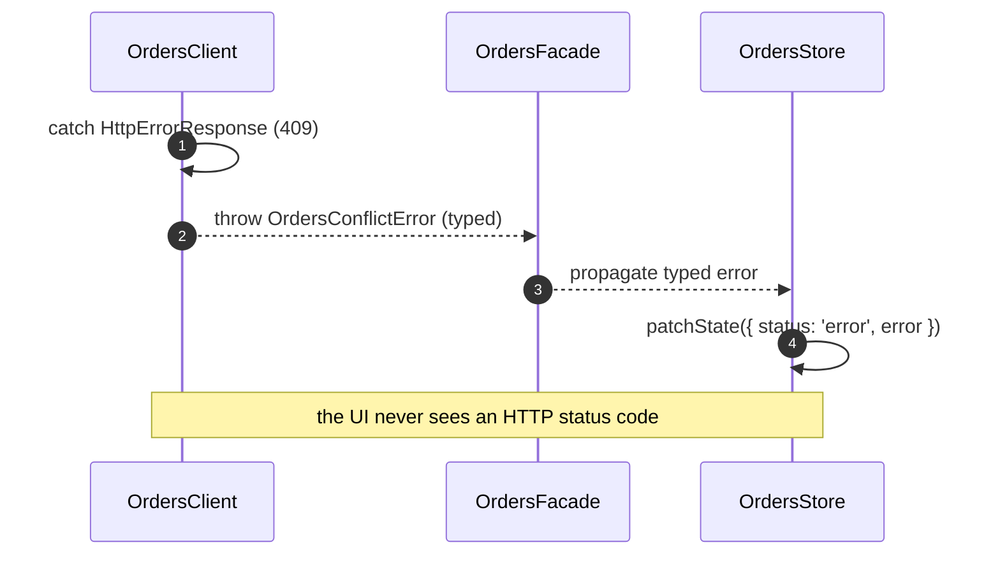

> **First plateau of the `monolith` catalog** — built from scratch, `standalone: true`. It fixes the [monolith Variability Map](skills/angular/architecture/v3.1/monolith/variability-map.md) at **VP2 (GlobalStore) = Yes, VP3 (BackendDataAccess) = Yes**; VP1, VP4–VP8 = No. Next in the chain: `plateau-perf-routing-monolith` (VP1). This is "everything the app needs to run online, end to end, as one deployable unit". No lazy-loading tuning, no offline resilience, no federation, and — deliberately — no authentication (every user implicitly trusted until `plateau-multiuser-monolith`).

# Core Principles

- `apps/` are deployable units, `libs/` are reusable code — nothing else at top level. Every feature is a `feature` lib (components + `{feature}.routes.ts` + a feature Signal Store) plus a `data-access` lib (Facade/Client/Mapper). Every lib exposes only its `index.ts`. Boundaries are enforced by `@nx/enforce-module-boundaries`.
- State lives at the smallest tier that satisfies its real consumers: component `signal()` → feature NgRx Signal Store → the classical NgRx global store in `libs/shared/state`. Promoted upward only when a second unrelated consumer needs it.
- The classical NgRx global store (`libs/shared/state`) exists and is wired (`store.config.ts` root registration), but ships **empty** — no concrete slice yet. Slices arrive with their features later in the chain (`connectivity`, `notifications`, `auth`).
- Routes are owned hierarchically: `apps/platform-shell` mounts first-level feature root segments only (lazy `loadChildren`); a feature knows only paths relative to its own root.
- New forms are built with Signal Forms; `submitForm()`'s callback calls the owning feature's data-access Facade — never `HttpClient` directly.
- Each feature's `data-access` is layered Facade (public API, business validation) → Client (internal transport + DTO mapping) → `libs/shared/http-core`. A raw `HttpErrorResponse` never escapes a Client. For feature-level operations the Signal Store calls the Facade directly — no Action/Reducer/Effect — which is what makes an optimistic `"creating…"` → `"created"` transition a `patchState` around a Facade call.
- Everything logs through `LoggerService` (`libs/shared/logging`), forwarding only to `ConsoleLogSink`; no direct `console.*` anywhere else.
- Every Nx project runs unit tests via Vitest; `HttpTestingController` only inside a Client spec. Every UI component gets a behavioral (Testing Library) + visual (Playwright, against `apps/component-preview`) + accessibility (`@axe-core/playwright`) + style-snapshot spec. Coverage and bundle budgets are enforced as CI errors.

# Capabilities

- `nx affected` runs CI only for impacted projects; module boundaries checked by lint.
- No NgRx boilerplate for purely local UI state; feature state stays encapsulated; a single auditable global store, wired but empty until a feature needs it.
- Any feature can be mounted, remounted, or moved without touching its own code — it never assumes its URL prefix.
- Fine-grained, synchronous field-level form validity/touched/error state with no manual subscriptions.
- A component action reflects immediately as an optimistic status in the UI via the Signal Store, then resolves once the Facade/Client round trip completes.
- Common HTTP concerns (base URL, timeout, retry) live once in `libs/shared/http-core`; every DTO↔model conversion is an explicit, unit-testable mapper.
- A single structured logging entry point, ready for a future backend sink with zero call-site rewrites.
- Every component has a fast DOM-accurate behavioral spec plus a Playwright screenshot-regression spec, an axe accessibility scan, and a computed-style snapshot.

# Structure

See [`structure/`](structure/plateau-online-monolith--repo-online-monolith.skill.md) — one repo skill, the project skills (`apps/platform-shell`, `apps/platform-shell-e2e`, `apps/component-preview`, `libs/shared/{ui,util,state,http-core,logging}`, `libs/{feature}/{feature,data-access}`), and the class/artifact skills under each.

# Example

See [`example/`](plateau-online-monolith.skill/example/) — a runnable Nx workspace with one feature (`orders`) end to end: a routed feature lib with a Signal Forms create form + feature Signal Store, an `orders` data-access lib (Facade/Client/Mapper/errors), `libs/shared/http-core`, `libs/shared/logging`, the empty-but-wired `libs/shared/state`, and the full four-layer test suite. `npm test` (Vitest) and `npm run e2e` (Playwright) green.

# Usecases

## Optimistic create — status flips from "creating" to "created"

## Transport failure mapped to a domain error

